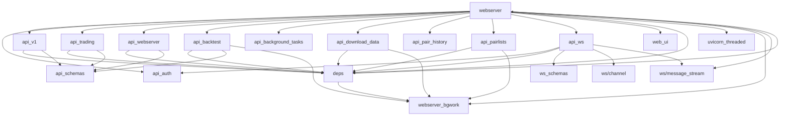
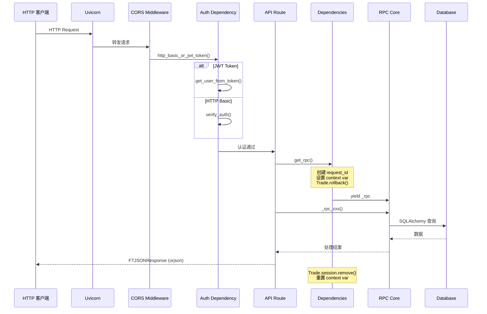
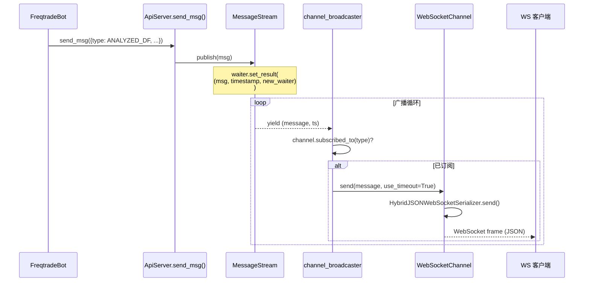
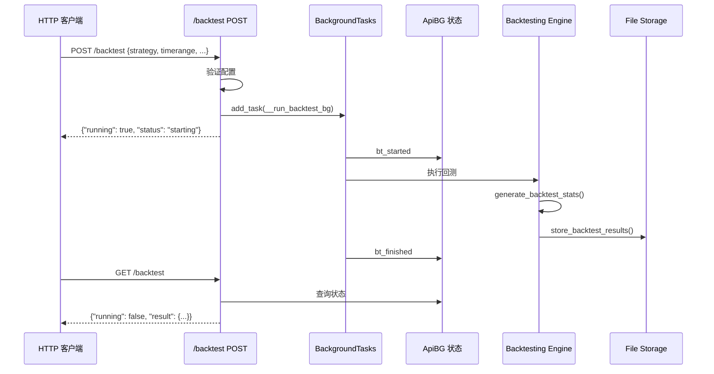

# REST API Server 模块源码文档

## 1. 模块概述

API Server 模块是 freqtrade 的 **REST API 和 WebSocket 服务器**实现，基于 **FastAPI** 框架构建。它为 FreqUI（Web 前端）和其他第三方客户端提供完整的 HTTP API 接口，支持交易控制、状态查询、回测管理、数据下载等功能。同时，通过 WebSocket 端点实现实时数据推送。

该模块采用 **Singleton 模式** 确保全局只有一个 ApiServer 实例，使用 **Uvicorn** 作为 ASGI 服务器在独立线程中运行。认证体系支持 **HTTP Basic Auth** 和 **JWT Token** 双模式。

API 版本当前为 **2.47**，路由前缀统一为 `/api/v1`。

## 2. 目录结构

```
freqtrade/rpc/api_server/
├── __init__.py                 # 模块入口，导出 ApiServer
├── webserver.py                # ApiServer 主类（Singleton），FastAPI 应用配置与启动
├── api_auth.py                 # 认证模块：HTTP Basic + JWT Token + WebSocket Token 验证
├── api_v1.py                   # v1 API 路由：公共端点 + 通用信息端点（配置、日志、策略等）
├── api_trading.py              # 交易模式专用路由：余额、利润、交易管理、强制入场/出场等
├── api_webserver.py            # Webserver 模式专用路由：策略列表、交易所列表、Hyperopt 等
├── api_backtest.py             # 回测管理路由：启动回测、查询结果、管理历史记录
├── api_background_tasks.py     # 后台任务管理路由：查询任务状态
├── api_download_data.py        # 数据下载路由：触发 OHLCV 数据下载
├── api_pair_history.py         # K线历史路由：获取带策略分析的历史数据
├── api_pairlists.py            # Pairlist 管理路由：列出/评估 Pairlist 插件
├── api_schemas.py              # Pydantic Schema 定义：所有请求/响应模型
├── api_ws.py                   # WebSocket 端点：实时消息推送与请求处理
├── deps.py                     # FastAPI 依赖注入：获取 RPC、Config、Exchange 等
├── uvicorn_threaded.py         # 多线程 Uvicorn Server 封装
├── web_ui.py                   # Web UI 静态文件服务（FreqUI）
├── webserver_bgwork.py         # 后台任务状态管理（ApiBG 类）
├── ws_schemas.py               # WebSocket 消息/请求的 Pydantic Schema
└── ws/                         # WebSocket 底层通信模块（见独立文档）
```

## 3. 架构图

```mermaid
graph TB
    subgraph Client
        FreqUI[FreqUI Web 前端]
        CLI[curl / 第三方客户端]
        WSClient[WebSocket 客户端]
    end

    subgraph FastAPI Application
        subgraph 中间件
            CORS[CORS Middleware]
            Auth[HTTP Basic / JWT Auth]
        end

        subgraph 路由层
            Public[router_public<br/>/ping]
            V1[router (api_v1)<br/>通用信息端点]
            Trading[router (api_trading)<br/>交易操作端点]
            Webserver[router (api_webserver)<br/>Webserver 端点]
            Backtest[router (api_backtest)<br/>回测端点]
            BgTasks[router (api_background_tasks)<br/>后台任务端点]
            PairHist[router (api_pair_history)<br/>K线历史端点]
            Pairlists[router (api_pairlists)<br/>Pairlist 端点]
            Download[router (api_download_data)<br/>数据下载端点]
            WS[router (api_ws)<br/>WebSocket 端点]
            UI[router_ui (web_ui)<br/>静态文件服务]
        end

        subgraph 依赖注入 deps.py
            GetRPC[get_rpc / get_rpc_optional]
            GetConfig[get_config / get_api_config]
            GetExchange[get_exchange]
            IsTradingMode[is_trading_mode]
            IsWebserverMode[is_webserver_mode]
        end

        subgraph 核心组件
            ApiSrv[ApiServer<br/>Singleton]
            MsgStream[MessageStream<br/>消息流]
            ApiBGState[ApiBG<br/>后台任务状态]
        end
    end

    subgraph 底层
        Uvicorn[UvicornServer<br/>多线程 ASGI Server]
        RPCCore[RPC 核心类]
        DB[(Database)]
    end

    FreqUI --> CORS
    CLI --> CORS
    WSClient --> WS

    CORS --> Auth
    Auth --> Public
    Auth --> V1
    Auth --> Trading
    Auth --> Webserver
    Auth --> Backtest
    Auth --> BgTasks
    Auth --> PairHist
    Auth --> Pairlists
    Auth --> Download

    V1 --> GetRPC
    Trading --> GetRPC
    Trading --> IsTradingMode
    Webserver --> IsWebserverMode
    Backtest --> IsWebserverMode
    PairHist --> GetExchange

    GetRPC --> ApiSrv
    ApiSrv --> RPCCore
    RPCCore --> DB
    ApiSrv --> MsgStream
    WS --> MsgStream

    ApiSrv --> Uvicorn
    UI --> FreqUI
```

### 路由依赖关系图

```mermaid
graph LR
    subgraph 不需要认证
        ping[GET /ping]
    end

    subgraph 需要认证
        subgraph 所有模式可用
            login[POST /token/login]
            refresh[POST /token/refresh]
            version[GET /version]
            show_config[GET /show_config]
            logs[GET /logs]
            plot_config[GET /plot_config]
            sysinfo[GET /sysinfo]
            health[GET /health]
            markets[GET /markets]
            strategy[GET /strategy/:name]
        end

        subgraph 仅 Trading 模式
            balance[GET /balance]
            profit[GET /profit]
            status[GET /status]
            trades[GET /trades]
            start[POST /start]
            stop[POST /stop]
            forceexit[POST /forceexit]
            forceenter[POST /forceenter]
            blacklist[GET|POST|DELETE /blacklist]
            whitelist[GET /whitelist]
            locks[GET|POST|DELETE /locks]
            pair_candles[GET|POST /pair_candles]
        end

        subgraph 仅 Webserver 模式
            strategies_list[GET /strategies]
            exchanges[GET /exchanges]
            hyperoptloss[GET /hyperoptloss]
            backtest[POST /backtest]
            available_pairs[GET /available_pairs]
            pair_history[GET|POST /pair_history]
            pairlists_eval[POST /pairlists/evaluate]
            download_data[POST /download_data]
            bg_jobs[GET /background]
        end
    end
```

## 4. 核心类/函数说明

### 4.1 `ApiServer` (webserver.py) -- 核心 Singleton 类

```python
class ApiServer(RPCHandler):
    __instance = None           # Singleton 实例
    __initialized = False       # 初始化标志
    _rpc: RPC                   # RPC 核心实例
    _has_rpc: bool              # RPC 是否已绑定
    _config: Config             # 全局配置
    _message_stream: MessageStream | None  # WebSocket 消息流
```

**关键方法：**

| 方法 | 说明 |
|------|------|
| `__new__()` | Singleton 实现，确保全局只有一个实例 |
| `__init__(config, standalone)` | 创建 FastAPI 应用并启动 Uvicorn |
| `add_rpc_handler(rpc)` | 绑定 RPC 核心实例 |
| `cleanup()` | 清理资源、停止服务器 |
| `shutdown()` | 类方法，完全销毁 Singleton |
| `send_msg(msg)` | 将消息发布到 MessageStream |
| `configure_app(app, config)` | 注册所有路由、中间件、异常处理 |
| `start_api()` | 配置并启动 Uvicorn |

**路由注册顺序：**
1. `api_v1_public` -- 无需认证
2. `router_login` -- 登录端点
3. `api_v1` -- 需认证的通用端点
4. `api_trading` -- 需认证 + Trading 模式
5. `api_webserver` -- 需认证 + Webserver 模式
6. `api_backtest` -- 需认证 + Webserver 模式
7. `api_bg_tasks` -- 需认证 + Webserver 模式
8. `api_pair_history` -- 需认证 + Webserver 模式
9. `api_pairlists` -- 需认证 + Webserver 模式
10. `api_download_data` -- 需认证 + Webserver 模式
11. `ws_router` -- WebSocket 端点
12. `router_ui` -- 静态文件（**必须最后注册**）

**`FTJSONResponse`**: 自定义 JSON 响应类，使用 `orjson` 替代标准 JSON 编码器，支持 NumPy 数据类型序列化。

### 4.2 `api_auth.py` -- 认证模块

实现三种认证方式：

**HTTP Basic Auth：**
```python
def verify_auth(api_config, username, password) -> bool
    # 使用 secrets.compare_digest 防止时序攻击
```

**JWT Token：**
```python
def create_token(data, secret_key, token_type) -> str
    # Access Token: 15分钟有效期
    # Refresh Token: 30天有效期
    # 算法: HS256

def get_user_from_token(token, secret_key, token_type) -> str
    # 解码并验证 JWT Token
```

**WebSocket Token：**
```python
async def validate_ws_token(ws, ws_token, api_config)
    # 优先检查 ws_token 配置（支持字符串或列表）
    # 回退到 JWT Token 验证
    # 验证失败则关闭 WebSocket（WS_1008_POLICY_VIOLATION）
```

**合并认证依赖：**
```python
def http_basic_or_jwt_token(form_data, token, api_config)
    # 优先使用 JWT Token
    # 回退到 HTTP Basic Auth
    # 两者都失败返回 401
```

**端点：**
- `POST /api/v1/token/login` -- 获取 Access + Refresh Token
- `POST /api/v1/token/refresh` -- 使用 Refresh Token 获取新 Access Token

### 4.3 `api_v1.py` -- 通用 API 路由

API 版本 `2.47`，包含两个路由器：

**`router_public`（无需认证）：**
- `GET /ping` / `HEAD /ping` -- 健康探针，返回 `{"status": "pong"}`

**`router`（需认证）：**
- `GET /version` -- Bot 版本
- `GET /show_config` -- 运行配置（含 API 版本号）
- `GET /logs` -- 最近日志
- `GET /plot_config` -- 绘图配置（支持指定 strategy）
- `GET /markets` -- 市场信息
- `GET /strategy/{strategy}` -- 策略详情（源码 + 参数）
- `GET /sysinfo` -- 系统信息
- `GET /health` -- 健康检查

### 4.4 `api_trading.py` -- 交易操作路由

仅在 Trading 模式下可用的端点（约 40 个）：

**交易信息端点：**
| 端点 | 方法 | 说明 |
|------|------|------|
| `/balance` | GET | 账户余额 |
| `/count` | GET | 当前交易数 |
| `/entries` | GET | 入场标签表现 |
| `/exits` | GET | 出场原因表现 |
| `/mix_tags` | GET | 混合标签表现 |
| `/performance` | GET | 交易对表现排名 |
| `/profit` | GET | 累计利润统计 |
| `/profit_all` | GET | 全方向利润（含 long/short 分开统计） |
| `/stats` | GET | 退出原因统计 |
| `/daily` / `/weekly` / `/monthly` | GET | 按时间维度利润 |
| `/status` | GET | 当前开仓交易 |

**交易管理端点：**
| 端点 | 方法 | 说明 |
|------|------|------|
| `/trades` | GET | 交易历史（分页） |
| `/trade/{tradeid}` | GET | 单笔交易详情 |
| `/trades/{tradeid}` | DELETE | 删除交易 |
| `/trades/{tradeid}/open-order` | DELETE | 取消挂单 |
| `/trades/{tradeid}/reload` | POST | 从交易所重新加载交易 |
| `/trades/{trade_id}/custom-data` | GET | 交易自定义数据 |
| `/trades/open/custom-data` | GET | 所有开仓交易的自定义数据 |

**交易操作端点：**
| 端点 | 方法 | 说明 |
|------|------|------|
| `/forceenter` / `/forcebuy` | POST | 强制入场 |
| `/forceexit` / `/forcesell` | POST | 强制出场 |
| `/start` | POST | 启动交易 |
| `/stop` | POST | 停止交易 |
| `/pause` / `/stopentry` / `/stopbuy` | POST | 暂停入场 |
| `/reload_config` | POST | 重新加载配置 |

**Pairlist 管理：**
| 端点 | 方法 | 说明 |
|------|------|------|
| `/blacklist` | GET/POST/DELETE | 黑名单管理 |
| `/whitelist` | GET | 白名单查询 |
| `/locks` | GET/POST | 锁定管理 |
| `/locks/{lockid}` | DELETE | 删除锁定 |
| `/locks/delete` | POST | 按条件删除锁定 |

**K 线数据：**
| 端点 | 方法 | 说明 |
|------|------|------|
| `/pair_candles` | GET/POST | 当前策略分析的 K 线数据（POST 支持列过滤） |

### 4.5 `api_webserver.py` -- Webserver 模式路由

仅在 Webserver 模式下可用：

| 端点 | 说明 |
|------|------|
| `GET /strategies` | 列出所有可用策略 |
| `GET /exchanges` | 列出所有支持的交易所 |
| `GET /hyperoptloss` | 列出所有 Hyperopt Loss 函数 |
| `GET /freqaimodels` | 列出所有 FreqAI 模型 |
| `GET /available_pairs` | 列出有数据的交易对（支持过滤） |

### 4.6 `api_backtest.py` -- 回测管理路由

提供完整的回测生命周期管理：

| 端点 | 方法 | 说明 |
|------|------|------|
| `/backtest` | POST | 启动回测（后台运行） |
| `/backtest` | GET | 查询回测状态和结果 |
| `/backtest` | DELETE | 重置回测状态 |
| `/backtest/abort` | POST | 中止正在运行的回测 |
| `/backtest/history` | GET | 列出历史回测结果 |
| `/backtest/history/result` | GET | 获取指定回测结果详情 |
| `/backtest/history/{id}` | DELETE | 删除回测历史 |
| `/backtest/history/{id}` | PATCH | 更新回测元数据 |

### 4.7 `api_schemas.py` -- Pydantic Schema

定义了所有 API 端点的请求和响应模型（约 100+ 个模型），关键模型包括：

- `Ping`, `Version`, `StatusMsg`, `ResultMsg` -- 基础响应
- `AccessToken`, `AccessAndRefreshToken` -- 认证响应
- `Balance`, `Balances` -- 余额信息
- `Count` -- 交易计数
- `Profit`, `ProfitAll` -- 利润统计
- `OpenTradeSchema` -- 开仓交易详情
- `ForceEnterPayload`, `ForceExitPayload` -- 强制交易请求
- `BacktestRequest`, `BacktestResponse` -- 回测请求/响应
- `PairHistory`, `PairHistoryRequest` -- K 线历史
- `DownloadDataPayload` -- 数据下载请求
- `BackgroundTaskStatus` -- 后台任务状态

### 4.8 `deps.py` -- 依赖注入

FastAPI 依赖注入函数，提供统一的资源获取方式：

```python
def get_rpc_optional() -> RPC | None        # 获取 RPC（可选）
async def get_rpc() -> AsyncIterator[RPC]    # 获取 RPC（必须，含 Session 管理）
def get_config() -> dict                     # 获取配置
def get_api_config() -> dict                 # 获取 API 配置
def get_exchange(config)                     # 获取/缓存 Exchange 实例
def get_message_stream()                     # 获取 MessageStream
def is_webserver_mode(config)                # 验证 Webserver 模式
def is_trading_mode(config)                  # 验证 Trading 模式
def verify_strategy(strategy)                # 验证策略名称安全性（禁止 base64）
```

`get_rpc()` 特别重要：它为每个请求创建唯一的 `request_id`，设置 context variable，并在请求结束时清理 DB Session。

### 4.9 `UvicornServer` (uvicorn_threaded.py)

多线程 Uvicorn Server 封装：

```python
class UvicornServer(uvicorn.Server):
    def run(self, sockets=None)     # 覆盖默认 run，支持 uvloop
    def run_in_thread(self)         # 在独立线程中运行
    def cleanup(self)               # 设置 should_exit 并等待线程结束
```

### 4.10 `web_ui.py` -- Web UI 静态文件服务

为 FreqUI 前端提供静态文件服务：

| 端点 | 说明 |
|------|------|
| `GET /favicon.ico` | 网站图标 |
| `GET /fallback_file.html` | FreqUI 未安装时的 Fallback 页面 |
| `GET /ui_version` | FreqUI 版本信息 |
| `GET /{rest_of_path:path}` | SPA 路由支持（fallback 到 index.html） |

注意：包含**目录遍历保护**（`is_relative_to` 检查）。

### 4.11 `ApiBG` (webserver_bgwork.py)

后台任务状态管理类（非实例化，使用类变量）：

```python
class ApiBG:
    bt: dict                    # 回测状态
    bgtask_running: bool        # 回测任务运行标志
    exchanges: dict             # 缓存的 Exchange 实例
    jobs: dict[str, JobsContainer]  # 通用后台任务
    pairlist_running: bool      # Pairlist 评估运行标志
    download_data_running: bool # 数据下载运行标志

    @staticmethod
    def get_job_id() -> str     # 生成 UUID 任务 ID
```

### 4.12 `api_ws.py` -- WebSocket 端点

核心 WebSocket 端点实现：

```python
@router.websocket("/message/ws")
async def message_endpoint(websocket, token, rpc, message_stream)
```

每个 WebSocket 连接创建两个并发任务：

1. **`channel_reader`**: 从客户端读取请求
   - `SUBSCRIBE`: 设置订阅的消息类型
   - `WHITELIST`: 返回白名单数据
   - `ANALYZED_DF`: 返回策略分析后的 DataFrame

2. **`channel_broadcaster`**: 从 MessageStream 读取并广播消息
   - 检查 channel 是否订阅了该消息类型
   - 检测消息延迟，超过 60 秒发出警告
   - 使用 `use_timeout=True` 防止慢客户端阻塞

## 5. 依赖关系

### 模块间依赖



### 外部依赖

| 依赖 | 使用位置 | 说明 |
|------|----------|------|
| `fastapi` | 全模块 | Web 框架 |
| `uvicorn` | uvicorn_threaded.py | ASGI 服务器 |
| `uvloop` (可选) | uvicorn_threaded.py | 高性能 event loop |
| `orjson` | webserver.py, serializer.py | 快速 JSON 编解码 |
| `pydantic` | api_schemas.py, ws_schemas.py | 数据验证 |
| `PyJWT` | api_auth.py | JWT Token 处理 |
| `starlette` | webserver.py, web_ui.py | ASGI 工具包 |

## 6. 数据流

### 6.1 REST API 请求流



### 6.2 WebSocket 消息推送流



### 6.3 回测执行流


