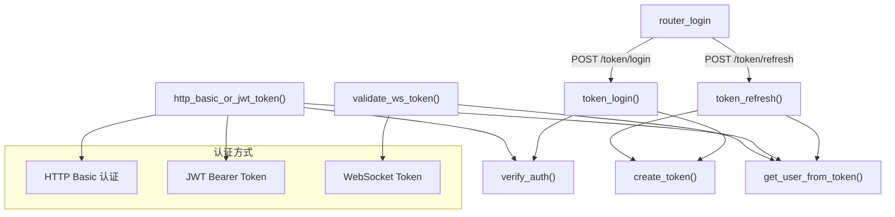

# api_auth.py

## 概述
API 认证模块，负责 Freqtrade REST API 和 WebSocket 的身份验证。实现了基于 JWT (JSON Web Token) 的 token 认证机制以及 HTTP Basic 认证，支持 access token 和 refresh token 双 token 模式。同时提供 WebSocket 连接的 token 验证功能。

## 架构图

## 核心类/函数

### verify_auth(api_config, username, password)
验证用户名和密码是否与配置中存储的凭据匹配。
- **参数**: `api_config` (dict) - API 配置字典；`username` (str) - 用户名；`password` (str) - 密码
- **返回值**: `bool` - 验证是否通过
- **关键逻辑**: 使用 `secrets.compare_digest()` 进行安全的字符串比较，防止时序攻击

### get_user_from_token(token, secret_key, token_type)
从 JWT token 中解析并提取用户信息。
- **参数**: `token` - JWT token 字符串；`secret_key` (str) - JWT 密钥；`token_type` (str) - token 类型，默认 "access"
- **返回值**: `str` - 用户名
- **异常**: `HTTPException(401)` - token 无效或类型不匹配时抛出
- **关键逻辑**: 使用 HS256 算法解码 JWT，验证 payload 中的 `identity.u` 字段和 `type` 字段

### create_token(data, secret_key, token_type)
创建 JWT token。
- **参数**: `data` (dict) - 要编码到 token 中的数据；`secret_key` (str) - JWT 密钥；`token_type` (str) - "access" 或 "refresh"
- **返回值**: `str` - 编码后的 JWT token
- **关键逻辑**: access token 有效期 15 分钟，refresh token 有效期 30 天

### validate_ws_token(ws, ws_token, api_config)
WebSocket 连接的 token 验证。支持两种验证方式：
1. 直接匹配预配置的 `ws_token`（支持字符串和列表形式）
2. 验证 JWT token
- **参数**: `ws` (WebSocket) - WebSocket 连接对象；`ws_token` (str|None) - 查询参数中的 token；`api_config` (dict) - API 配置
- **关键逻辑**: 如果验证失败，会直接关闭 WebSocket 连接（code 1008）

### http_basic_or_jwt_token(form_data, token, api_config)
FastAPI 依赖注入函数，支持 HTTP Basic 认证和 JWT Bearer Token 两种方式。优先检查 JWT token，如果没有则回退到 HTTP Basic 认证。
- **返回值**: `str` - 认证成功的用户名
- **异常**: `HTTPException(401)` - 认证失败

### token_login(form_data, api_config)
`POST /token/login` 端点处理函数。使用 HTTP Basic 认证验证凭据，成功后返回 access token 和 refresh token。
- **返回值**: `AccessAndRefreshToken` - 包含 access_token 和 refresh_token

### token_refresh(token, api_config)
`POST /token/refresh` 端点处理函数。使用 refresh token 获取新的 access token。
- **返回值**: `AccessToken` - 包含新的 access_token

## 依赖关系

### 内部依赖（本项目模块）
- `freqtrade.rpc.api_server.api_schemas` — 导入 `AccessAndRefreshToken`、`AccessToken` 响应模型
- `freqtrade.rpc.api_server.deps` — 导入 `get_api_config` 依赖

### 外部依赖（第三方库）
- `jwt` (PyJWT) — JWT token 的编码和解码
- `fastapi` — Web 框架，提供路由、依赖注入、HTTPException 等
- `secrets` — 安全字符串比较

### 被依赖（谁引用了本文件）
- `freqtrade.rpc.api_server.webserver` — 在 `configure_app()` 中导入 `http_basic_or_jwt_token` 和 `router_login` 用于路由配置
- `freqtrade.rpc.api_server.api_ws` — 导入 `validate_ws_token` 用于 WebSocket 认证
- `tests.rpc.test_rpc_apiserver` — 测试文件
