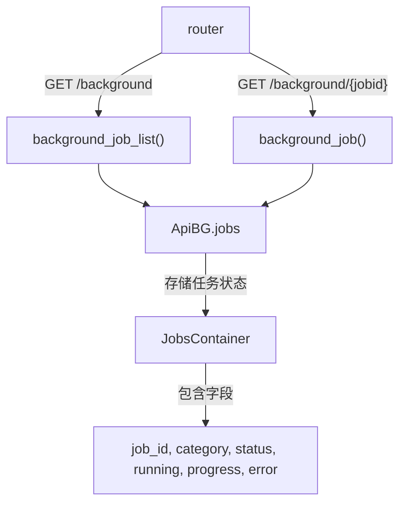

# api_background_tasks.py

## 概述
后台任务状态查询 API 模块。提供两个端点用于列出所有后台任务的状态和查询单个后台任务的详细状态。这些后台任务包括 pairlist 评估、数据下载等长时间运行的操作。该模块是私有 API，需要认证且仅在 webserver 模式下可用。

## 架构图

## 核心类/函数

### background_job_list()
`GET /background` 端点。列出所有后台任务的状态信息。
- **返回值**: `list[BackgroundTaskStatus]` - 所有后台任务状态列表
- **关键逻辑**: 遍历 `ApiBG.jobs` 字典，将每个任务格式化为包含 `job_id`、`job_category`、`status`、`running`、`progress`、`progress_tasks`、`error` 的字典

### background_job(jobid)
`GET /background/{jobid}` 端点。查询指定 ID 的后台任务状态。
- **参数**: `jobid` (str) - 任务 ID
- **返回值**: `BackgroundTaskStatus` - 指定任务的状态
- **异常**: `HTTPException(404)` - 任务不存在时抛出

## 依赖关系

### 内部依赖（本项目模块）
- `freqtrade.rpc.api_server.api_schemas` — 导入 `BackgroundTaskStatus` 响应模型
- `freqtrade.rpc.api_server.webserver_bgwork` — 导入 `ApiBG` 用于访问后台任务状态

### 外部依赖（第三方库）
- `fastapi` — Web 框架

### 被依赖（谁引用了本文件）
- `freqtrade.rpc.api_server.webserver` — 在 `configure_app()` 中注册此路由
