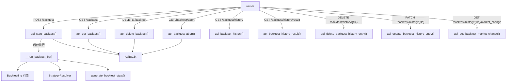

# api_backtest.py

## 概述
回测（Backtesting）API 模块，提供完整的回测生命周期管理接口。包括启动回测、查询回测状态/结果、中止回测、重置回测、查看回测历史记录、删除/更新历史记录元数据，以及获取市场变化数据。回测作为后台任务运行，通过 `ApiBG` 管理状态。该模块是私有 API，仅在 webserver 模式下可用。

## 架构图

## 核心类/函数

### __run_backtest_bg(btconfig)
后台回测执行函数（私有函数），在独立线程中运行。
- **参数**: `btconfig` (Config) - 回测配置字典
- **关键逻辑**:
  1. 创建新的 asyncio event loop
  2. 通过 `StrategyResolver` 加载策略
  3. 检测时间设置是否变化（timeframe、timeframe_detail、timerange），决定是否需要重新初始化 `Backtesting` 对象
  4. 如果数据未加载或时间设置变化，重新加载回测数据
  5. 检查是否有缓存的回测结果可以复用
  6. 执行回测并生成统计报告
  7. 如配置了导出，保存回测结果
  8. 异常处理：区分 `ConfigurationError` 和其他异常

### api_start_backtest(bt_settings, background_tasks, config)
`POST /backtest` 端点。启动回测任务。
- **参数**: `bt_settings` (BacktestRequest) - 回测请求参数；`background_tasks` (BackgroundTasks) - FastAPI 后台任务管理器；`config` - 系统配置
- **返回值**: `BacktestResponse` - 包含运行状态
- **关键逻辑**: 验证策略名称有效性，深拷贝配置并合并请求参数，强制设置 `dry_run=True`，移除交易所凭据，通过 `background_tasks.add_task()` 启动后台回测

### api_get_backtest()
`GET /backtest` 端点。查询当前回测的状态和结果。
- **返回值**: `BacktestResponse` - 根据状态返回不同内容：
  - `running`: 包含进度信息和交易数量
  - `not_started`: 回测尚未执行
  - `error`: 回测出错信息
  - `ended`: 包含完整回测结果

### api_delete_backtest()
`DELETE /backtest` 端点。重置回测状态，清理 Backtesting 对象和数据。

### api_backtest_abort()
`GET /backtest/abort` 端点。中止正在运行的回测。通过设置 `ApiBG.bt["bt"].abort = True` 实现。

### api_backtest_history(config)
`GET /backtest/history` 端点。获取历史回测结果列表，从 `backtest_results` 目录的元数据文件读取。

### api_backtest_history_result(filename, strategy, config)
`GET /backtest/history/result` 端点。加载并返回特定历史回测结果。支持 `.zip` 和 `.json` 格式。

### api_delete_backtest_history_entry(file, config)
`DELETE /backtest/history/{file}` 端点。删除指定的历史回测结果文件。

### api_update_backtest_history_entry(file, body, config)
`PATCH /backtest/history/{file}` 端点。更新回测历史记录的元数据（如 notes 备注）。

### api_get_backtest_market_change(file, config)
`GET /backtest/history/{file}/market_change` 端点。获取指定回测结果对应的市场变化数据。支持从 `.zip` 或 `.feather` 文件加载。

## 依赖关系

### 内部依赖（本项目模块）
- `freqtrade.configuration` — `remove_exchange_credentials` 移除交易所凭据，`validate_config_consistency` 验证配置一致性
- `freqtrade.constants` — `Config` 类型
- `freqtrade.data.btanalysis` — 回测结果的加载、合并、删除、更新等操作
- `freqtrade.enums` — `BacktestState` 枚举
- `freqtrade.exceptions` — 异常类型
- `freqtrade.ft_types` — `get_BacktestResultType_default` 默认结果类型
- `freqtrade.misc` — `deep_merge_dicts` 深度合并字典，`is_file_in_dir` 安全路径检查
- `freqtrade.rpc.api_server.api_schemas` — 请求和响应模型
- `freqtrade.rpc.api_server.deps` — `get_config`、`verify_strategy` 依赖
- `freqtrade.rpc.api_server.webserver_bgwork` — `ApiBG` 后台任务状态管理
- `freqtrade.rpc.rpc` — `RPCException`

### 外部依赖（第三方库）
- `fastapi` — Web 框架
- `asyncio` — 异步事件循环

### 被依赖（谁引用了本文件）
- `freqtrade.rpc.api_server.webserver` — 在 `configure_app()` 中注册此路由
