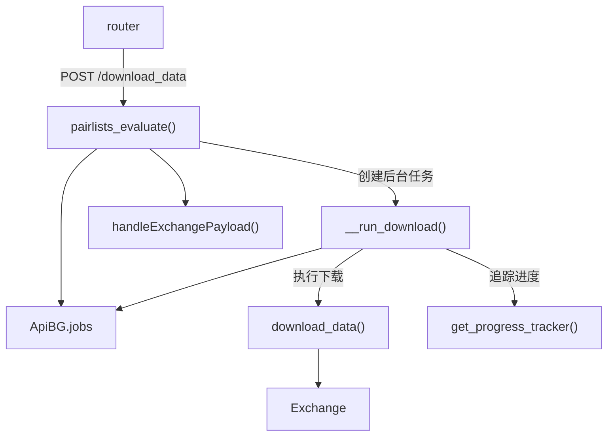

# api_download_data.py

## 概述
数据下载 API 模块，提供通过 API 触发历史 K 线数据下载的功能。下载操作作为后台任务运行，支持进度追踪。该模块是私有 API，仅在 webserver 模式下可用。

## 架构图

## 核心类/函数

### __run_download(job_id, config_loc)
后台数据下载执行函数（私有函数）。
- **参数**: `job_id` (str) - 任务 ID；`config_loc` (Config) - 下载配置
- **关键逻辑**:
  1. 在 `FtNoDBContext` 上下文中运行（无数据库模式）
  2. 创建 Exchange 实例
  3. 设置进度追踪回调函数 `ft_callback`，将每个子任务的进度更新到 `ApiBG.jobs[job_id]["progress_tasks"]`
  4. 调用 `download_data()` 执行实际下载
  5. 更新任务状态为 "success" 或 "failed"
  6. 无论成功或失败，设置 `is_running=False` 和 `download_data_running=False`

### pairlists_evaluate(payload, background_tasks, config)
`POST /download_data` 端点（函数名为 `pairlists_evaluate`，但实际处理数据下载）。
- **参数**: `payload` (DownloadDataPayload) - 下载参数，包含 pairs、timeframes、days、timerange、erase、download_trades、candle_types、prepend_data 等；`background_tasks` (BackgroundTasks) - FastAPI 后台任务管理器；`config` - 系统配置
- **返回值**: `BgJobStarted` - 包含状态消息和 job_id
- **异常**: `HTTPException(400)` - 如果数据下载已在运行
- **关键逻辑**:
  1. 检查是否已有下载任务运行
  2. 深拷贝配置并设置下载参数
  3. 通过 `handleExchangePayload()` 处理交易所和交易模式相关配置
  4. 生成唯一 job_id，初始化任务状态
  5. 启动后台下载任务

## 依赖关系

### 内部依赖（本项目模块）
- `freqtrade.constants` — `Config` 类型
- `freqtrade.exceptions` — `OperationalException`
- `freqtrade.persistence` — `FtNoDBContext` 无数据库上下文
- `freqtrade.rpc.api_server.api_pairlists` — `handleExchangePayload` 处理交易所参数
- `freqtrade.rpc.api_server.api_schemas` — `BgJobStarted`、`DownloadDataPayload` 模型
- `freqtrade.rpc.api_server.deps` — `get_config`、`get_exchange` 依赖
- `freqtrade.rpc.api_server.webserver_bgwork` — `ApiBG` 后台任务状态管理
- `freqtrade.util.progress_tracker` — `get_progress_tracker` 进度追踪器
- `freqtrade.data.history.history_utils` — `download_data` 实际下载逻辑（延迟导入）

### 外部依赖（第三方库）
- `fastapi` — Web 框架

### 被依赖（谁引用了本文件）
- `freqtrade.rpc.api_server.webserver` — 在 `configure_app()` 中注册此路由
