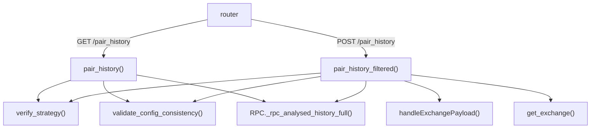

# api_pair_history.py

## 概述
交易对历史数据 API 模块，提供获取经过策略分析处理的 K 线历史数据端点。支持 GET 和 POST 两种方式，POST 方式支持列过滤和自定义交易所配置。该模块仅在 webserver 模式下可用。

## 架构图

## 核心类/函数

### pair_history(pair, timeframe, timerange, strategy, freqaimodel, config, exchange)
`GET /pair_history` 端点。获取指定交易对的策略分析历史数据。
- **参数**:
  - `pair` (str) - 交易对名称
  - `timeframe` (str) - 时间周期
  - `timerange` (str) - 时间范围
  - `strategy` (str) - 策略名称
  - `freqaimodel` (str|None) - FreqAI 模型名称（可选）
  - `config` - 系统配置（依赖注入）
  - `exchange` - Exchange 实例（依赖注入）
- **返回值**: `PairHistory` - 包含 K 线数据、信号和策略信息
- **异常**: `HTTPException(502)` - 分析过程出错
- **关键逻辑**: 深拷贝配置，验证策略名称和配置一致性，调用 `RPC._rpc_analysed_history_full()` 获取完整分析数据

### pair_history_filtered(payload, config)
`POST /pair_history` 端点。功能与 GET 版本类似，但支持更多参数。
- **参数**: `payload` (PairHistoryRequest) - 请求体，包含 pair、timeframe、timerange、strategy、columns、live_mode 等；`config` - 系统配置
- **返回值**: `PairHistory` - 包含 K 线数据
- **关键逻辑**:
  1. 支持 `columns` 参数过滤返回的列
  2. 支持 `live_mode` 参数获取实时数据
  3. 通过 `handleExchangePayload()` 支持自定义交易所和交易模式
  4. 自行创建 Exchange 实例（而非依赖注入）

## 依赖关系

### 内部依赖（本项目模块）
- `freqtrade.configuration` — `validate_config_consistency` 验证配置
- `freqtrade.rpc.api_server.api_pairlists` — `handleExchangePayload` 处理交易所参数
- `freqtrade.rpc.api_server.api_schemas` — `PairHistory`、`PairHistoryRequest` 模型
- `freqtrade.rpc.api_server.deps` — `get_config`、`get_exchange`、`verify_strategy` 依赖
- `freqtrade.rpc.rpc` — `RPC._rpc_analysed_history_full()` 分析数据获取

### 外部依赖（第三方库）
- `fastapi` — Web 框架

### 被依赖（谁引用了本文件）
- `freqtrade.rpc.api_server.webserver` — 在 `configure_app()` 中注册此路由
