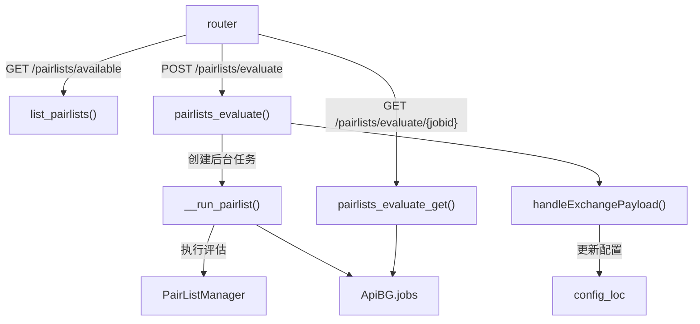

# api_pairlists.py

## 概述
交易对列表（Pairlist）管理 API 模块。提供查看可用 pairlist 插件、评估 pairlist 配置、查询评估结果等功能。Pairlist 评估作为后台任务运行。同时提供 `handleExchangePayload()` 通用工具函数，被多个其他模块复用。该模块是私有 API，仅在 webserver 模式下可用。

## 架构图

## 核心类/函数

### list_pairlists(config)
`GET /pairlists/available` 端点。列出所有可用的 pairlist 插件。
- **返回值**: `PairListsResponse` - 包含 pairlist 列表，每个条目含 name、is_pairlist_generator、params、description
- **关键逻辑**: 通过 `PairListResolver.search_all_objects()` 搜索所有 pairlist 插件，按名称排序返回

### __run_pairlist(job_id, config_loc)
后台 pairlist 评估执行函数（私有函数）。
- **参数**: `job_id` (str) - 任务 ID；`config_loc` (Config) - 配置
- **关键逻辑**:
  1. 在 `FtNoDBContext` 上下文中运行
  2. 创建 Exchange 实例
  3. 初始化 `PairListManager` 并刷新 pairlist
  4. 将结果（whitelist、方法名列表、长度）存储到 `ApiBG.jobs`
  5. 处理异常并更新任务状态

### pairlists_evaluate(payload, background_tasks, config)
`POST /pairlists/evaluate` 端点。启动 pairlist 评估后台任务。
- **参数**: `payload` (PairListsPayload) - 包含 pairlists 配置、blacklist、stake_currency 等；`background_tasks` (BackgroundTasks) - 后台任务管理器；`config` - 系统配置
- **返回值**: `BgJobStarted` - 包含状态消息和 job_id
- **异常**: `HTTPException(400)` - 如果评估已在运行

### handleExchangePayload(payload, config_loc)
通用工具函数，处理交易所和交易模式相关的请求参数，更新配置。
- **参数**: `payload` (ExchangeModePayloadMixin) - 包含 exchange、trading_mode、margin_mode 的请求体；`config_loc` (Config) - 要更新的配置字典
- **关键逻辑**:
  1. 如果指定了 exchange，更新 `config_loc["exchange"]["name"]` 并重新创建 datadir
  2. 如果指定了 trading_mode，更新交易模式和默认 candle 类型
  3. 如果指定了 margin_mode，更新保证金模式
- **重要**: 此函数被 `api_download_data`、`api_pair_history`、`api_v1` 等多个模块复用

### pairlists_evaluate_get(jobid)
`GET /pairlists/evaluate/{jobid}` 端点。查询 pairlist 评估结果。
- **参数**: `jobid` (str) - 任务 ID
- **返回值**: `WhitelistEvaluateResponse` - 成功时包含 whitelist 结果，失败时包含错误信息
- **异常**: `HTTPException(404)` - 任务不存在；`HTTPException(400)` - 任务尚未完成

## 依赖关系

### 内部依赖（本项目模块）
- `freqtrade.constants` — `Config` 类型
- `freqtrade.enums` — `CandleType` 枚举
- `freqtrade.exceptions` — `OperationalException`
- `freqtrade.persistence` — `FtNoDBContext` 无数据库上下文
- `freqtrade.rpc.api_server.api_schemas` — 请求和响应模型
- `freqtrade.rpc.api_server.deps` — `get_config`、`get_exchange` 依赖
- `freqtrade.rpc.api_server.webserver_bgwork` — `ApiBG` 后台任务管理
- `freqtrade.configuration.directory_operations` — `create_datadir`（延迟导入）
- `freqtrade.resolvers` — `PairListResolver`（延迟导入）
- `freqtrade.plugins.pairlistmanager` — `PairListManager`（延迟导入）

### 外部依赖（第三方库）
- `fastapi` — Web 框架

### 被依赖（谁引用了本文件）
- `freqtrade.rpc.api_server.webserver` — 在 `configure_app()` 中注册此路由
- `freqtrade.rpc.api_server.api_download_data` — 导入 `handleExchangePayload`
- `freqtrade.rpc.api_server.api_pair_history` — 导入 `handleExchangePayload`
- `freqtrade.rpc.api_server.api_v1` — 导入 `handleExchangePayload`
