# api_schemas.py

## 概述
API 数据模型定义模块，使用 Pydantic BaseModel 定义了 Freqtrade REST API 的所有请求和响应数据结构。包含超过 60 个数据模型，涵盖认证、交易信息、回测、策略、系统信息等各个方面。这些模型既用于请求验证（输入序列化），也用于响应序列化（输出格式化）。

## 架构图

```mermaid
classDiagram
    class BaseModel {
        <<pydantic>>
    }

    class ExchangeModePayloadMixin {
        trading_mode: TradingMode
        margin_mode: MarginMode
        exchange: str
    }

    class AccessToken {
        access_token: str
    }
    class AccessAndRefreshToken {
        refresh_token: str
    }
    AccessToken <|-- AccessAndRefreshToken

    class StatusMsg {
        status: str
    }
    class BgJobStarted {
        job_id: str
    }
    StatusMsg <|-- BgJobStarted

    class BackgroundTaskResult {
        error: str
        status: str
    }
    class WhitelistEvaluateResponse {
        result: WhitelistResponse
    }
    BackgroundTaskResult <|-- WhitelistEvaluateResponse

    class __BaseStatsModel {
        profit_ratio: float
        profit_pct: float
        profit_abs: float
        count: int
    }
    __BaseStatsModel <|-- Entry
    __BaseStatsModel <|-- Exit
    __BaseStatsModel <|-- MixTag
    __BaseStatsModel <|-- PerformanceEntry

    class TradeSchema {
        trade_id: int
        pair: str
        is_open: bool
        ...
    }
    class OpenTradeSchema {
        stoploss_current_dist: float
        current_rate: float
        ...
    }
    TradeSchema <|-- OpenTradeSchema

    class PairCandlesRequest {
        pair: str
        timeframe: str
        limit: int
        columns: list
    }
    class PairHistoryRequest {
        timerange: str
        strategy: str
        live_mode: bool
    }
    PairCandlesRequest <|-- PairHistoryRequest
    ExchangeModePayloadMixin <|-- PairHistoryRequest

    class __StrategyParameter {
        param_type: str
        name: str
        space: str
    }
    __StrategyParameter <|-- IntParameter
    __StrategyParameter <|-- RealParameter
    __StrategyParameter <|-- DecimalParameter
    __StrategyParameter <|-- BooleanParameter
    __StrategyParameter <|-- CategoricalParameter

    class PairListsPayload {
        pairlists: list
        blacklist: list
        stake_currency: str
    }
    ExchangeModePayloadMixin <|-- PairListsPayload

    class DownloadDataPayload {
        pairs: list
        timeframes: list
        days: int
    }
    ExchangeModePayloadMixin <|-- DownloadDataPayload

    class MarketRequest {
        base: str
        quote: str
    }
    ExchangeModePayloadMixin <|-- MarketRequest
```

## 核心类/函数

### 认证相关
- **`Ping`** — 简单状态响应 (`status: str`)
- **`AccessToken`** — access token 响应
- **`AccessAndRefreshToken`** — 继承 AccessToken，增加 refresh_token 字段
- **`Version`** — 版本信息响应

### 通用响应
- **`StatusMsg`** — 通用状态消息
- **`BgJobStarted`** — 后台任务启动响应，继承 StatusMsg，增加 job_id
- **`BackgroundTaskStatus`** — 后台任务详细状态，包含 job_id、job_category、status、running、progress、progress_tasks、error
- **`BackgroundTaskResult`** — 后台任务结果基类
- **`ResultMsg`** — 通用结果消息

### Mixin 类
- **`ExchangeModePayloadMixin`** — 交易所和交易模式混入类，提供 trading_mode、margin_mode、exchange 可选字段。被 `PairListsPayload`、`DownloadDataPayload`、`PairHistoryRequest`、`MarketRequest` 继承

### 交易信息
- **`Balance`** — 单币种余额信息（currency、free、balance、used、est_stake 等）
- **`Balances`** — 全部余额汇总信息
- **`Count`** — 当前/最大交易数量
- **`Profit`** — 利润统计，包含已关闭交易和所有交易的利润率、回撤、Sharpe/Sortino 比率等详细指标
- **`ProfitAll`** — 分方向利润统计（all、long、short）
- **`DailyWeeklyMonthlyRecord`** — 日/周/月利润记录
- **`DailyWeeklyMonthly`** — 日/周/月利润列表容器

### 交易统计
- **`__BaseStatsModel`** — 统计基类，包含 profit_ratio、profit_pct、profit_abs、count
- **`Entry`** — 入场标签统计（继承 __BaseStatsModel）
- **`Exit`** — 出场原因统计
- **`MixTag`** — 混合标签统计
- **`PerformanceEntry`** — 交易对表现统计
- **`SellReason`** — 出场原因分类（wins、losses、draws）
- **`Stats`** — 统计信息（exit_reasons 和 durations）

### 交易订单
- **`OrderSchema`** — 订单数据模型，包含 pair、order_id、status、amount、price 等
- **`TradeSchema`** — 交易数据模型，包含完整的交易生命周期信息（开仓/平仓价格时间、利润、止损、杠杆等约 60 个字段）
- **`OpenTradeSchema`** — 继承 TradeSchema，增加实时止损距离和当前利润率等字段
- **`TradeResponse`** — 交易列表分页响应
- **`ForceEnterResponse`** — 强制入场响应（RootModel，可为 TradeSchema 或 StatusMsg）

### 交易操作
- **`ForceEnterPayload`** — 强制入场请求（pair、side、price、ordertype、stakeamount、entry_tag、leverage）
- **`ForceExitPayload`** — 强制出场请求（tradeid、ordertype、amount、price）
- **`LocksPayload`** — 添加锁定请求（pair、side、until、reason）
- **`DeleteLockRequest`** — 删除锁定请求

### 黑白名单
- **`BlacklistPayload`** — 黑名单添加请求
- **`BlacklistResponse`** — 黑名单响应（含 blacklist_expanded 和 method）
- **`WhitelistResponse`** — 白名单响应
- **`WhitelistEvaluateResponse`** — Pairlist 评估结果响应

### K 线数据
- **`PairCandlesRequest`** — K 线数据请求（pair、timeframe、limit、columns）
- **`PairHistoryRequest`** — 继承 PairCandlesRequest 和 ExchangeModePayloadMixin，增加 timerange、strategy、freqaimodel、live_mode
- **`PairHistory`** — K 线数据响应，包含列名、数据、信号统计、annotations 等
- **`AvailablePairs`** — 可用交易对列表

### 回测相关
- **`BacktestFreqAIInputs`** — FreqAI 回测输入
- **`BacktestRequest`** — 回测请求参数
- **`BacktestResponse`** — 回测响应，包含 status、running、progress、backtest_result
- **`BacktestHistoryEntry`** — 回测历史条目
- **`BacktestMetadataUpdate`** — 回测元数据更新请求
- **`BacktestMarketChange`** — 市场变化数据

### 策略相关
- **`StrategyListResponse`** — 策略列表
- **`StrategyResponse`** — 策略详情（含源码和参数）
- **`__StrategyParameter`** — 策略参数基类
- **`IntParameter`**、**`RealParameter`**、**`DecimalParameter`**、**`BooleanParameter`**、**`CategoricalParameter`** — 各类型策略参数
- **`AllParameters`** — 联合类型，使用 discriminator 按 param_type 区分

### 市场数据
- **`MarketRequest`** — 市场查询请求（继承 ExchangeModePayloadMixin）
- **`MarketModel`** — 市场信息（symbol、base、quote、spot、swap）
- **`MarketResponse`** — 市场响应

### 系统/配置
- **`ShowConfig`** — 完整的 bot 配置展示
- **`OrderTypes`** — 订单类型配置
- **`UnfilledTimeout`** — 未成交超时配置
- **`SysInfo`** — 系统信息（CPU、RAM 使用率）
- **`CpuInfo`** — 单核 CPU 信息
- **`Health`** — 健康检查响应

### 自定义数据
- **`CustomDataEntry`** — 自定义数据条目
- **`ListCustomData`** — 交易自定义数据列表

### 其他
- **`PlotConfig_`** / **`PlotConfig`** — 图表配置
- **`ExchangeListResponse`** — 交易所列表
- **`HyperoptLoss`** / **`HyperoptLossListResponse`** — 超参数优化损失函数
- **`PairListResponse`** / **`PairListsResponse`** — Pairlist 插件信息
- **`PairListsPayload`** — Pairlist 评估请求
- **`DownloadDataPayload`** — 数据下载请求，含 `@model_validator` 确保 timerange 和 days 互斥
- **`FreqAIModelListResponse`** — FreqAI 模型列表
- **`DeleteTrade`** — 删除交易响应
- **`LockModel`** / **`Locks`** — 锁定信息
- **`Logs`** — 日志响应

## 依赖关系

### 内部依赖（本项目模块）
- `freqtrade.constants` — `DL_DATA_TIMEFRAMES`、`IntOrInf` 类型
- `freqtrade.enums` — `MarginMode`、`OrderTypeValues`、`SignalDirection`、`TradingMode` 枚举
- `freqtrade.ft_types` — `AnnotationType`、`ValidExchangesType` 类型
- `freqtrade.rpc.api_server.webserver_bgwork` — `ProgressTask` TypedDict

### 外部依赖（第三方库）
- `pydantic` — 数据模型定义和验证（BaseModel、Field、RootModel、model_validator 等）

### 被依赖（谁引用了本文件）
- `freqtrade.rpc.api_server.api_auth` — 导入 token 响应模型
- `freqtrade.rpc.api_server.api_background_tasks` — 导入 BackgroundTaskStatus
- `freqtrade.rpc.api_server.api_backtest` — 导入回测相关模型
- `freqtrade.rpc.api_server.api_download_data` — 导入下载数据相关模型
- `freqtrade.rpc.api_server.api_pair_history` — 导入 PairHistory、PairHistoryRequest
- `freqtrade.rpc.api_server.api_pairlists` — 导入 pairlist 相关模型
- `freqtrade.rpc.api_server.api_trading` — 导入交易相关模型
- `freqtrade.rpc.api_server.api_v1` — 导入通用信息模型
- `freqtrade.rpc.api_server.api_webserver` — 导入 webserver 模式模型
