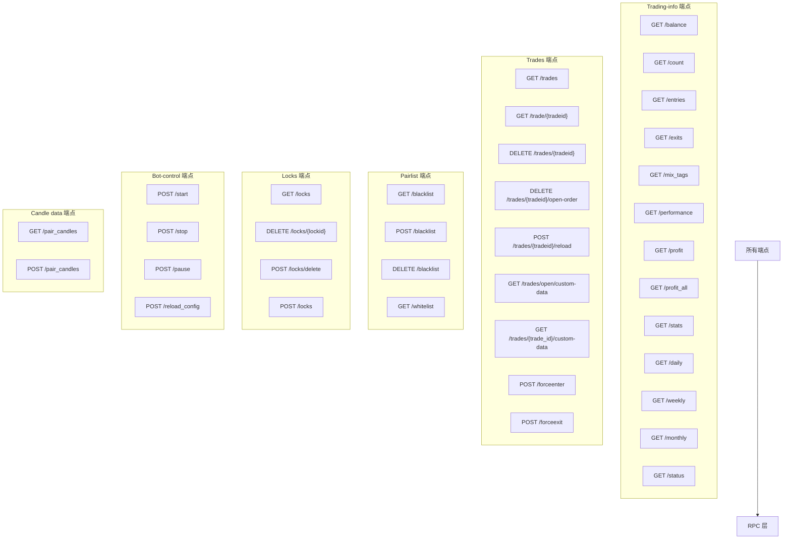

# api_trading.py

## 概述
交易操作 API 模块，提供 Freqtrade bot 运行时的交易管理相关端点。涵盖账户余额、交易信息查询、交易操作（强制入场/出场）、黑白名单管理、锁定管理、bot 控制（启停/暂停/重载配置）以及 K 线数据查询。该模块是私有 API，需要认证且仅在交易模式下可用（非 webserver 模式）。

## 架构图

## 核心类/函数

### 交易信息端点

#### balance(rpc, config)
`GET /balance` — 获取账户余额信息，调用 `rpc._rpc_balance()`。

#### count(rpc)
`GET /count` — 获取当前交易数量和最大允许交易数量。

#### entries(pair, rpc)
`GET /entries` — 获取入场标签统计，可按交易对过滤。

#### exits(pair, rpc)
`GET /exits` — 获取出场原因统计，可按交易对过滤。

#### mix_tags(pair, rpc)
`GET /mix_tags` — 获取混合标签统计。

#### performance(rpc)
`GET /performance` — 获取交易对表现排行。

#### profit(rpc, config)
`GET /profit` — 获取综合利润统计。

#### profit_all(rpc, config)
`GET /profit_all` — 获取分方向利润统计（全部/多头/空头），仅在非 SPOT 模式下返回多头/空头数据。

#### stats(rpc)
`GET /stats` — 获取出场原因统计和持仓时间统计。

#### daily(timescale, rpc, config) / weekly(...) / monthly(...)
`GET /daily`、`GET /weekly`、`GET /monthly` — 获取日/周/月利润统计。timescale 默认分别为 7/4/3。

#### status(rpc)
`GET /status` — 获取所有当前开仓交易的详细状态。如无交易返回空列表。

### 交易管理端点

#### trades(limit, offset, order_by_id, rpc)
`GET /trades` — 获取交易历史列表，支持分页（limit、offset）和排序方式选择。注意：未使用 response_model 以优化大数据库的响应时间。

#### trade(tradeid, rpc)
`GET /trade/{tradeid}` — 获取指定交易的详细状态。

#### trades_delete(tradeid, rpc)
`DELETE /trades/{tradeid}` — 删除指定交易。

#### trade_cancel_open_order(tradeid, rpc)
`DELETE /trades/{tradeid}/open-order` — 取消指定交易的未成交订单。

#### trade_reload(tradeid, rpc)
`POST /trades/{tradeid}/reload` — 从交易所重新加载指定交易的数据。

#### list_open_trades_custom_data(key, limit, offset, rpc)
`GET /trades/open/custom-data` — 获取所有开仓交易的自定义数据，支持按 key 过滤和分页。

#### list_custom_data(trade_id, key, rpc)
`GET /trades/{trade_id}/custom-data` — 获取指定交易的自定义数据。

#### force_entry(payload, rpc)
`POST /forceenter` (也映射到 `/forcebuy`，已废弃) — 强制入场。
- **参数**: `payload` (ForceEnterPayload) - 包含 pair、side（默认 LONG）、price、ordertype、stakeamount、entry_tag、leverage
- **返回值**: `ForceEnterResponse` - 成功时返回交易信息，失败时返回状态消息

#### forceexit(payload, rpc)
`POST /forceexit` (也映射到 `/forcesell`，已废弃) — 强制出场。
- **参数**: `payload` (ForceExitPayload) - 包含 tradeid、ordertype、amount、price

### 黑白名单端点

#### blacklist(rpc) / blacklist_post(payload, rpc) / blacklist_delete(pairs_to_delete, rpc)
`GET/POST/DELETE /blacklist` — 查看/添加/删除黑名单交易对。

#### whitelist(rpc)
`GET /whitelist` — 获取当前白名单。

### 锁定管理端点

#### locks(rpc) / delete_lock(lockid, rpc) / delete_lock_pair(payload, rpc) / add_locks(payload, rpc)
`GET/DELETE/POST /locks` — 查看/删除/添加交易对锁定。

### Bot 控制端点

#### start(rpc) / stop(rpc)
`POST /start`、`POST /stop` — 启动/停止 bot 交易。

#### pause(rpc)
`POST /pause` (也映射到 `/stopentry`、`/stopbuy`) — 暂停入场（仍允许出场）。

#### reload_config(rpc)
`POST /reload_config` — 重新加载配置文件。

### K 线数据端点

#### pair_candles(pair, timeframe, limit, rpc)
`GET /pair_candles` — 获取指定交易对的 K 线数据（含策略分析指标）。

#### pair_candles_filtered(payload, rpc)
`POST /pair_candles` — 高级 K 线端点，支持列过滤（columns 参数）。

## 依赖关系

### 内部依赖（本项目模块）
- `freqtrade.enums` — `TradingMode` 枚举
- `freqtrade.rpc` — `RPC` 类
- `freqtrade.rpc.api_server.api_schemas` — 大量请求和响应模型
- `freqtrade.rpc.api_server.deps` — `get_config`、`get_rpc` 依赖
- `freqtrade.rpc.rpc` — `RPCException`

### 外部依赖（第三方库）
- `fastapi` — Web 框架（APIRouter、Depends、Query、HTTPException）

### 被依赖（谁引用了本文件）
- `freqtrade.rpc.api_server.webserver` — 在 `configure_app()` 中注册此路由
