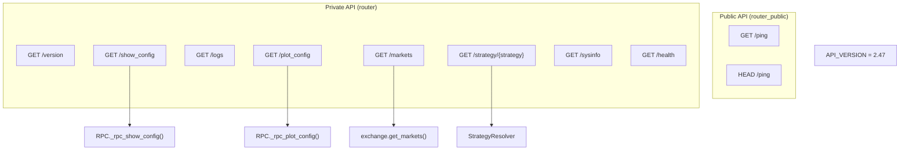

# api_v1.py

## 概述
API v1 核心路由模块，定义了 Freqtrade REST API 的版本号和通用端点。包含公共端点（无需认证）和私有端点（需认证）。提供系统信息、配置展示、日志查看、策略管理、市场数据、图表配置等功能。同时定义了 API 版本历史记录（从 1.x 到 2.47）。

## 架构图

## 核心类/函数

### 常量
- **`API_VERSION = 2.47`** — 当前 API 版本号。文件中详细记录了版本演进历史（从 1.11 到 2.47）

### 公共端点

#### ping()
`GET/HEAD /ping` — 简单的健康检查端点，返回 `{"status": "pong"}`。无需认证。

### 私有端点

#### version()
`GET /version` — 返回 Freqtrade 版本号。

#### show_config(rpc, config)
`GET /show_config` — 展示完整的 bot 配置信息。
- **关键逻辑**: 如果有 RPC 连接（交易模式），还会包含 bot 状态和策略版本。附加 `api_version` 到响应中。
- **返回值**: `ShowConfig` - 包含 version、strategy、exchange、trading_mode 等完整配置

#### logs(limit)
`GET /logs` — 获取 bot 日志，可通过 limit 限制返回条数。

#### plot_config(strategy, config, rpc)
`GET /plot_config` — 获取图表配置。
- **关键逻辑**:
  - 如果未指定 strategy 参数，使用当前运行策略的配置（需要 RPC）
  - 如果指定了 strategy，加载指定策略的图表配置（webserver 模式下可用）

#### markets(query, config, rpc)
`GET /markets` — 获取市场信息。
- **参数**: `query` (MarketRequest) - 支持 base、quote 过滤，以及 trading_mode、exchange 参数
- **关键逻辑**: 在 webserver 模式下会创建新的 exchange 实例；在交易模式下使用已有的 exchange

#### get_strategy(strategy, config, rpc)
`GET /strategy/{strategy}` — 获取策略详情，包含源码和参数。
- **关键逻辑**:
  - webserver 模式：通过 `StrategyResolver._load_strategy()` 加载策略并获取超参数
  - 交易模式：只能获取当前活跃策略的信息
- **返回值**: `StrategyResponse` - 包含 strategy 名称、timeframe、code（源码）、params（参数列表）
- **异常**: `HTTPException(404)` - 策略未找到或非当前活跃策略

#### sysinfo()
`GET /sysinfo` — 获取系统信息（CPU、RAM 使用率等）。

#### health(rpc)
`GET /health` — 获取 bot 健康状态，包含最后处理时间和启动时间。

## 依赖关系

### 内部依赖（本项目模块）
- `freqtrade` — `__version__` 版本号
- `freqtrade.enums` — `RunMode`、`State` 枚举
- `freqtrade.exceptions` — `OperationalException`
- `freqtrade.rpc` — `RPC` 类
- `freqtrade.rpc.api_server.api_pairlists` — `handleExchangePayload` 处理交易所参数
- `freqtrade.rpc.api_server.api_schemas` — 响应模型
- `freqtrade.rpc.api_server.deps` — `get_config`、`get_exchange`、`get_rpc`、`get_rpc_optional`、`verify_strategy` 依赖
- `freqtrade.rpc.rpc` — `RPCException`
- `freqtrade.resolvers.strategy_resolver` — `StrategyResolver`（延迟导入）

### 外部依赖（第三方库）
- `fastapi` — Web 框架

### 被依赖（谁引用了本文件）
- `freqtrade.rpc.api_server.webserver` — 在 `configure_app()` 中注册 `router` 和 `router_public`
