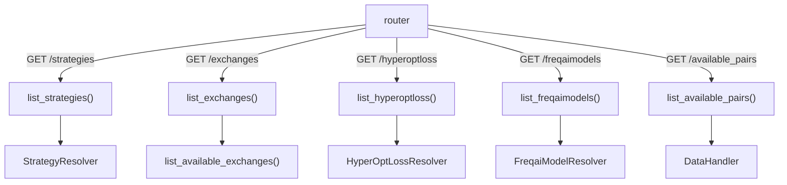

# api_webserver.py

## 概述
Webserver 模式专用 API 模块，提供在 webserver 模式下可用的列表查询端点。包括策略列表、交易所列表、Hyperopt 损失函数列表、FreqAI 模型列表，以及本地已有的可用数据交易对列表。这些端点仅在 webserver 模式下可用，不需要 bot 处于交易运行状态。

## 架构图

## 核心类/函数

### list_strategies(config)
`GET /strategies` — 列出所有可用策略。
- **返回值**: `StrategyListResponse` - 包含策略名称列表
- **关键逻辑**: 通过 `StrategyResolver.search_all_objects()` 搜索策略，支持 `recursive_strategy_search` 配置递归搜索

### list_exchanges(config)
`GET /exchanges` — 列出所有可用交易所。
- **返回值**: `ExchangeListResponse` - 包含交易所详细信息列表
- **关键逻辑**: 通过 `list_available_exchanges()` 获取支持的交易所列表

### list_hyperoptloss(config)
`GET /hyperoptloss` — 列出所有可用的 Hyperopt 损失函数。
- **返回值**: `HyperoptLossListResponse` - 包含损失函数名称和描述
- **关键逻辑**: 通过 `HyperOptLossResolver.search_all_objects()` 搜索，使用 `textwrap.dedent` 格式化 docstring 作为描述

### list_freqaimodels(config)
`GET /freqaimodels` — 列出所有可用的 FreqAI 模型。
- **返回值**: `FreqAIModelListResponse` - 包含模型名称列表
- **关键逻辑**: 通过 `FreqaiModelResolver.search_all_objects()` 搜索

### list_available_pairs(timeframe, stake_currency, candletype, config)
`GET /available_pairs` — 列出本地已有数据的交易对。
- **参数**:
  - `timeframe` (str|None) - 按时间周期过滤
  - `stake_currency` (str|None) - 按计价货币过滤
  - `candletype` (CandleType|None) - 按 K 线类型过滤
  - `config` - 系统配置
- **返回值**: `AvailablePairs` - 包含 pairs 列表、pair_interval 详细列表和总数
- **关键逻辑**: 通过 DataHandler 的 `ohlcv_get_available_data()` 获取本地已有数据，支持多维度过滤。如果未指定 candletype，使用当前 trading_mode 的默认类型

## 依赖关系

### 内部依赖（本项目模块）
- `freqtrade.data.history.datahandlers` — `get_datahandler` 获取数据处理器
- `freqtrade.enums` — `CandleType`、`TradingMode` 枚举
- `freqtrade.rpc.api_server.api_schemas` — 响应模型
- `freqtrade.rpc.api_server.deps` — `get_config` 依赖
- `freqtrade.resolvers.strategy_resolver` — `StrategyResolver`（延迟导入）
- `freqtrade.resolvers.hyperopt_resolver` — `HyperOptLossResolver`（延迟导入）
- `freqtrade.resolvers.freqaimodel_resolver` — `FreqaiModelResolver`（延迟导入）
- `freqtrade.exchange` — `list_available_exchanges`（延迟导入）

### 外部依赖（第三方库）
- `fastapi` — Web 框架

### 被依赖（谁引用了本文件）
- `freqtrade.rpc.api_server.webserver` — 在 `configure_app()` 中注册此路由
