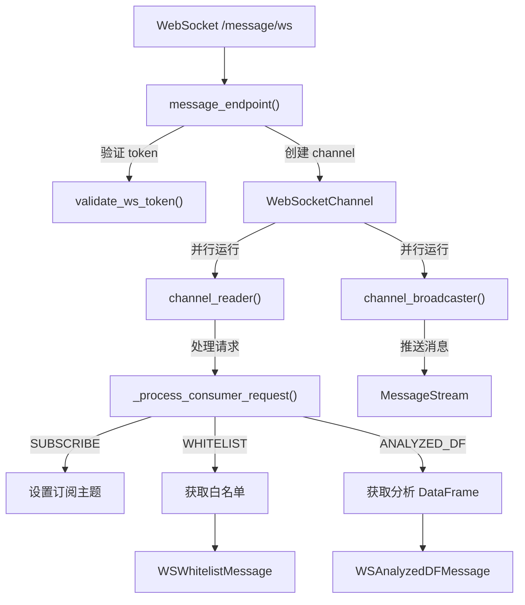

# api_ws.py

## 概述
WebSocket API 模块，实现了 Freqtrade 的实时消息推送和双向通信功能。客户端可以通过 WebSocket 连接订阅实时消息（如交易信号、分析数据等），也可以发送请求（如获取白名单、分析后的 DataFrame 等）。使用 channel reader/broadcaster 模式进行消息处理。

## 架构图

## 核心类/函数

### channel_reader(channel, rpc)
异步函数，迭代 WebSocket channel 接收的消息并处理请求。
- **参数**: `channel` (WebSocketChannel) - WebSocket 通道；`rpc` (RPC) - RPC 实例
- **关键逻辑**: 异步遍历 channel 的消息，调用 `_process_consumer_request()` 处理。发生异常时发送 `WSErrorMessage` 错误消息

### channel_broadcaster(channel, message_stream)
异步函数，迭代消息流中的消息并推送给订阅了对应类型的 channel。
- **参数**: `channel` (WebSocketChannel) - WebSocket 通道；`message_stream` (MessageStream) - 消息流
- **关键逻辑**:
  1. 异步遍历 message_stream 获取消息和时间戳
  2. 检查 channel 是否订阅了该消息类型 (`channel.subscribed_to()`)
  3. 如果消息延迟超过 60 秒，记录警告日志（可能导致内存泄漏）
  4. 使用 `use_timeout=True` 发送消息，防止慢消费者阻塞

### _process_consumer_request(request, channel, rpc)
异步函数，验证并处理 WebSocket 消费者请求。
- **参数**: `request` (dict) - 原始请求字典；`channel` (WebSocketChannel) - WebSocket 通道；`rpc` (RPC) - RPC 实例
- **关键逻辑**:
  1. 使用 `WSRequestSchema.model_validate()` 验证请求格式
  2. 根据请求类型分发处理：
    - **SUBSCRIBE**: 设置 channel 的消息订阅主题。验证所有主题都是有效的 `RPCMessageType`
    - **WHITELIST**: 调用 `rpc._ws_request_whitelist()` 获取白名单，返回 `WSWhitelistMessage`
    - **ANALYZED_DF**: 调用 `rpc._ws_request_analyzed_df()` 获取分析后的 DataFrame，支持 limit（最大 1500）和 pair 过滤。为每个交易对发送独立消息

### message_endpoint(websocket, token, rpc, message_stream)
`WebSocket /message/ws` 端点。WebSocket 连接入口。
- **参数**: `websocket` (WebSocket) - WebSocket 连接对象；`token` - 验证后的 token（通过 `validate_ws_token` 依赖注入）；`rpc` (RPC) - RPC 实例；`message_stream` (MessageStream) - 消息流
- **关键逻辑**: 验证 token 后创建 WebSocketChannel，并行运行 channel_reader 和 channel_broadcaster 两个任务

## 依赖关系

### 内部依赖（本项目模块）
- `freqtrade.enums` — `RPCMessageType`、`RPCRequestType` 枚举
- `freqtrade.exceptions` — `FreqtradeException`
- `freqtrade.rpc.api_server.api_auth` — `validate_ws_token` WebSocket 认证
- `freqtrade.rpc.api_server.deps` — `get_message_stream`、`get_rpc` 依赖
- `freqtrade.rpc.api_server.ws.channel` — `WebSocketChannel`、`create_channel`
- `freqtrade.rpc.api_server.ws.message_stream` — `MessageStream` 消息流
- `freqtrade.rpc.api_server.ws_schemas` — WebSocket 消息模型
- `freqtrade.rpc.rpc` — `RPC` 类

### 外部依赖（第三方库）
- `fastapi` — Web 框架（APIRouter、Depends、WebSocket）
- `pydantic` — `ValidationError` 请求验证

### 被依赖（谁引用了本文件）
- `freqtrade.rpc.api_server.webserver` — 在 `configure_app()` 中注册此路由
