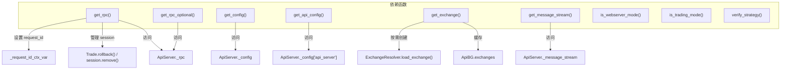

# deps.py

## 概述
FastAPI 依赖注入（Dependencies）模块，为所有 API 端点提供共享的依赖函数。包括 RPC 实例获取、配置获取、Exchange 实例管理（带缓存）、消息流获取，以及运行模式验证（webserver 模式 / 交易模式）。还提供策略名称安全验证功能。

## 架构图

## 核心类/函数

### get_rpc_optional() -> RPC | None
获取 RPC 实例，如果不可用则返回 None。
- **关键逻辑**: 检查 `ApiServer._has_rpc` 标志

### get_rpc() -> AsyncIterator[RPC] | None
异步生成器，获取 RPC 实例并管理数据库 session 生命周期。
- **关键逻辑**:
  1. 生成唯一 request_id 并设置到 context var（用于数据库 session 追踪）
  2. 调用 `Trade.rollback()` 确保 session 干净
  3. yield RPC 实例
  4. 在 finally 中移除 session 和重置 context var
- **异常**: `RPCException("Bot is not in the correct state")` - 如果 RPC 不可用

### get_config() -> dict[str, Any]
获取全局配置字典。直接返回 `ApiServer._config`。

### get_api_config() -> dict[str, Any]
获取 API 服务器配置。返回 `ApiServer._config["api_server"]`。

### _generate_exchange_key(config) -> str
生成 Exchange 缓存键。
- **格式**: `"{exchange_name}_{trading_mode}"`
- **用途**: 用于在 `ApiBG.exchanges` 中缓存不同配置的 Exchange 实例

### get_exchange(config)
获取或创建 Exchange 实例（带缓存）。
- **关键逻辑**: 以 exchange 名称和 trading_mode 为键缓存 Exchange 实例到 `ApiBG.exchanges`。首次请求时通过 `ExchangeResolver.load_exchange()` 创建，`validate=False`、`load_leverage_tiers=False` 以加快初始化

### get_message_stream()
获取 WebSocket 消息流实例。返回 `ApiServer._message_stream`。

### is_webserver_mode(config)
验证 bot 是否运行在 webserver 模式。
- **异常**: `HTTPException(503)` - 如果不是 webserver 模式
- **用途**: 作为路由依赖，限制某些端点只在 webserver 模式下可用

### is_trading_mode(config)
验证 bot 是否运行在交易模式（DRY_RUN 或 LIVE）。
- **异常**: `HTTPException(503)` - 如果不在交易模式
- **用途**: 作为路由依赖，限制某些端点只在交易模式下可用

### verify_strategy(strategy)
验证策略名称的安全性，防止 base64 编码的策略名称。
- **参数**: `strategy` (str|None) - 策略名称
- **异常**: `HTTPException(422)` - 如果策略名称包含 ":"（可能是 base64 编码）
- **安全考虑**: 防止通过 base64 编码策略名称进行潜在攻击

## 依赖关系

### 内部依赖（本项目模块）
- `freqtrade.constants` — `Config` 类型
- `freqtrade.enums` — `TRADE_MODES`、`RunMode` 枚举
- `freqtrade.persistence` — `Trade` ORM 模型
- `freqtrade.persistence.models` — `_request_id_ctx_var` 上下文变量
- `freqtrade.rpc.api_server.webserver_bgwork` — `ApiBG` 后台工作状态
- `freqtrade.rpc.rpc` — `RPC`、`RPCException`
- `freqtrade.rpc.api_server.webserver` — `ApiServer` 单例

### 外部依赖（第三方库）
- `fastapi` — `Depends`、`HTTPException`
- `uuid` — 生成 request_id

### 被依赖（谁引用了本文件）
- `freqtrade.rpc.api_server.webserver` — 导入 `is_trading_mode`、`is_webserver_mode`
- `freqtrade.rpc.api_server.api_auth` — 导入 `get_api_config`
- `freqtrade.rpc.api_server.api_backtest` — 导入 `get_config`、`verify_strategy`
- `freqtrade.rpc.api_server.api_download_data` — 导入 `get_config`、`get_exchange`
- `freqtrade.rpc.api_server.api_pair_history` — 导入 `get_config`、`get_exchange`、`verify_strategy`
- `freqtrade.rpc.api_server.api_pairlists` — 导入 `get_config`、`get_exchange`
- `freqtrade.rpc.api_server.api_trading` — 导入 `get_config`、`get_rpc`
- `freqtrade.rpc.api_server.api_v1` — 导入 `get_config`、`get_exchange`、`get_rpc`、`get_rpc_optional`、`verify_strategy`
- `freqtrade.rpc.api_server.api_webserver` — 导入 `get_config`
- `freqtrade.rpc.api_server.api_ws` — 导入 `get_message_stream`、`get_rpc`
