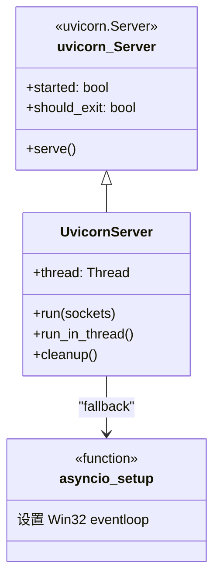

# uvicorn_threaded.py

## 概述
自定义的多线程 Uvicorn 服务器实现。继承 `uvicorn.Server`，解决了 Uvicorn 在多线程环境下运行的 event loop 问题。提供在独立线程中启动和停止 HTTP/WebSocket 服务器的能力，使 Freqtrade bot 能够在主线程运行交易逻辑的同时，在后台线程运行 API 服务器。

## 架构图

## 核心类/函数

### asyncio_setup()
为 Windows 平台设置正确的 asyncio event loop。
- **关键逻辑**: 在 Python 3.8+ 的 Windows 平台上，使用 `SelectorEventLoop` 替代默认的 `ProactorEventLoop`。这是为了解决 uvicorn 0.15.0 中引入的 event loop policy 变更问题
- **注意**: 标记为 `pragma: no cover`，仅在 Windows 上执行

### UvicornServer
多线程 Uvicorn 服务器类，继承自 `uvicorn.Server`。

#### run(sockets=None)
重写父类的 `run()` 方法，手动管理 event loop 的创建。
- **关键逻辑**:
  1. 优先尝试导入 `uvloop`，如可用则使用 uvloop 的 event loop（性能更优）
  2. 如果 uvloop 不可用，回退到 `asyncio_setup()`
  3. 尝试获取已有的 running loop，如果在线程中运行则创建新的 event loop
  4. 使用 `loop.run_until_complete(self.serve())` 启动服务
- **为什么重写**: 父类实现调用 `self.config.setup_event_loop()`，但在多线程场景下需要手动创建 event loop

#### run_in_thread()
在新线程中启动服务器。
- **关键逻辑**: 创建名为 "FTUvicorn" 的守护线程运行 `run()` 方法，然后阻塞等待直到服务器完成启动（`self.started` 为 True）

#### cleanup()
停止服务器并等待线程结束。
- **关键逻辑**: 设置 `self.should_exit = True` 通知服务器退出，然后 `self.thread.join()` 等待线程完成

## 依赖关系

### 内部依赖（本项目模块）
无

### 外部依赖（第三方库）
- `uvicorn` — ASGI 服务器，父类
- `uvloop`（可选）— 高性能 event loop 实现
- `threading` — 多线程支持
- `time` — 启动等待的 sleep

### 被依赖（谁引用了本文件）
- `freqtrade.rpc.api_server.webserver` — 导入 `UvicornServer` 用于启动 API 服务器
- `tests.rpc.test_rpc_apiserver` — 测试文件
