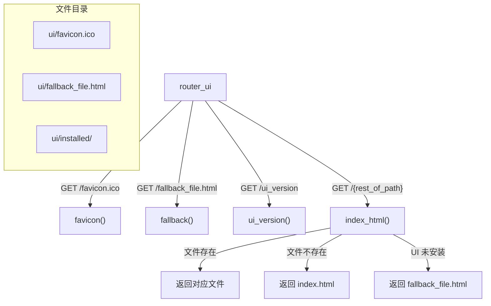

# web_ui.py

## 概述
Web UI 静态文件服务模块，负责提供 Freqtrade 前端用户界面（FreqUI）的静态文件服务。实现了 SPA (Single Page Application) 路由回退机制，确保前端路由在刷新时能正确加载。同时提供 favicon、fallback 页面和 UI 版本查询端点。

## 架构图

## 核心类/函数

### favicon()
`GET /favicon.ico` — 返回网站图标文件。
- **返回值**: `FileResponse` - 指向 `ui/favicon.ico` 文件

### fallback()
`GET /fallback_file.html` — 返回 UI 未安装时的回退页面。
- **返回值**: `FileResponse` - 指向 `ui/fallback_file.html` 文件

### ui_version()
`GET /ui_version` — 查询已安装的 UI 版本。
- **返回值**: JSON 对象，包含 `version` 字段（版本号字符串或 "not_installed"）
- **关键逻辑**: 调用 `read_ui_version()` 从 `ui/installed/` 目录读取版本信息

### index_html(rest_of_path)
`GET /{rest_of_path}` — 通用路由处理，实现 SPA 路由回退。
- **参数**: `rest_of_path` (str) - 请求路径
- **返回值**: `FileResponse` - 对应的静态文件或 index.html
- **关键逻辑**:
  1. **安全检查**: 拒绝以 "api" 或 "." 开头的路径（返回 404）
  2. **路径安全**: 使用 `resolve()` 解析绝对路径，并通过 `is_relative_to()` 检查防止目录遍历攻击
  3. **MIME 类型修复**: 对 `.js` 文件强制设置 `application/javascript` MIME 类型，解决部分系统配置错误的问题
  4. **文件存在**: 如果请求的文件存在于 `ui/installed/` 目录下，直接返回该文件
  5. **SPA 回退**: 如果文件不存在，返回 `index.html`（符合 Vue Router 的 history 模式要求）
  6. **UI 未安装**: 如果 `index.html` 也不存在，返回 `fallback_file.html`

## 依赖关系

### 内部依赖（本项目模块）
- `freqtrade.commands.deploy_ui` — `read_ui_version`（延迟导入）用于读取 UI 版本

### 外部依赖（第三方库）
- `fastapi` — `APIRouter`、`HTTPException`
- `starlette.responses` — `FileResponse` 静态文件响应
- `pathlib` — `Path` 路径处理

### 被依赖（谁引用了本文件）
- `freqtrade.rpc.api_server.webserver` — 在 `configure_app()` 中注册 `router_ui`（作为最后一个路由，确保不与 API 路由冲突）
