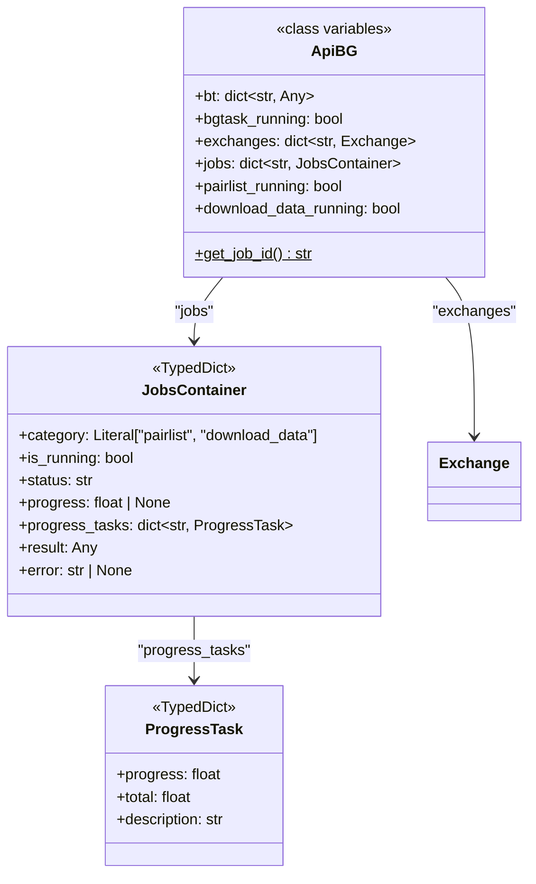

# webserver_bgwork.py

## 概述
API 服务器后台工作状态管理模块。定义了 `ApiBG` 类作为全局状态容器，管理后台任务（回测、pairlist 评估、数据下载等）的运行状态、Exchange 实例缓存以及任务结果。同时定义了 `ProgressTask` 和 `JobsContainer` 两个 TypedDict 用于类型标注。

## 架构图

## 核心类/函数

### ProgressTask (TypedDict)
子任务进度信息的类型定义。
- **字段**:
  - `progress` (float) — 已完成量
  - `total` (float) — 总量
  - `description` (str) — 任务描述

### JobsContainer (TypedDict)
后台任务容器的类型定义。
- **字段**:
  - `category` (Literal["pairlist", "download_data"]) — 任务类别
  - `is_running` (bool) — 是否正在运行
  - `status` (str) — 任务状态（如 "pending"、"success"、"failed"）
  - `progress` (float|None) — 整体进度
  - `progress_tasks` (dict[str, ProgressTask]) — 子任务进度（NotRequired）
  - `result` (Any) — 任务结果
  - `error` (str|None) — 错误信息

### ApiBG
全局后台工作状态容器类。所有属性均为类变量（class variables），实现全局单例效果。

#### 类变量
- **`bt`** (dict[str, Any]) — 回测状态字典，包含：
  - `"bt"` — Backtesting 实例或 None
  - `"data"` — 回测数据或 None
  - `"timerange"` — 时间范围或 None
  - `"last_config"` — 上次回测配置
  - `"bt_error"` — 回测错误信息或 None
- **`bgtask_running`** (bool) — 回测后台任务是否运行中
- **`exchanges`** (dict[str, Exchange]) — Exchange 实例缓存，key 为 "{exchange_name}_{trading_mode}"
- **`jobs`** (dict[str, JobsContainer]) — 通用后台任务注册表，key 为 job_id
- **`pairlist_running`** (bool) — pairlist 评估是否运行中
- **`download_data_running`** (bool) — 数据下载是否运行中

#### get_job_id() -> str
静态方法，生成唯一的任务 ID。
- **返回值**: UUID4 字符串

## 依赖关系

### 内部依赖（本项目模块）
- `freqtrade.exchange.exchange` — `Exchange` 类型（用于类型标注）

### 外部依赖（第三方库）
- `typing_extensions` — `TypedDict`
- `uuid` — `uuid4` 生成唯一 ID

### 被依赖（谁引用了本文件）
- `freqtrade.rpc.api_server.webserver` — 导入 `ApiBG` 用于清理和状态管理
- `freqtrade.rpc.api_server.api_backtest` — 导入 `ApiBG` 管理回测任务状态
- `freqtrade.rpc.api_server.api_download_data` — 导入 `ApiBG` 管理数据下载任务状态
- `freqtrade.rpc.api_server.api_pairlists` — 导入 `ApiBG` 管理 pairlist 评估任务状态
- `freqtrade.rpc.api_server.api_background_tasks` — 导入 `ApiBG` 查询任务状态
- `freqtrade.rpc.api_server.api_schemas` — 导入 `ProgressTask` 类型用于响应模型
- `freqtrade.rpc.api_server.deps` — 导入 `ApiBG` 管理 exchange 缓存
- `tests.rpc.test_rpc_apiserver` — 测试文件
