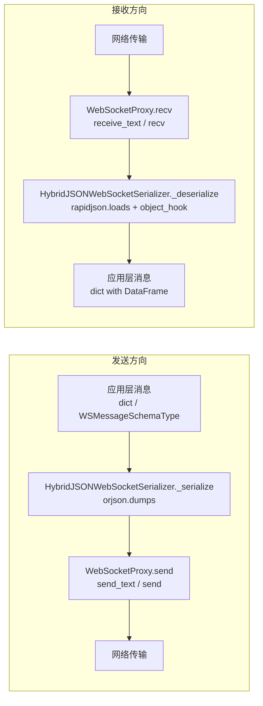
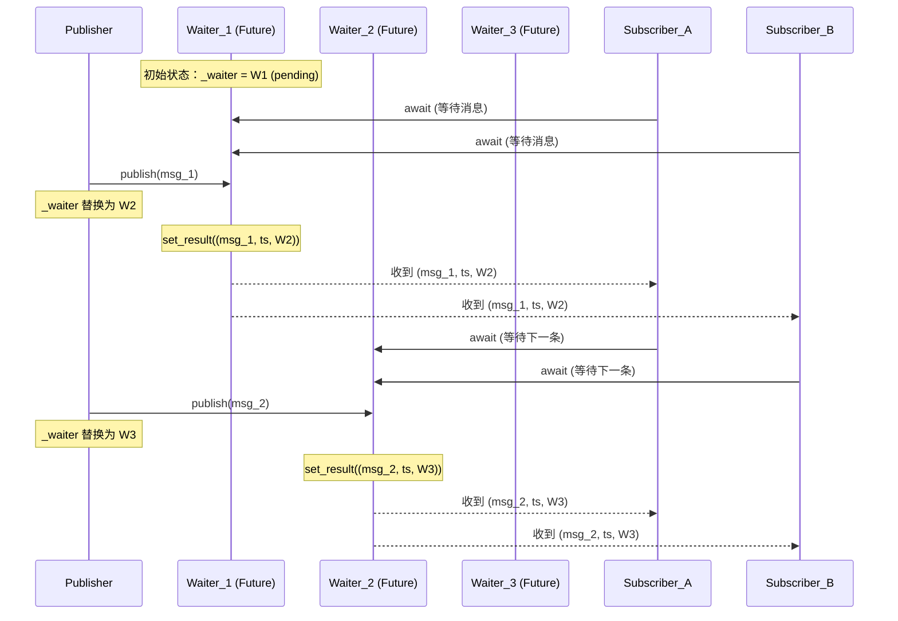
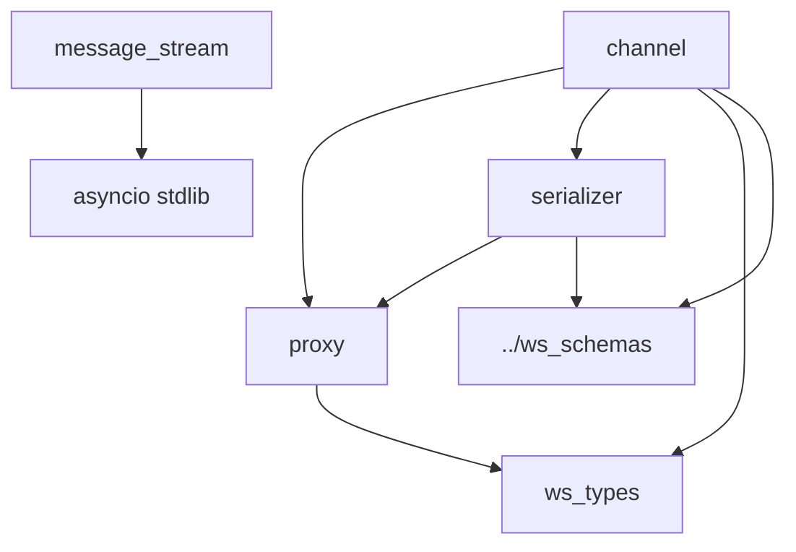
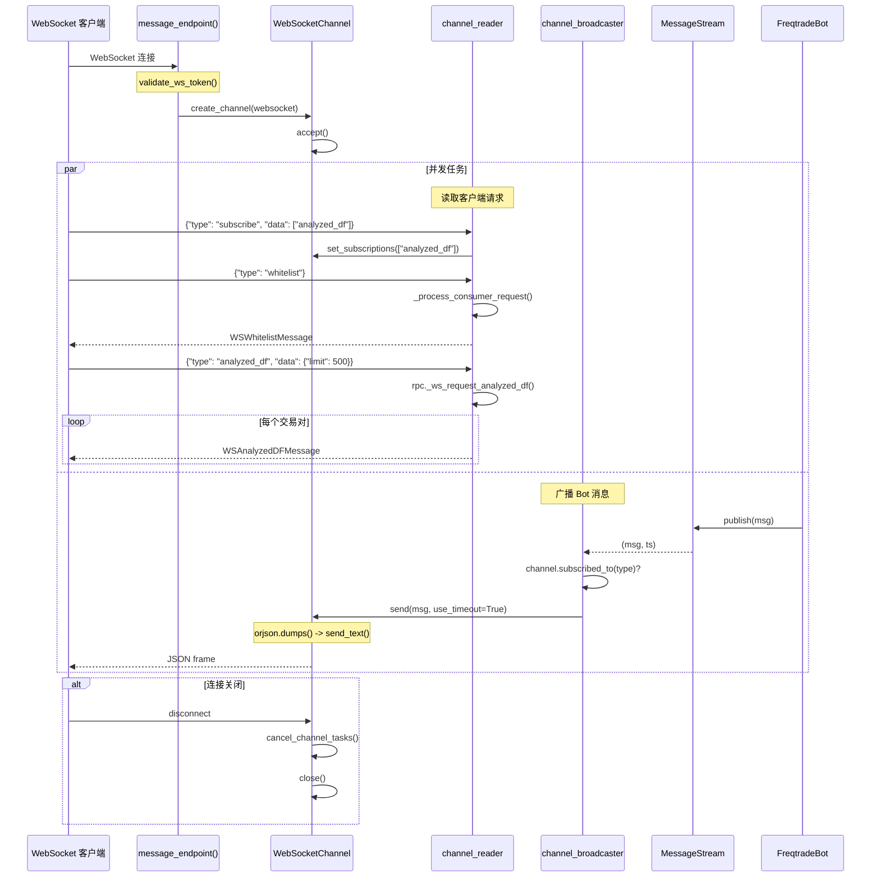
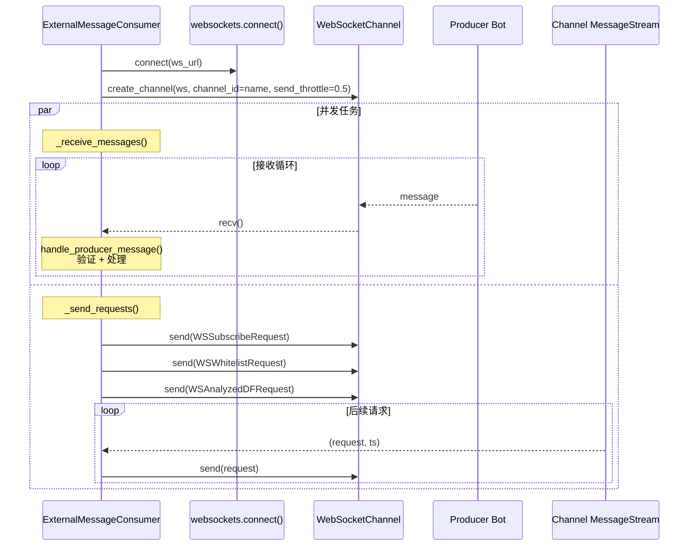
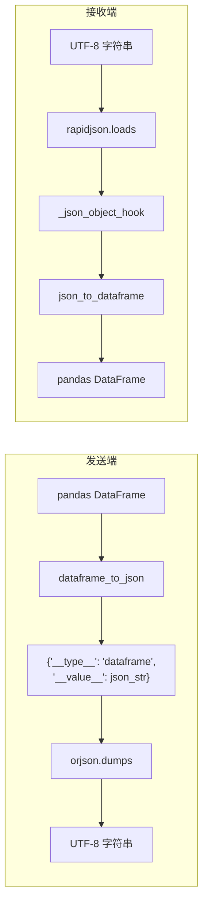

# WebSocket 通信模块源码文档

## 1. 模块概述

WebSocket 通信模块是 freqtrade API Server 的**实时消息传输底层基础设施**。它实现了一个通用的 WebSocket 通信框架，支持两种 WebSocket 实现的统一封装（FastAPI WebSocket 和 `websockets` 库的 ClientConnection），提供消息序列化/反序列化、通道管理、消息流发布-订阅等功能。

该模块被两个上游消费者使用：
1. **API Server 端**：`api_ws.py` 使用它向 FreqUI 等客户端推送实时交易数据
2. **ExternalMessageConsumer 端**：使用它连接到其他 Freqtrade Bot 消费分析数据

核心设计特点：
- **协议无关**：通过 `WebSocketProxy` 统一 FastAPI WebSocket（服务端）和 `websockets.ClientConnection`（客户端）的 API
- **异步原生**：全面使用 asyncio，支持 `async for`、`asynccontextmanager` 等现代 Python 异步模式
- **自适应限流**：`WebSocketChannel` 根据历史发送时间动态计算超时阈值，防止慢客户端阻塞
- **零拷贝广播**：`MessageStream` 使用 asyncio Future 链实现高效的一对多消息分发

## 2. 目录结构

```
freqtrade/rpc/api_server/ws/
├── __init__.py           # 模块导出：WebSocketType, WebSocketProxy,
│                         #            HybridJSONWebSocketSerializer, WebSocketChannel, MessageStream
├── ws_types.py           # 类型定义：WebSocketType TypeVar, MessageType
├── proxy.py              # WebSocketProxy - 统一 FastAPI/websockets 的 API 适配器
├── serializer.py         # WebSocketSerializer 抽象基类 + HybridJSONWebSocketSerializer 实现
├── channel.py            # WebSocketChannel - 完整的 WebSocket 通道管理器
├── message_stream.py     # MessageStream - 异步消息流（发布-订阅模式）
```

## 3. 架构图

```mermaid
graph TB
    subgraph 上游使用者
        APIWS[api_ws.py<br/>WebSocket 端点]
        EMC[ExternalMessageConsumer<br/>外部消息消费者]
    end

    subgraph WebSocket 通信模块
        subgraph 通道层
            Channel[WebSocketChannel<br/>通道管理器]
            CreateCh[create_channel()<br/>Context Manager]
        end

        subgraph 序列化层
            Serializer[WebSocketSerializer<br/>抽象基类]
            HybridJSON[HybridJSONWebSocketSerializer<br/>orjson + rapidjson]
        end

        subgraph 代理层
            Proxy[WebSocketProxy<br/>WebSocket 适配器]
        end

        subgraph 类型层
            WSTypes[WebSocketType<br/>TypeVar]
        end

        subgraph 消息流
            MsgStream[MessageStream<br/>发布-订阅消息流]
        end
    end

    subgraph 底层 WebSocket 实现
        FastAPIWS[FastAPI WebSocket<br/>服务端]
        WSLib[websockets.ClientConnection<br/>客户端]
    end

    APIWS --> CreateCh
    EMC --> CreateCh

    CreateCh --> Channel
    Channel --> HybridJSON
    HybridJSON --> Proxy
    Proxy --> FastAPIWS
    Proxy --> WSLib

    APIWS --> MsgStream
    EMC --> MsgStream

    Channel -.-> WSTypes
    Proxy -.-> WSTypes
```

### 消息处理管道



## 4. 核心类/函数说明

### 4.1 `WebSocketType` / `MessageType` (ws_types.py)

类型定义文件，提供 TypeVar 用于泛型支持：

```python
WebSocketType = TypeVar("WebSocketType", FastAPIWebSocket, WebSocket)
MessageType = dict[str, Any]
```

`WebSocketType` 是一个受约束的 TypeVar，只接受两种类型：
- `fastapi.WebSocket` -- FastAPI 的服务端 WebSocket
- `websockets.asyncio.client.ClientConnection` -- websockets 库的客户端连接

### 4.2 `WebSocketProxy` (proxy.py)

WebSocket 适配器，将两种不同的 WebSocket API 统一为一致的接口：

```python
class WebSocketProxy:
    def __init__(self, websocket: WebSocketType)

    @property
    def raw_websocket                    # 获取底层 WebSocket 对象
    @property
    def remote_addr -> tuple[Any, ...]   # 远程地址

    async def send(self, data)           # 发送数据
    async def recv(self)                 # 接收数据
    async def ping(self)                 # Ping（仅 websockets 支持）
    async def close(self, code=1000)     # 关闭连接（仅 FastAPI 支持）
    async def accept(self)               # 接受连接（仅 FastAPI 支持）
```

**API 差异处理：**

| 操作 | FastAPI WebSocket | websockets.ClientConnection |
|------|-------------------|----------------------------|
| 发送 | `send_text(data)` | `send(data)` |
| 接收 | `receive_text()` | `recv()` |
| Ping | 不支持（返回 False） | `ping()` |
| 关闭 | `close(code)` | `close(code)` |
| 接受连接 | `accept()` | 不需要 |
| 远程地址 | `client.host, client.port` | `remote_address` |

### 4.3 `WebSocketSerializer` / `HybridJSONWebSocketSerializer` (serializer.py)

消息序列化/反序列化抽象层：

```python
class WebSocketSerializer(ABC):
    def __init__(self, websocket: WebSocketProxy)
    @abstractmethod
    def _serialize(self, data)           # 序列化
    @abstractmethod
    def _deserialize(self, data)         # 反序列化
    async def send(self, data)           # 序列化 + 发送
    async def recv(self) -> bytes        # 接收 + 反序列化
```

**`HybridJSONWebSocketSerializer`** -- 混合 JSON 序列化器：

- **序列化**（发送方向）：使用 `orjson.dumps()`
  - 高性能，原生支持 NumPy 类型
  - 通过 `_json_default()` 自定义处理 pandas DataFrame
  - DataFrame 序列化为 `{"__type__": "dataframe", "__value__": json_str}`

- **反序列化**（接收方向）：使用 `rapidjson.loads()`
  - 通过 `_json_object_hook()` 自动将标记了 `__type__: dataframe` 的对象还原为 pandas DataFrame
  - 使用 `rapidjson` 而非 `orjson` 是因为需要 `object_hook` 功能

**为什么是"混合"（Hybrid）？** 因为发送使用 orjson（追求速度），接收使用 rapidjson（需要 object_hook 功能）。

### 4.4 `WebSocketChannel` (channel.py) -- 核心类

完整的 WebSocket 通道管理器，这是整个 ws 模块的**核心类**：

```python
class WebSocketChannel:
    def __init__(
        self,
        websocket: WebSocketType,
        channel_id: str | None = None,
        serializer_cls: type[WebSocketSerializer] = HybridJSONWebSocketSerializer,
        send_throttle: float = 0.01,
    )
```

**属性：**

| 属性 | 类型 | 说明 |
|------|------|------|
| `channel_id` | `str` | 通道 ID（默认 uuid4 前8位） |
| `_websocket` | `WebSocketProxy` | 代理后的 WebSocket |
| `_closed` | `asyncio.Event` | 关闭状态事件 |
| `_channel_tasks` | `list[asyncio.Task]` | 通道内运行的异步任务 |
| `_send_times` | `deque[float]` | 最近 10 次发送耗时 |
| `_send_high_limit` | `float` | 动态计算的发送超时上限（初始 3 秒） |
| `_send_throttle` | `float` | 发送节流间隔（默认 10ms） |
| `_subscriptions` | `list[str]` | 订阅的消息类型列表 |
| `_wrapped_ws` | `WebSocketSerializer` | 带序列化的 WebSocket |

**核心方法：**

```python
async def send(self, message, use_timeout=False)
    # 1. 如果 use_timeout=True，使用 asyncio.wait_for 设置超时
    # 2. 记录发送时间到 _send_times
    # 3. 动态计算 _send_high_limit = min(max(avg_time * 2, 1), 3)
    # 4. asyncio.sleep(_send_throttle) 限流

async def recv(self)
    # 接收并反序列化消息

async def ping(self)
    # 通过代理发送 ping

async def accept(self)
    # 接受 WebSocket 连接

async def close(self)
    # 设置 _closed 事件，关闭底层 WebSocket

def set_subscriptions(self, subscriptions: list[str])
    # 设置消息订阅列表

def subscribed_to(self, message_type: str) -> bool
    # 检查是否订阅了指定消息类型

async def run_channel_tasks(self, *tasks, **kwargs)
    # 并发运行多个任务（asyncio.gather）
    # 任何异常会取消所有其他任务

async def cancel_channel_tasks(self)
    # 取消所有通道任务并等待完成

async def __aiter__(self)
    # 异步迭代器，yield 接收到的消息
```

**自适应超时机制：**

```mermaid
graph TD
    Send[发送消息] --> Record[记录发送耗时]
    Record --> Check{send_times 已满?<br/>maxlen=10}
    Check -->|是| Calc[计算新 limit<br/>= min(max(avg*2, 1), 3)]
    Check -->|否| Done[保持当前 limit]
    Calc --> Done

    subgraph 超时判断
        UseTimeout{use_timeout?}
        UseTimeout -->|是| WaitFor[asyncio.wait_for<br/>timeout=_send_high_limit]
        UseTimeout -->|否| NoLimit[无超时限制]
        WaitFor -->|超时| Disconnect[断开连接]
    end
```

**`create_channel()` -- 异步上下文管理器：**

```python
@asynccontextmanager
async def create_channel(websocket, **kwargs) -> AsyncIterator[WebSocketChannel]:
    channel = WebSocketChannel(websocket, **kwargs)
    try:
        await channel.accept()
        yield channel
    finally:
        await channel.close()
```

确保 WebSocket 连接在使用后正确关闭，即使发生异常。

### 4.5 `MessageStream` (message_stream.py) -- 消息流

基于 asyncio Future 链的异步消息发布-订阅实现：

```python
class MessageStream:
    def __init__(self):
        self._loop = asyncio.get_running_loop()
        self._waiter = self._loop.create_future()

    def publish(self, message):
        waiter, self._waiter = self._waiter, self._loop.create_future()
        waiter.set_result((message, time.time(), self._waiter))

    async def __aiter__(self):
        waiter = self._waiter
        while True:
            message, ts, waiter = await asyncio.shield(waiter)
            yield message, ts
```

**工作原理详解：**



**关键设计点：**

1. **零拷贝广播**：每个消息只需 set_result 一次，所有等待该 Future 的订阅者同时收到
2. **链式 Future**：每条消息的结果包含下一个 Future 的引用，形成链式结构
3. **`asyncio.shield`**：防止订阅者被取消时影响 Future 本身
4. **时间戳**：每条消息附带 `time.time()` 时间戳，用于延迟检测
5. **新订阅者只收到新消息**：从当前 `_waiter` 开始等待，不会收到历史消息
6. **无锁设计**：不需要 Lock，因为 `publish()` 是同步操作且 GIL 保护

## 5. 依赖关系

### 内部依赖图



### 外部依赖

| 依赖 | 使用文件 | 说明 |
|------|----------|------|
| `fastapi` | proxy.py, ws_types.py | FastAPI WebSocket 类型 |
| `websockets` | proxy.py, ws_types.py, channel.py | WebSocket 客户端库 |
| `orjson` | serializer.py | 高性能 JSON 序列化（发送） |
| `rapidjson` | serializer.py | JSON 反序列化（接收，支持 object_hook） |
| `pandas` | serializer.py | DataFrame 序列化/反序列化 |
| `asyncio` (stdlib) | channel.py, message_stream.py | 异步编程基础 |

### 上游使用者

| 使用者 | 文件路径 | 使用方式 |
|--------|----------|----------|
| API WebSocket 端点 | `api_server/api_ws.py` | `create_channel()` 创建服务端通道 |
| ExternalMessageConsumer | `rpc/external_message_consumer.py` | `create_channel()` 创建客户端通道 |
| ApiServer | `api_server/webserver.py` | 创建 `MessageStream` 实例 |

## 6. 数据流

### 6.1 服务端 WebSocket 完整数据流



### 6.2 客户端 WebSocket 数据流（ExternalMessageConsumer）



### 6.3 DataFrame 序列化流



这种序列化方案确保了 pandas DataFrame 可以在 WebSocket 上透明传输，接收端自动还原为 DataFrame 对象。
