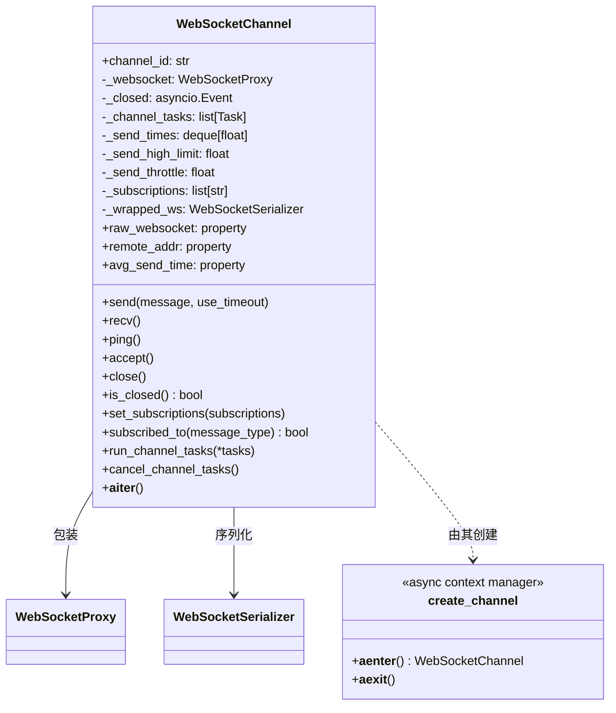
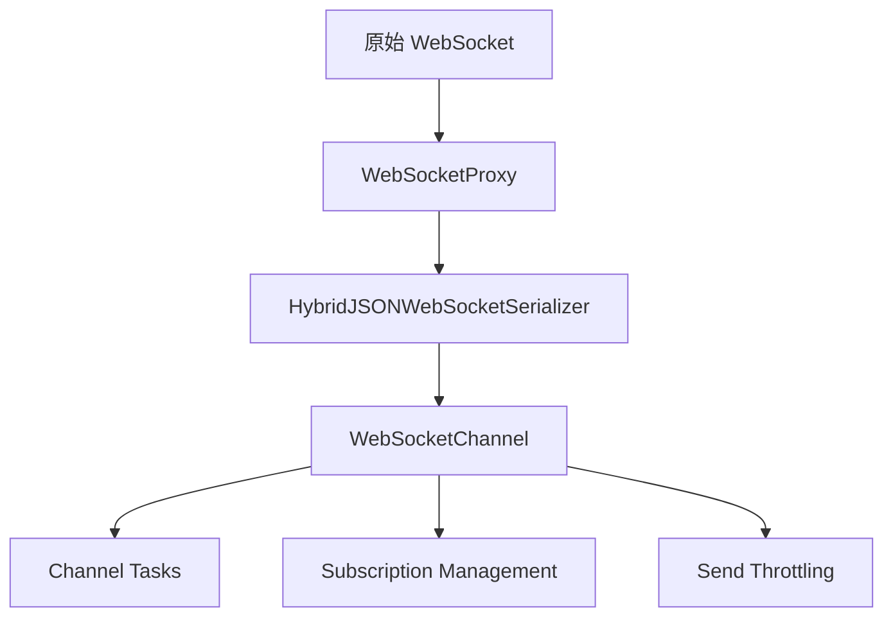

# channel.py

## 概述

`freqtrade/rpc/api_server/ws/channel.py` 实现了 WebSocket 通道管理，是 WebSocket 通信的核心封装层。`WebSocketChannel` 类将原始的 WebSocket 连接包装为一个功能丰富的通道对象，提供消息收发、超时控制、自适应发送限速、订阅管理和并发任务管理等能力。配合 `create_channel` 上下文管理器，实现了连接的安全创建和关闭。

## 架构图

## 核心类/函数

### WebSocketChannel

WebSocket 通道管理类，封装连接生命周期和消息收发。

#### `__init__(self, websocket, channel_id=None, serializer_cls=HybridJSONWebSocketSerializer, send_throttle=0.01)`
- **参数**:
  - `websocket: WebSocketType` -- 原始 WebSocket 对象
  - `channel_id: str | None` -- 通道标识（默认生成 8 位随机 hex）
  - `serializer_cls` -- 序列化器类（默认 `HybridJSONWebSocketSerializer`）
  - `send_throttle: float` -- 发送节流间隔（默认 0.01 秒）
- **初始化内容**:
  - 用 `WebSocketProxy` 包装原始 WebSocket
  - 创建 `_closed` 事件用于标识连接关闭
  - 初始化发送时间队列（最近 10 次）用于自适应限速
  - 默认发送高限为 3 秒
  - 创建序列化器实例包装代理对象

#### `__repr__(self) -> str`
- **返回**: `WebSocketChannel(channel_id, remote_addr)`

#### `raw_websocket` (property)
- **返回**: 底层原始 WebSocket 对象

#### `remote_addr` (property)
- **返回**: 远端地址

#### `avg_send_time` (property)
- **返回**: 最近发送的平均耗时

#### `_calc_send_limit(self)`
- **职责**: 基于最近发送时间动态计算发送超时限制
- **算法**: 当收集满 10 次数据后，取 `min(max(avg_time * 2, 1), 3)` 秒
- **范围**: 1 秒到 3 秒之间

#### `send(self, message, use_timeout=False)` (async)
- **参数**: `message` -- 消息对象或字典；`use_timeout` -- 是否启用超时限制
- **职责**: 通过序列化器发送消息
- **关键逻辑**:
  - 使用 `asyncio.wait_for` 控制超时
  - 记录每次发送耗时到 `_send_times` 队列
  - 超时时抛出 `TimeoutError`（由上层处理连接关闭）
  - 发送后 `await asyncio.sleep(_send_throttle)` 进行节流

#### `recv(self)` (async)
- **返回**: 接收到的反序列化消息
- **职责**: 通过序列化器接收消息

#### `ping(self)` (async)
- **返回**: Pong Future
- **职责**: 向远端发送 ping

#### `accept(self)` (async)
- **职责**: 接受 WebSocket 连接（仅 FastAPI 模式需要）
- **异常处理**: 如果 accept 前连接已关闭，自动调用 `close()`

#### `close(self)` (async)
- **职责**: 关闭通道
- **关键逻辑**: 设置 `_closed` Event，然后关闭底层 WebSocket

#### `is_closed(self) -> bool`
- **返回**: 通道是否已关闭

#### `set_subscriptions(self, subscriptions: list[str])`
- **参数**: `subscriptions` -- 订阅的消息类型列表
- **职责**: 设置此通道订阅的消息类型

#### `subscribed_to(self, message_type: str) -> bool`
- **返回**: 此通道是否订阅了指定的消息类型

#### `run_channel_tasks(self, *tasks, **kwargs)` (async)
- **参数**: `*tasks` -- 协程或 Task 对象
- **职责**: 并发运行通道相关的任务
- **关键逻辑**:
  - 将协程包装为 Task
  - 使用 `asyncio.gather` 并发执行
  - 任何任务抛出异常时取消所有其他任务

#### `cancel_channel_tasks(self)` (async)
- **职责**: 取消所有通道任务并等待完成
- **异常处理**: 静默处理 `TimeoutError`、`CancelledError`、`WebSocketDisconnect`、`ConnectionClosed`、`RuntimeError`

#### `__aiter__(self)` (async generator)
- **职责**: 异步迭代器，持续 yield 接收到的消息，直到通道关闭

### create_channel(websocket, **kwargs) (异步上下文管理器)
- **参数**: `websocket: WebSocketType`；`**kwargs` 传递给 `WebSocketChannel` 构造函数
- **返回**: `WebSocketChannel` 实例
- **职责**: 安全地创建、accept 和关闭 WebSocket 通道
- **关键逻辑**: `try` 块中 accept 并 yield；`finally` 块中 close 并记录断开日志

## 依赖关系

### 内部依赖（本项目模块）
- `freqtrade.rpc.api_server.ws.proxy` -- 导入 `WebSocketProxy`
- `freqtrade.rpc.api_server.ws.serializer` -- 导入 `HybridJSONWebSocketSerializer`、`WebSocketSerializer`
- `freqtrade.rpc.api_server.ws.ws_types` -- 导入 `WebSocketType`
- `freqtrade.rpc.api_server.ws_schemas` -- 导入 `WSMessageSchemaType`

### 外部依赖（第三方库）
- `asyncio` -- 异步事件管理、任务、超时控制
- `logging` -- 日志记录
- `time` -- 发送耗时测量
- `collections.deque` -- 定长队列存储发送时间
- `uuid` -- 生成默认 channel_id
- `fastapi` -- `WebSocketDisconnect` 异常
- `websockets.exceptions` -- `ConnectionClosed` 异常

### 被依赖（谁引用了本文件）
- `freqtrade.rpc.api_server.ws.__init__` -- 导出 `WebSocketChannel`
- `freqtrade.rpc.external_message_consumer` -- 使用 `WebSocketChannel` 和 `create_channel` 管理与 Producer 的连接
- `freqtrade.rpc.api_server.api_ws` -- 使用 `WebSocketChannel` 管理客户端连接
