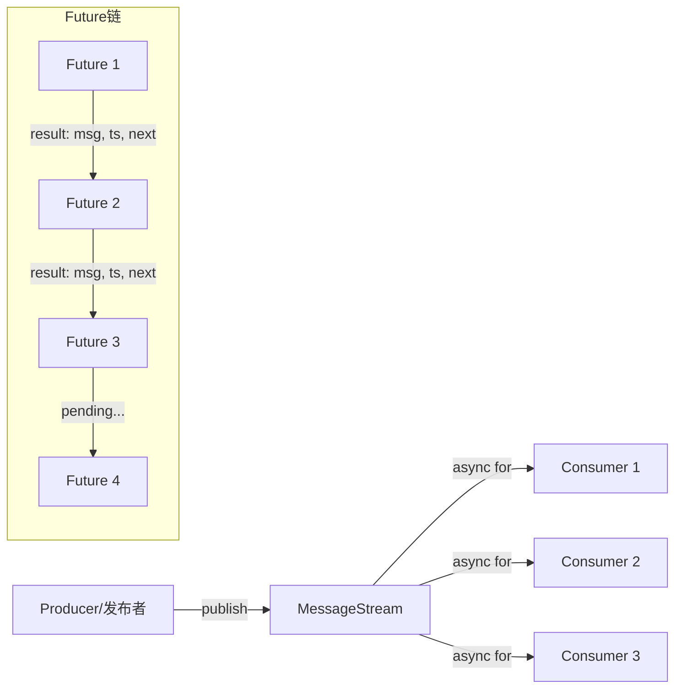
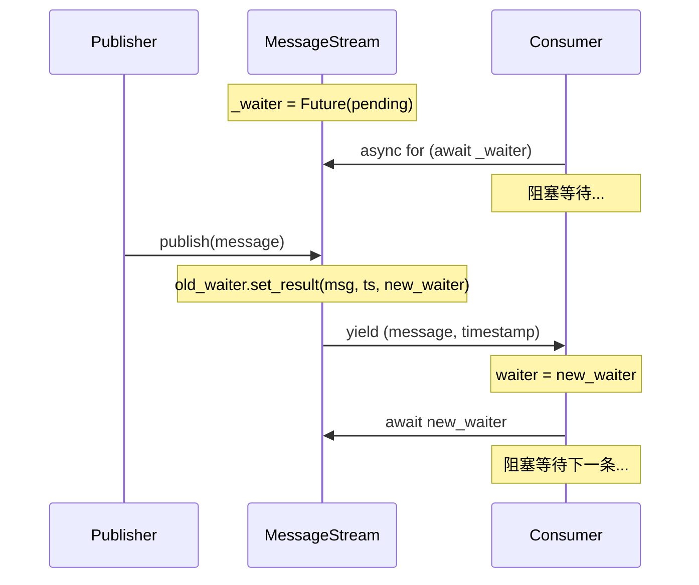

# message_stream.py

## 概述

`freqtrade/rpc/api_server/ws/message_stream.py` 实现了一个轻量级的异步消息流（Message Stream），基于 asyncio Future 链实现了 publish-subscribe 模式。多个消费者可以异步迭代同一个 `MessageStream` 来接收发布的消息，每个消费者独立跟踪自己的读取位置。这种设计非常高效，无需锁机制或队列复制。

## 架构图

## 核心类/函数

### MessageStream

异步消息流，支持一对多的消息发布-订阅。

#### `__init__(self)`
- **职责**: 获取当前事件循环，创建初始的 Future 对象作为等待点
- **前提条件**: 必须在异步上下文中创建（需要运行中的事件循环）

#### `publish(self, message)`
- **参数**: `message` -- 要发布的消息（任意类型）
- **职责**: 向所有等待中的消费者发布消息
- **关键逻辑**:
  1. 保存当前 `_waiter`（旧 Future）
  2. 创建新的 `_waiter`（新 Future）
  3. 用 `set_result((message, timestamp, new_waiter))` 完成旧 Future
  4. 消费者收到 result 后，从中取出新 Future 继续等待
- **时间复杂度**: O(1) -- 不需要遍历消费者列表
- **线程安全**: 适用于单个事件循环内的协程

#### `__aiter__(self)` (async generator)
- **职责**: 异步迭代器，持续 yield `(message, timestamp)` 元组
- **关键逻辑**:
  - 保存本地 `waiter` 变量（各消费者独立跟踪位置）
  - 使用 `asyncio.shield(waiter)` 防止 Future 被外部取消
  - 每次迭代从 result 中解构出 `(message, ts, next_waiter)`
  - 更新 `waiter = next_waiter` 继续等待下一条消息

**设计亮点**:
- 使用 Future 链而非队列，天然支持多消费者，且每个消费者独立追踪进度
- `asyncio.shield` 确保一个消费者被取消不会影响其他消费者
- 无需显式的消费者注册或注销
- 新消费者加入时只能收到加入后发布的消息

## 依赖关系

### 内部依赖（本项目模块）
无

### 外部依赖（第三方库）
- `asyncio` -- 事件循环和 Future 对象
- `time` -- 消息时间戳

### 被依赖（谁引用了本文件）
- `freqtrade.rpc.api_server.ws.__init__` -- 导出 `MessageStream`
- `freqtrade.rpc.external_message_consumer` -- 为每个 Producer 连接创建 `MessageStream` 实例，用于异步发送请求
- `freqtrade.rpc.api_server.webserver` -- 在 API Server 中使用 `MessageStream` 广播消息给 WebSocket 客户端
- `freqtrade.rpc.api_server.api_ws` -- 消费 `MessageStream` 中的消息并发送到 WebSocket 客户端
