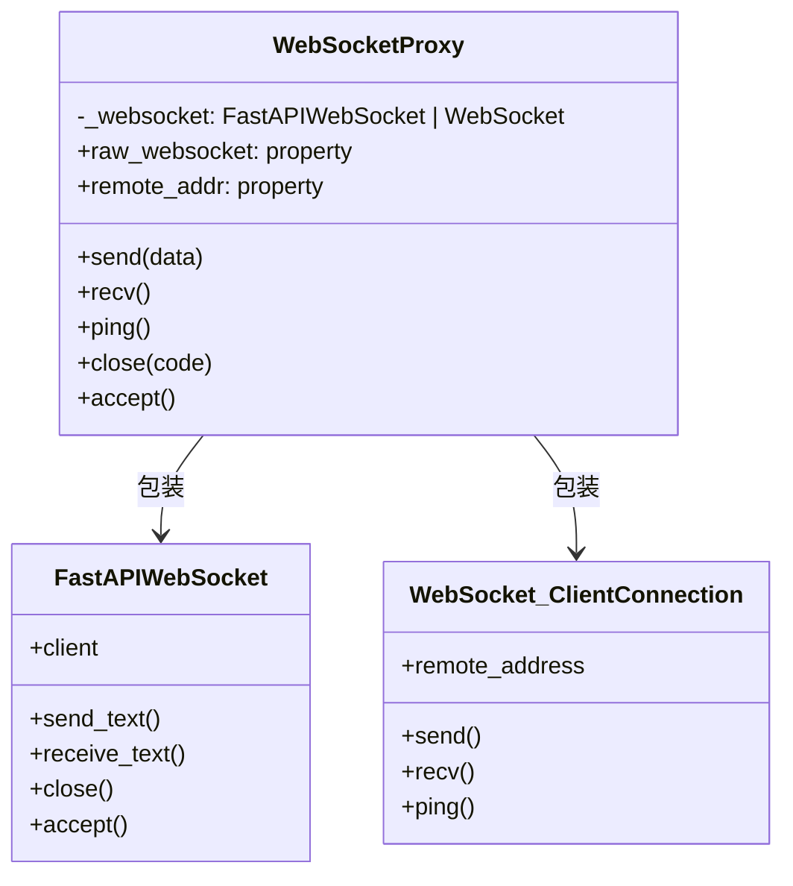

# proxy.py

## 概述

`freqtrade/rpc/api_server/ws/proxy.py` 实现了 `WebSocketProxy` 代理类，将 FastAPI WebSocket 和 websockets 库的 `ClientConnection` 这两种不同的 WebSocket 实现统一到相同的 API 接口下。这是一个适配器模式（Adapter Pattern）的应用，使得上层代码（如 `WebSocketChannel`、`WebSocketSerializer`）无需关心底层使用的是哪种 WebSocket 实现。

## 架构图

## 核心类/函数

### WebSocketProxy

WebSocket 代理类，统一两种 WebSocket 实现的 API。

#### `__init__(self, websocket: WebSocketType)`
- **参数**: `websocket` -- FastAPI WebSocket 或 websockets ClientConnection 实例
- **职责**: 保存底层 WebSocket 对象

#### `raw_websocket` (property)
- **返回**: 原始的底层 WebSocket 对象
- **用途**: 需要直接访问底层实现时使用

#### `remote_addr` (property) -> tuple[Any, ...]
- **返回**: 远端地址元组 `(host, port)`
- **关键逻辑**:
  - 对于 websockets 的 `ClientConnection`：访问 `remote_address` 属性
  - 对于 FastAPI 的 `WebSocket`：通过 `websocket.client.host` 和 `websocket.client.port` 获取
  - 无法获取时返回 `("unknown", 0)`

#### `send(self, data)` (async)
- **参数**: `data` -- 要发送的文本数据
- **关键逻辑**:
  - FastAPI WebSocket: 调用 `send_text(data)`
  - websockets: 调用 `send(data)`
  - 通过 `hasattr` 检测方法是否存在来区分实现

#### `recv(self)` (async)
- **返回**: 接收到的文本数据
- **关键逻辑**:
  - FastAPI WebSocket: 调用 `receive_text()`
  - websockets: 调用 `recv()`

#### `ping(self)` (async)
- **返回**: ping 的 pong Future 或 `False`
- **说明**: FastAPI WebSocket 不支持 ping，此时返回 `False`

#### `close(self, code: int = 1000)` (async)
- **参数**: `code` -- WebSocket 关闭状态码（默认 1000 正常关闭）
- **说明**: 仅 FastAPI WebSocket 支持 `close`，捕获 `RuntimeError`（连接已关闭时）

#### `accept(self)` (async)
- **说明**: 仅 FastAPI WebSocket 需要显式 accept，websockets 客户端连接无需此操作

## 依赖关系

### 内部依赖（本项目模块）
- `freqtrade.rpc.api_server.ws.ws_types` -- 导入 `WebSocketType`

### 外部依赖（第三方库）
- `typing` -- `Any` 类型
- `fastapi` -- `WebSocket as FastAPIWebSocket`
- `websockets.asyncio.client` -- `ClientConnection as WebSocket`

### 被依赖（谁引用了本文件）
- `freqtrade.rpc.api_server.ws.__init__` -- 导出 `WebSocketProxy`
- `freqtrade.rpc.api_server.ws.channel` -- `WebSocketChannel` 内部使用 `WebSocketProxy` 包装原始 WebSocket
- `freqtrade.rpc.api_server.ws.serializer` -- `WebSocketSerializer` 持有 `WebSocketProxy` 引用
