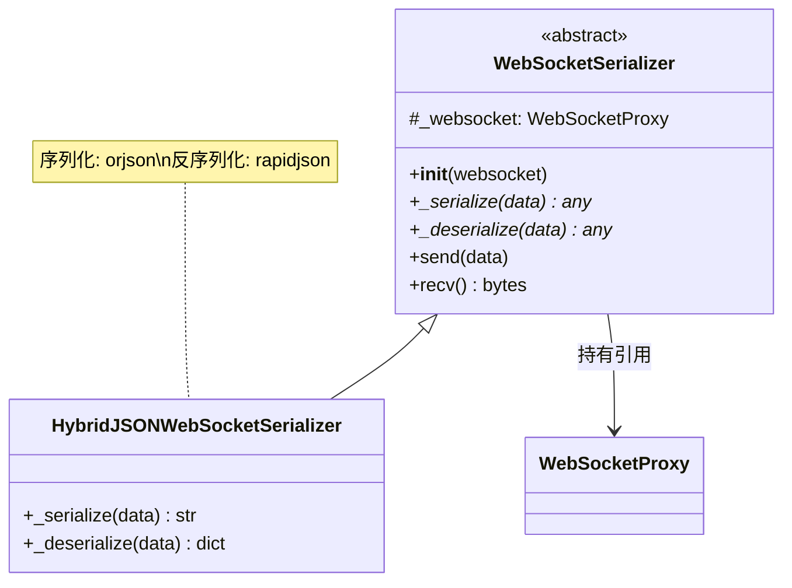

# serializer.py

## 概述

`freqtrade/rpc/api_server/ws/serializer.py` 实现了 WebSocket 消息的序列化和反序列化逻辑。核心是 `HybridJSONWebSocketSerializer`，它使用 `orjson` 进行高性能 JSON 序列化（发送），使用 `rapidjson` 进行反序列化（接收），并特别支持 Pandas DataFrame 的透明序列化/反序列化，使得包含 DataFrame 的消息可以在 WebSocket 上无缝传输。

## 架构图

## 核心类/函数

### WebSocketSerializer（抽象基类）

WebSocket 序列化器的抽象基类，定义序列化/反序列化接口。

#### `__init__(self, websocket: WebSocketProxy)`
- **参数**: `websocket` -- WebSocket 代理对象
- **职责**: 保存 WebSocket 代理引用

#### `_serialize(self, data)` (abstract)
- **职责**: 将 Python 对象序列化为可传输的格式

#### `_deserialize(self, data)` (abstract)
- **职责**: 将接收到的数据反序列化为 Python 对象

#### `send(self, data)` (async)
- **参数**: `data` -- `WSMessageSchemaType` 或 `dict[str, Any]`
- **职责**: 序列化数据后通过 WebSocket 发送

#### `recv(self)` (async)
- **返回**: 反序列化后的数据
- **职责**: 从 WebSocket 接收数据并反序列化

### HybridJSONWebSocketSerializer

混合 JSON 序列化器实现，使用两种不同的 JSON 库分别处理序列化和反序列化。

#### `_serialize(self, data) -> str`
- **使用库**: `orjson`
- **返回**: UTF-8 编码的 JSON 字符串
- **特殊处理**: 通过 `default=_json_default` 参数支持 DataFrame 的自定义序列化
- **选择 orjson 的原因**: 序列化速度极快，适合频繁发送大量数据

#### `_deserialize(self, data: str)`
- **使用库**: `rapidjson`
- **参数**: `data` -- JSON 字符串
- **返回**: Python 字典
- **特殊处理**: 通过 `object_hook=_json_object_hook` 参数支持 DataFrame 的自定义反序列化
- **选择 rapidjson 的原因**: 支持 `object_hook` 参数（orjson 不支持），可以在反序列化时直接处理自定义类型

### _json_default(z) (模块级函数)
- **参数**: `z` -- orjson 无法默认序列化的对象
- **职责**: 为 orjson 提供自定义类型的序列化逻辑
- **关键逻辑**:
  - 如果 `z` 是 `DataFrame`，转换为 `{"__type__": "dataframe", "__value__": <json_data>}`
  - 使用 `dataframe_to_json` 将 DataFrame 转为 JSON 字符串
  - 不支持的类型抛出 `TypeError`

### _json_object_hook(z) (模块级函数)
- **参数**: `z` -- 反序列化过程中的字典对象
- **职责**: 为 rapidjson 提供自定义类型的反序列化逻辑
- **关键逻辑**:
  - 检查字典是否包含 `__type__: "dataframe"` 标记
  - 如果是，使用 `json_to_dataframe` 将 `__value__` 转回 DataFrame
  - 否则原样返回字典

## 依赖关系

### 内部依赖（本项目模块）
- `freqtrade.misc` -- 导入 `dataframe_to_json`、`json_to_dataframe`（DataFrame 与 JSON 互转工具）
- `freqtrade.rpc.api_server.ws.proxy` -- 导入 `WebSocketProxy`
- `freqtrade.rpc.api_server.ws_schemas` -- 导入 `WSMessageSchemaType`

### 外部依赖（第三方库）
- `orjson` -- 高性能 JSON 序列化库，用于消息发送
- `rapidjson` -- 带 object_hook 支持的 JSON 解析库，用于消息接收
- `pandas` -- `DataFrame` 类型检测
- `logging` -- 日志记录

### 被依赖（谁引用了本文件）
- `freqtrade.rpc.api_server.ws.__init__` -- 导出 `HybridJSONWebSocketSerializer`
- `freqtrade.rpc.api_server.ws.channel` -- `WebSocketChannel` 默认使用 `HybridJSONWebSocketSerializer` 作为序列化器
