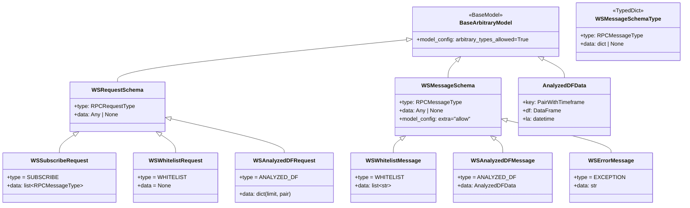

# ws_schemas.py

## 概述
WebSocket 消息的 Pydantic 数据模型定义模块。定义了 WebSocket 通信中使用的请求和响应消息的结构，包括订阅请求、白名单请求/响应、分析 DataFrame 请求/响应以及错误消息。使用 `BaseArbitraryModel` 基类允许模型包含任意类型（如 Pandas DataFrame）。

## 架构图

## 核心类/函数

### BaseArbitraryModel
Pydantic BaseModel 子类，配置 `arbitrary_types_allowed=True`，允许模型字段使用非标准类型（如 Pandas DataFrame）。

### WSRequestSchema
WebSocket 请求基础模型。
- **字段**: `type` (RPCRequestType) - 请求类型；`data` (Any|None) - 请求数据

### WSMessageSchemaType (TypedDict)
WebSocket 消息类型标注（非 Pydantic 模型），用于静态类型检查，避免运行时 Pydantic 验证开销。
- **字段**: `type` (RPCMessageType)；`data` (dict|None)

### WSMessageSchema
WebSocket 响应/消息基础模型。
- **字段**: `type` (RPCMessageType) - 消息类型；`data` (Any|None) - 消息数据
- **配置**: `extra="allow"` 允许额外字段

### 请求 Schema

#### WSSubscribeRequest
订阅请求，客户端用于设置希望接收的消息类型。
- **type**: `RPCRequestType.SUBSCRIBE`（固定值）
- **data**: `list[RPCMessageType]` — 要订阅的消息类型列表

#### WSWhitelistRequest
白名单请求，客户端请求当前白名单数据。
- **type**: `RPCRequestType.WHITELIST`（固定值）
- **data**: `None`

#### WSAnalyzedDFRequest
分析 DataFrame 请求，客户端请求经策略分析的 K 线数据。
- **type**: `RPCRequestType.ANALYZED_DF`（固定值）
- **data**: `dict` — 默认 `{"limit": 1500, "pair": None}`，可指定返回条数和交易对

### 消息 Schema

#### WSWhitelistMessage
白名单响应消息。
- **type**: `RPCMessageType.WHITELIST`
- **data**: `list[str]` — 白名单交易对列表

#### WSAnalyzedDFMessage
分析 DataFrame 响应消息，包含内嵌的 `AnalyzedDFData` 模型。
- **type**: `RPCMessageType.ANALYZED_DF`
- **data**: `AnalyzedDFData` — 包含：
  - `key` (PairWithTimeframe) — 交易对和时间周期的元组
  - `df` (DataFrame) — Pandas DataFrame，包含 K 线和策略信号数据
  - `la` (datetime) — 最后分析时间

#### WSErrorMessage
错误消息。
- **type**: `RPCMessageType.EXCEPTION`
- **data**: `str` — 错误描述

## 依赖关系

### 内部依赖（本项目模块）
- `freqtrade.constants` — `PairWithTimeframe` 类型
- `freqtrade.enums` — `RPCMessageType`、`RPCRequestType` 枚举

### 外部依赖（第三方库）
- `pydantic` — `BaseModel`、`ConfigDict` 数据模型
- `pandas` — `DataFrame` 类型（用于 AnalyzedDFData）

### 被依赖（谁引用了本文件）
- `freqtrade.rpc.api_server.api_ws` — 导入 `WSAnalyzedDFMessage`、`WSErrorMessage`、`WSMessageSchema`、`WSRequestSchema`、`WSWhitelistMessage`
- `freqtrade.rpc.api_server.ws.channel` — 导入 ws_schemas 用于消息处理
- `freqtrade.rpc.api_server.ws.serializer` — 导入 ws_schemas 用于消息序列化
- `freqtrade.rpc.external_message_consumer` — 导入 ws_schemas 用于外部消息消费
