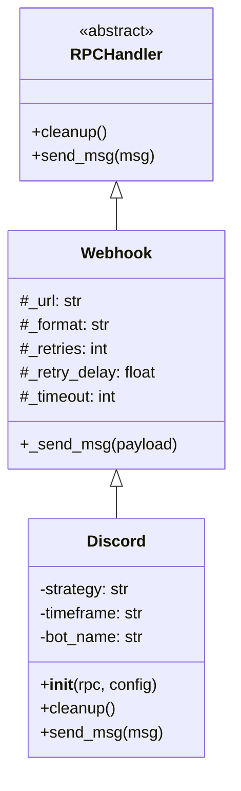

# discord.py

## 概述

`freqtrade/rpc/discord.py` 实现了通过 Discord Webhook 发送交易通知的功能。`Discord` 类继承自 `Webhook`，复用其 HTTP 发送逻辑，但使用 Discord 专属的 Embed 消息格式。消息会根据配置文件中定义的字段模板进行格式化，并根据交易盈亏情况使用不同颜色标识。

## 架构图



## 核心类/函数

### Discord

继承自 `Webhook` 的 Discord 通知处理器。

#### `__init__(self, rpc: RPC, config: Config)`
- **参数**: `rpc` -- RPC 核心实例；`config` -- 项目配置
- **职责**:
  - 从 `config["discord"]` 中读取 `webhook_url`、`timeout`
  - 固定使用 `json` 格式（Discord Webhook 要求 JSON payload）
  - 设置 `retries=1`、`retry_delay=0.1`
  - 保存 `strategy`、`timeframe`、`bot_name` 用于消息模板渲染
- **注意**: 未调用 `super().__init__()`，而是直接设置属性。这是因为 Discord 的配置结构与 Webhook 不同

#### `cleanup(self) -> None`
- **职责**: 空操作。Webhook 类的通知不需要清理资源

#### `send_msg(self, msg) -> None`
- **参数**: `msg` -- 消息字典
- **职责**: 将消息格式化为 Discord Embed 格式并发送
- **关键逻辑**:
  1. 从 `config["discord"]` 中查找与 `msg["type"].value` 匹配的字段配置
  2. 如果未配置该消息类型，直接跳过
  3. 向 msg 注入 `strategy`、`timeframe`、`bot_name` 字段
  4. **颜色规则**:
     - 默认蓝色（`0x0000FF`）
     - EXIT/EXIT_FILL 类型：盈利为绿色（`0x00FF00`），亏损为红色（`0xFF0000`）
  5. 构建 Discord Embed 结构，遍历配置字段用 `str.format(**msg)` 渲染值
  6. 调用父类 `_send_msg(payload)` 发送

**Discord Embed 消息结构示例**:
```json
{
    "embeds": [{
        "title": "Trade: BTC/USDT exit",
        "color": 65280,
        "fields": [
            {"name": "Profit", "value": "5.2%", "inline": true}
        ]
    }]
}
```

## 依赖关系

### 内部依赖（本项目模块）
- `freqtrade.constants` -- 导入 `Config` 类型
- `freqtrade.enums` -- 导入 `RPCMessageType`
- `freqtrade.rpc` -- 导入 `RPC`
- `freqtrade.rpc.webhook` -- 继承 `Webhook` 类，使用其 `_send_msg` 方法

### 外部依赖（第三方库）
- `logging` -- 日志记录

### 被依赖（谁引用了本文件）
- `freqtrade.rpc.rpc_manager` -- 当配置中启用 Discord 时延迟导入并实例化
