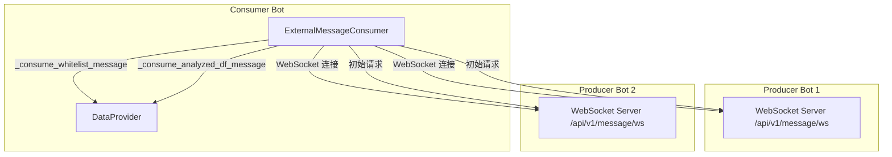
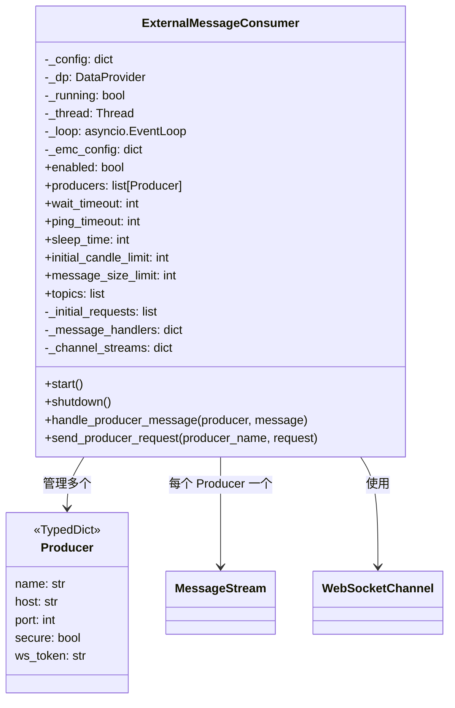

# external_message_consumer.py

## 概述

`freqtrade/rpc/external_message_consumer.py` 实现了外部消息消费者功能，允许当前 Bot 通过 WebSocket 连接到其他 Freqtrade Bot（"Producer"）的消息端点，消费其交易白名单和已分析的 DataFrame 数据。这是 Freqtrade 的多 Bot 协作架构核心组件，使得一个 "Consumer" Bot 可以基于其他 "Producer" Bot 的信号和数据进行交易决策。

## 架构图

## 核心类/函数

### Producer（TypedDict）
- **字段**: `name`（Producer 名称）、`host`（主机地址）、`port`（端口号）、`secure`（是否使用 WSS）、`ws_token`（WebSocket 认证令牌）
- **用途**: 定义一个 Producer 连接的配置

### schema_to_dict(schema) -> dict
- **参数**: `schema` -- `WSMessageSchema` 或 `WSRequestSchema` 实例
- **返回**: Pydantic model 转换后的字典（排除 None 值）
- **用途**: 序列化请求对象以便通过 WebSocket 发送

### ExternalMessageConsumer

外部消息消费者的主控制器类。

#### `__init__(self, config, dataprovider)`
- **参数**: `config` -- 全局配置字典；`dataprovider` -- DataProvider 实例
- **职责**: 读取 `external_message_consumer` 配置项，设置连接参数，注册消息处理器，最后调用 `start()` 启动
- **配置项**:
  - `wait_timeout` (默认 30s) -- 等待消息超时
  - `ping_timeout` (默认 10s) -- Ping 超时
  - `sleep_time` (默认 10s) -- 连接失败后的重试间隔
  - `initial_candle_limit` (默认 1500) -- 初始请求的K线数量
  - `message_size_limit` (默认 8MB) -- WebSocket 消息大小限制
- **订阅主题**: `WHITELIST` 和 `ANALYZED_DF`
- **初始请求**: `WSSubscribeRequest`（订阅主题）、`WSWhitelistRequest`（请求白名单）、`WSAnalyzedDFRequest`（请求已分析的 DataFrame）

#### `start(self)`
- **职责**: 创建新的 asyncio 事件循环和后台线程，启动主协程
- **关键逻辑**: 使用 `asyncio.run_coroutine_threadsafe` 在后台线程中运行异步主任务

#### `shutdown(self)`
- **职责**: 优雅关闭所有连接、取消任务、停止事件循环和线程
- **关键逻辑**: 先运行异步关闭，等待线程 5 秒超时后强制退出

#### `_main(self)` (async)
- **职责**: 为每个 Producer 创建一个连接任务并并发运行
- **关键逻辑**: 使用 `asyncio.gather` 并发管理所有 Producer 连接

#### `_create_connection(self, producer, lock)` (async)
- **参数**: `producer` -- Producer 配置字典；`lock` -- asyncio 锁
- **职责**: 创建并维护与单个 Producer 的 WebSocket 连接
- **关键逻辑**:
  - 使用 `while self._running` 循环保持持久连接
  - 根据 `secure` 配置选择 `ws://` 或 `wss://` 协议
  - 使用 `create_channel` 上下文管理器创建通信通道
  - 为每个连接创建 `MessageStream` 用于异步请求发送
  - 同时运行接收消息和发送请求两个任务
  - 处理各种连接异常（无效 URI、连接拒绝、连接关闭）并自动重连

#### `_send_requests(self, channel, channel_stream)` (async)
- **职责**: 先发送初始请求，然后持续监听 `MessageStream` 发送后续请求

#### `_receive_messages(self, channel, producer, lock)` (async)
- **职责**: 持续接收消息并处理
- **关键逻辑**:
  - 使用 `asyncio.wait_for` 带超时接收消息
  - 超时时通过 ping 检测连接健康状态
  - 使用 asyncio Lock 保护消息处理的线程安全

#### `handle_producer_message(self, producer, message)`
- **参数**: `producer` -- Producer 配置；`message` -- 原始消息字典
- **职责**: 验证消息格式，根据消息类型路由到对应的处理函数
- **关键逻辑**: 使用 Pydantic `model_validate` 验证消息结构

#### `_consume_whitelist_message(self, producer_name, message)`
- **职责**: 处理白名单消息，将交易对数据设置到 DataProvider

#### `_consume_analyzed_df_message(self, producer_name, message)`
- **职责**: 处理已分析的 DataFrame 消息
- **关键逻辑**:
  - 可选移除 Producer 的入场/出场信号（`remove_entry_exit_signals` 配置）
  - 调用 `_dp._add_external_df` 将数据追加到 DataProvider
  - 如果追加失败（数据空洞），自动请求缺失的K线数据
  - 缺失数量超过 `FULL_DATAFRAME_THRESHOLD` 时请求完整的 1500 根K线

#### `send_producer_request(self, producer_name, request)`
- **参数**: `producer_name` -- Producer 名称；`request` -- 请求对象或字典
- **职责**: 向指定 Producer 的 `MessageStream` 发布请求

## 依赖关系

### 内部依赖（本项目模块）
- `freqtrade.constants` -- 导入 `FULL_DATAFRAME_THRESHOLD`
- `freqtrade.data.dataprovider` -- 导入 `DataProvider`，用于存储外部数据
- `freqtrade.enums` -- 导入 `RPCMessageType`
- `freqtrade.misc` -- 导入 `remove_entry_exit_signals`（移除入场/出场信号）
- `freqtrade.rpc.api_server.ws.channel` -- 导入 `WebSocketChannel`、`create_channel`
- `freqtrade.rpc.api_server.ws.message_stream` -- 导入 `MessageStream`
- `freqtrade.rpc.api_server.ws_schemas` -- 导入 WebSocket 消息/请求 Schema

### 外部依赖（第三方库）
- `asyncio` -- 异步事件循环和任务管理
- `logging` -- 日志记录
- `socket` -- 网络错误处理
- `threading.Thread` -- 后台线程运行事件循环
- `websockets` -- WebSocket 客户端连接
- `pydantic.ValidationError` -- 消息验证

### 被依赖（谁引用了本文件）
- `freqtrade.freqtradebot` -- FreqtradeBot 根据配置创建 `ExternalMessageConsumer` 实例
