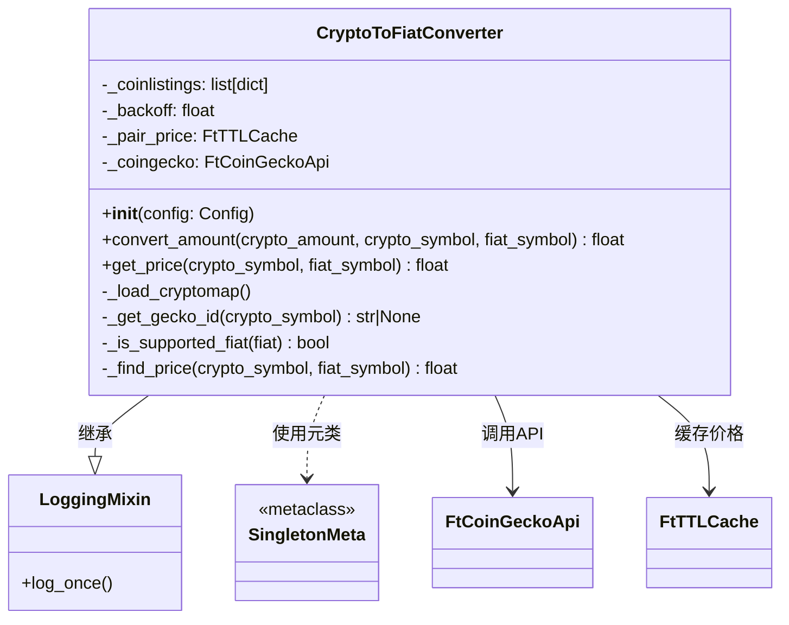

# fiat_convert.py

## 概述

`freqtrade/rpc/fiat_convert.py` 提供加密货币到法币的价格转换功能。它通过 CoinGecko API 获取实时价格数据，将加密货币金额转换为用户配置的法定货币显示值（如 BTC -> USD）。该模块使用单例模式，确保全局只有一个转换器实例，并配备 TTL 缓存以减少 API 调用频率。

## 架构图

## 核心类/函数

### coingecko_mapping（模块级常量）
- **类型**: `dict[str, str]`
- **说明**: 手动维护的加密货币符号到 CoinGecko ID 的映射表，用于处理 CoinGecko 上存在多个同名币种的情况
- **示例映射**: `"eth" -> "ethereum"`, `"btc" -> "bitcoin"`, `"usdt" -> "tether"`

### CryptoToFiatConverter

加密货币到法币转换器，使用单例模式和 CoinGecko API。

#### `__init__(self, config: Config) -> None`
- **参数**: `config` -- 项目配置字典
- **职责**:
  1. 初始化 TTL 缓存（6小时过期，最多500条）
  2. 从配置中读取 CoinGecko API key（支持 demo 和 pro 模式）
  3. 初始化 `LoggingMixin`（日志防刷屏，3600秒间隔）
  4. 加载 CoinGecko 币种映射表

#### `_load_cryptomap(self) -> None`
- **职责**: 从 CoinGecko API 获取完整的币种列表
- **关键逻辑**:
  - 遇到 429（频率限制）错误时，设置 60 秒退避时间
  - 其他错误仅记录日志，不中断运行

#### `_get_gecko_id(self, crypto_symbol) -> str | None`
- **参数**: `crypto_symbol` -- 加密货币符号（小写）
- **返回**: CoinGecko 对应的 ID，或 `None`
- **关键逻辑**: 优先使用 `coingecko_mapping` 中的手动映射；如果找到多个匹配项则返回 `None` 并记录警告

#### `convert_amount(self, crypto_amount, crypto_symbol, fiat_symbol) -> float`
- **参数**: 加密货币金额、币种符号、法币符号
- **返回**: 法币金额
- **说明**: 如果 crypto_symbol == fiat_symbol，直接返回原始金额

#### `get_price(self, crypto_symbol, fiat_symbol) -> float`
- **参数**: 加密货币符号、法币符号
- **返回**: 法币价格
- **关键逻辑**:
  - 特殊处理 `"usd"` 符号（CoinGecko 上映射到 "uniswap-state-dollar"），通过交换货币对并取倒数来获取正确价格
  - 检查法币是否在支持列表中（`SUPPORTED_FIAT`）
  - 优先从缓存获取价格

#### `_find_price(self, crypto_symbol, fiat_symbol) -> float`
- **参数**: 加密货币符号（小写）、法币符号（小写）
- **返回**: 法币价格，获取失败返回 `0.0`
- **职责**: 实际调用 CoinGecko API 获取价格

## 依赖关系

### 内部依赖（本项目模块）
- `freqtrade.constants` -- 导入 `SUPPORTED_FIAT`（支持的法币列表）和 `Config` 类型
- `freqtrade.mixins.logging_mixin` -- 导入 `LoggingMixin`，提供 `log_once` 功能
- `freqtrade.util` -- 导入 `FtTTLCache`（带 TTL 的缓存）
- `freqtrade.util.coin_gecko` -- 导入 `FtCoinGeckoApi`（CoinGecko API 封装）
- `freqtrade.util.singleton` -- 导入 `SingletonMeta`（单例元类）

### 外部依赖（第三方库）
- `logging` -- 日志记录
- `datetime` -- 时间戳处理
- `requests.exceptions.RequestException` -- HTTP 请求异常处理

### 被依赖（谁引用了本文件）
- `freqtrade.rpc.rpc` -- `RPC.__init__` 中创建 `CryptoToFiatConverter` 实例，用于在各种统计和余额查询中进行法币转换
