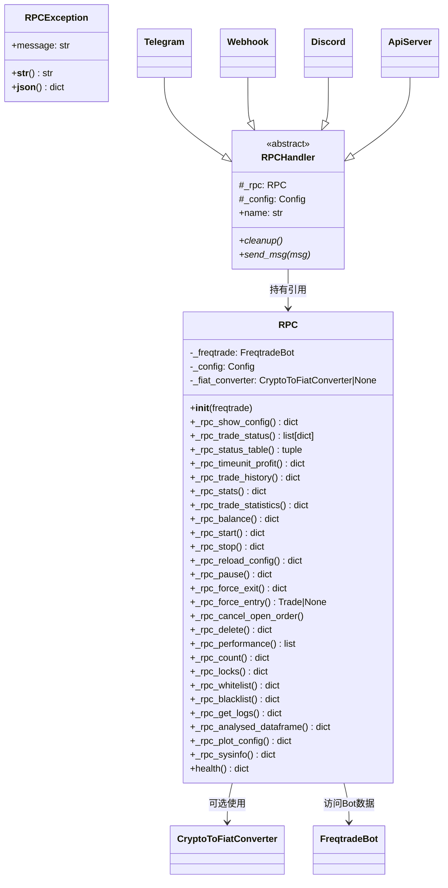

# rpc.py

## 概述

`freqtrade/rpc/rpc.py` 是 RPC 系统的核心业务逻辑层，定义了三个关键类：`RPCException`（异常类）、`RPCHandler`（处理器抽象基类）和 `RPC`（核心数据访问类）。`RPC` 类提供了所有远程可调用的方法（以 `_rpc_` 前缀命名），涵盖交易状态查询、收益统计、余额查询、交易操作、交易对管理、系统信息等功能。所有 RPC 通信渠道（Telegram、API Server、Webhook 等）都通过此类访问 Bot 数据和执行操作。

## 架构图

## 核心类/函数

### RPCException
- **继承**: `Exception`
- **属性**: `message: str`
- **用途**: 在 `_rpc_*` 方法中当状态不符合要求时抛出，携带格式化的错误消息
- **特殊方法**: `__json__()` 返回 `{"msg": self.message}`，便于 API 响应序列化

### RPCHandler（抽象基类）
- **属性**:
  - `_rpc: RPC` -- RPC 核心实例
  - `_config: Config` -- 配置对象
  - `name: str` -- 返回子类名的小写（如 `"telegram"`）
- **抽象方法**:
  - `cleanup()` -- 清理模块资源
  - `send_msg(msg: RPCSendMsg)` -- 发送消息
- **用途**: 所有通信渠道处理器（Telegram、Webhook、Discord、ApiServer）的基类

### RPC（核心类）

RPC 系统的核心数据访问和操作类。所有方法均通过 `self._freqtrade` 访问 Bot 的交易所、钱包、策略等组件。

#### `__init__(self, freqtrade)`
- **参数**: `freqtrade` -- FreqtradeBot 实例
- **职责**: 保存 Bot 引用，如果配置了 `fiat_display_currency` 则创建 `CryptoToFiatConverter`

---

#### 配置与状态查询

##### `_rpc_show_config(config, botstate, strategy_version) -> dict` (static)
- **返回**: 安全的配置信息字典（不包含敏感信息）
- **包含**: 版本号、交易模式、质押货币、ROI、止损、时间帧、交易所等

##### `_rpc_trade_status(trade_ids=None) -> list[dict]`
- **返回**: 当前活跃交易的详细信息列表
- **关键计算**: 当前盈亏、法币盈亏、止损距离、止损盈亏比

##### `_rpc_status_table(stake_currency, fiat_display_currency) -> tuple`
- **返回**: 交易表格数据（trades_list, columns, fiat_profit_sum, fiat_total_profit_sum）
- **用途**: 为 Telegram `/status table` 命令提供数据

---

#### 收益统计

##### `_rpc_timeunit_profit(timescale, stake_currency, fiat_display_currency, timeunit) -> dict`
- **参数**: `timescale` -- 时间段数量；`timeunit` -- "days"/"weeks"/"months"
- **返回**: 按时间单位分组的收益数据
- **用途**: 支持 `/daily`、`/weekly`、`/monthly` 命令

##### `_rpc_trade_history(limit, offset, order_by_id) -> dict`
- **返回**: 最近的已关闭交易历史，支持分页

##### `_rpc_stats() -> dict`
- **返回**: 交易统计（按退出原因分组的胜/负/平数量，以及各组的平均持仓时长）

##### `_rpc_trade_statistics(stake_currency, fiat_display_currency, start_date, direction) -> dict`
- **返回**: 详尽的累计收益统计
- **包含**: 盈亏总额/均值/比率、法币价值、交易数量、最佳交易对、胜率、Profit Factor、Expectancy、Sharpe Ratio、Sortino Ratio、SQN、Calmar Ratio、CAGR、最大回撤等

---

#### 余额查询

##### `_rpc_balance(stake_currency, fiat_display_currency) -> dict`
- **返回**: 账户各币种余额及估值
- **关键逻辑**:
  - 区分现货和期货模式
  - 期货模式计算仓位权益（含杠杆 PnL）
  - 标识 Bot 管理的资产与非 Bot 资产
  - 计算起始资金比率

---

#### Bot 控制

##### `_rpc_start() / _rpc_stop() / _rpc_reload_config() / _rpc_pause() -> dict`
- **职责**: 切换 Bot 状态（RUNNING / STOPPED / RELOAD_CONFIG / PAUSED）
- **PAUSED 状态**: 不再开新仓，但继续管理现有仓位

##### `_rpc_reload_trade_from_exchange(trade_id) -> dict`
- **职责**: 从交易所重新加载指定交易的订单数据

---

#### 交易操作

##### `_rpc_force_exit(trade_id, ordertype, amount, price) -> dict`
- **职责**: 强制平仓指定交易或所有交易
- **支持**: 部分平仓（指定 amount）、指定价格的 limit 订单
- **关键逻辑**: 先取消未成交订单，再执行平仓

##### `_rpc_force_entry(pair, price, order_type, order_side, stake_amount, enter_tag, leverage) -> Trade | None`
- **职责**: 强制开仓
- **验证**: 检查 force_entry 是否启用、Bot 是否运行、是否允许做空、交易对有效性、最大仓位数
- **支持**: 加仓（position_adjustment_enable）

##### `_rpc_cancel_open_order(trade_id)`
- **职责**: 取消指定交易的所有未成交订单

##### `_rpc_delete(trade_id) -> dict`
- **职责**: 删除交易记录，取消关联的交易所订单（包括止损单）

---

#### 交易对管理

##### `_rpc_whitelist() / _rpc_blacklist(add) / _rpc_blacklist_delete(delete)`
- **职责**: 查询/管理白名单和黑名单

---

#### 数据分析

##### `_rpc_analysed_dataframe(pair, timeframe, limit, selected_cols) -> dict`
- **返回**: 策略分析后的 DataFrame 数据（含信号、注释）
- **关键逻辑**: 从 DataProvider 获取数据，转换为可序列化的字典格式

##### `_rpc_analysed_history_full(config, pair, timeframe, exchange, selected_cols, live) -> dict` (static)
- **职责**: 加载完整历史数据并运行策略分析
- **使用场景**: Web Server 模式下独立运行（不干扰正在运行的 Bot）

##### `_ws_all_analysed_dataframes(pairlist, limit)` (Generator)
- **职责**: 为 WebSocket 批量生成所有交易对的分析结果

---

#### 系统信息

##### `_rpc_sysinfo() -> dict` (static)
- **返回**: CPU 使用率（每核）、CPU 负载平均值、RAM 使用率

##### `health() -> dict`
- **返回**: Bot 最近处理时间、启动时间等健康状态信息

##### `_rpc_get_logs(limit) -> dict` (static)
- **返回**: 最近的日志记录

##### `_rpc_plot_config() -> dict`
- **返回**: 策略的绘图配置

---

#### 其他

##### `_rpc_list_custom_data(trade_id, key, limit, offset) -> list[dict]`
- **职责**: 获取交易的自定义数据
- **使用装饰器**: `@custom_data_rpc_wrapper`

##### `_rpc_performance() / _rpc_enter_tag_performance(pair) / _rpc_exit_reason_performance(pair) / _rpc_mix_tag_performance(pair)`
- **职责**: 交易对绩效、入场标签绩效、退出原因绩效、混合标签绩效

##### `_rpc_locks() / _rpc_delete_lock(lockid, pair) / _rpc_add_lock(pair, until, reason, side)`
- **职责**: 查询/删除/添加交易对锁定

##### `_rpc_count() -> dict`
- **返回**: 当前交易数量、最大交易数、总质押金额

##### `_update_market_direction(direction) / _get_market_direction()`
- **职责**: 更新/获取市场方向（多头/空头/中性）

## 依赖关系

### 内部依赖（本项目模块）
- `freqtrade.__init__` -- 导入 `__version__`
- `freqtrade.configuration.timerange` -- 导入 `TimeRange`
- `freqtrade.constants` -- 导入 `CANCEL_REASON`、`DEFAULT_DATAFRAME_COLUMNS`、`Config`
- `freqtrade.data.history` -- 导入 `load_data`
- `freqtrade.data.metrics` -- 导入各种统计指标计算函数（Sharpe、Sortino、SQN 等）
- `freqtrade.enums` -- 导入 `CandleType`、`ExitCheckTuple`、`ExitType`、`State` 等
- `freqtrade.exceptions` -- 导入 `ExchangeError`、`PricingError`
- `freqtrade.exchange` -- 导入 `Exchange`、时间帧转换函数
- `freqtrade.ft_types` -- 导入 `AnnotationType`
- `freqtrade.loggers` -- 导入 `bufferHandler`（内存日志缓冲区）
- `freqtrade.persistence` -- 导入 `Trade`、`Order`、`PairLocks`、`KeyValueStore` 等
- `freqtrade.plugins.pairlist.pairlist_helpers` -- 导入 `expand_pairlist`
- `freqtrade.rpc.fiat_convert` -- 导入 `CryptoToFiatConverter`
- `freqtrade.rpc.rpc_types` -- 导入 `RPCSendMsg`
- `freqtrade.util` -- 导入日期格式化、精度处理等工具函数
- `freqtrade.wallets` -- 导入 `Wallet`、`PositionWallet` 类型

### 外部依赖（第三方库）
- `psutil` -- 获取系统 CPU/内存信息
- `dateutil.relativedelta` -- 月/周时间偏移计算
- `dateutil.tz` -- 本地时区转换
- `numpy` -- 数值计算（`inf`、`nan`、`mean`、`isnan`）
- `pandas` -- DataFrame 数据处理
- `sqlalchemy` -- 数据库查询（`func`、`select`）

### 被依赖（谁引用了本文件）
- `freqtrade.rpc.__init__` -- 导出 `RPC`、`RPCException`、`RPCHandler`
- `freqtrade.rpc.rpc_manager` -- 创建 `RPC` 实例
- `freqtrade.rpc.telegram` -- 导入并调用 `RPC` 方法
- `freqtrade.rpc.webhook` -- 导入 `RPCHandler` 作为基类
- `freqtrade.rpc.discord` -- 导入 `RPC`
- `freqtrade.rpc.api_server.*` -- 多个 API Server 模块导入并调用 `RPC` 方法
