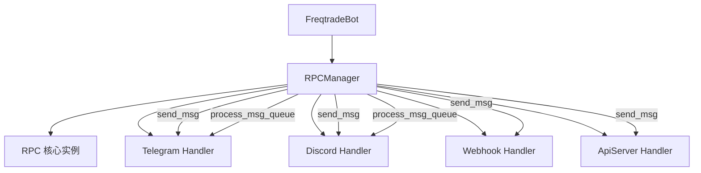

# rpc_manager.py

## 概述

`freqtrade/rpc/rpc_manager.py` 是 RPC 通信管理器，负责初始化、注册和协调所有已启用的 RPC 通信模块（Telegram、Discord、Webhook、API Server）。它是 FreqtradeBot 与各种外部通知渠道之间的中间层，统一管理消息的分发和模块的生命周期。

## 架构图

## 核心类/函数

### RPCManager

RPC 管理器类，管理所有已注册的 RPC 通信模块。

#### `__init__(self, freqtrade) -> None`
- **参数**: `freqtrade` -- FreqtradeBot 实例
- **职责**:
  1. 创建 `RPC` 核心实例
  2. 根据配置文件中各模块的 `enabled` 标志，延迟导入并初始化对应的 RPC Handler
  3. 支持的模块：Telegram、Discord、Webhook、API Server
- **关键逻辑**: 使用延迟导入（lazy import）避免不必要的依赖加载。API Server 的注册方式略有不同，需要先创建实例再通过 `add_rpc_handler` 添加 RPC 核心。

#### `cleanup(self) -> None`
- **职责**: 按顺序停止并清理所有已注册的 RPC 模块
- **关键逻辑**: 使用 `while` 循环逐个 `pop` 并调用 `cleanup()`，最后 `del` 释放引用

#### `send_msg(self, msg: RPCSendMsg) -> None`
- **参数**: `msg` -- RPCSendMsg 类型的消息字典
- **职责**: 将消息转发给所有已注册的 RPC 模块
- **关键逻辑**:
  - 对于 `NO_ECHO_MESSAGES` 中定义的消息类型（如 ANALYZED_DF），不会记录日志（避免日志刷屏）
  - 每个模块的 `send_msg` 调用被独立的 `try/except` 包裹，单个模块的失败不会影响其他模块
  - 捕获 `NotImplementedError`（模块未实现该消息类型）和通用 `Exception`

#### `process_msg_queue(self, queue: deque) -> None`
- **参数**: `queue` -- 一个 `deque` 消息队列
- **职责**: 处理策略自定义消息队列
- **关键逻辑**: 逐条取出消息，只发送给配置了 `allow_custom_messages: True` 的模块，消息类型统一为 `RPCMessageType.STRATEGY_MSG`

#### `startup_messages(self, config: Config, pairlist, protections) -> None`
- **参数**: `config`、`pairlist`（交易对列表管理器）、`protections`（保护机制管理器）
- **职责**: Bot 启动时发送一系列启动信息
- **发送内容**:
  1. 如果是模拟运行（dry_run），发送警告
  2. 发送交易参数摘要（交易所、质押金额、ROI、止损、时间帧、策略名）
  3. 发送正在搜索的交易对信息
  4. 如果启用了保护机制，发送保护策略列表

## 依赖关系

### 内部依赖（本项目模块）
- `freqtrade.constants` -- 导入 `Config` 类型
- `freqtrade.enums` -- 导入 `NO_ECHO_MESSAGES`、`RPCMessageType`
- `freqtrade.rpc` -- 导入 `RPC`、`RPCHandler`
- `freqtrade.rpc.rpc_types` -- 导入 `RPCSendMsg`
- `freqtrade.rpc.telegram` -- 延迟导入 `Telegram`（条件加载）
- `freqtrade.rpc.discord` -- 延迟导入 `Discord`（条件加载）
- `freqtrade.rpc.webhook` -- 延迟导入 `Webhook`（条件加载）
- `freqtrade.rpc.api_server` -- 延迟导入 `ApiServer`（条件加载）

### 外部依赖（第三方库）
- `logging` -- 日志记录
- `collections.deque` -- 消息队列类型

### 被依赖（谁引用了本文件）
- `freqtrade.rpc.__init__` -- 作为 RPC 包的导出
- `freqtrade.freqtradebot` -- FreqtradeBot 创建并持有 RPCManager 实例
