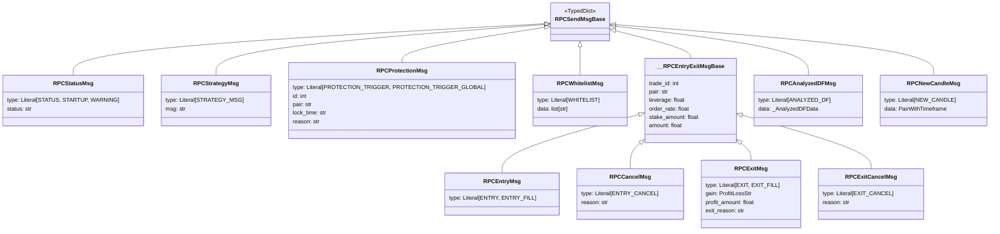

# rpc_types.py

## 概述

`freqtrade/rpc/rpc_types.py` 定义了 RPC 消息系统中使用的所有类型化字典（TypedDict）。这些类型为不同种类的交易事件（入场、出场、取消、保护触发等）提供了结构化的消息格式，确保 RPC 消息在各个通信渠道之间保持一致的数据结构。

## 架构图

## 核心类/函数

### ProfitLossStr
- **类型**: `Literal["profit", "loss"]`
- **说明**: 用于标识交易是盈利还是亏损的字面量类型别名

### RPCSendMsgBase
- **类型**: TypedDict（基类）
- **说明**: 所有 RPC 消息的基类，本身为空字典，其中 `type` 字段被注释掉了（各子类自行定义）

### RPCStatusMsg
- **继承**: `RPCSendMsgBase`
- **字段**: `type`（STATUS/STARTUP/WARNING）、`status`（状态文本）
- **用途**: 用于状态通知、启动消息和警告消息

### RPCStrategyMsg
- **继承**: `RPCSendMsgBase`
- **字段**: `type`（STRATEGY_MSG）、`msg`（策略自定义消息文本）
- **用途**: 策略发出的自定义消息

### RPCProtectionMsg
- **继承**: `RPCSendMsgBase`
- **字段**: `type`、`id`、`pair`、`base_currency`、`lock_time`、`lock_timestamp`、`lock_end_time`、`lock_end_timestamp`、`reason`、`side`、`active`
- **用途**: 保护机制触发消息，包含锁定时间段和原因

### RPCWhitelistMsg
- **继承**: `RPCSendMsgBase`
- **字段**: `type`（WHITELIST）、`data`（交易对列表）
- **用途**: 白名单更新消息

### __RPCEntryExitMsgBase（私有基类）
- **继承**: `RPCSendMsgBase`
- **字段**: `trade_id`、`buy_tag`、`enter_tag`、`exchange`、`pair`、`base_currency`、`quote_currency`、`leverage`、`direction`、`limit`（已废弃）、`order_rate`、`open_rate`、`order_type`、`stake_amount`、`stake_currency`、`fiat_currency`、`amount`、`open_date`、`current_rate`、`sub_trade`
- **用途**: 入场和出场消息的公共字段基类

### RPCEntryMsg
- **继承**: `__RPCEntryExitMsgBase`
- **字段**: `type`（ENTRY / ENTRY_FILL）
- **用途**: 入场订单消息

### RPCCancelMsg
- **继承**: `__RPCEntryExitMsgBase`
- **字段**: `type`（ENTRY_CANCEL）、`reason`
- **用途**: 入场取消消息

### RPCExitMsg
- **继承**: `__RPCEntryExitMsgBase`
- **字段**: `type`（EXIT / EXIT_FILL）、`cumulative_profit`、`gain`、`close_rate`、`profit_amount`、`profit_ratio`、`exit_reason`、`close_date`、`final_profit_ratio`、`is_final_exit`
- **用途**: 出场订单消息，包含盈亏信息

### RPCExitCancelMsg
- **继承**: `__RPCEntryExitMsgBase`
- **字段**: `type`（EXIT_CANCEL）、`reason`、`gain`、`profit_amount`、`profit_ratio`、`exit_reason`、`close_date`
- **用途**: 出场取消消息

### RPCAnalyzedDFMsg
- **继承**: `RPCSendMsgBase`
- **字段**: `type`（ANALYZED_DF）、`data`（`_AnalyzedDFData`）
- **用途**: 策略分析完成后的 DataFrame 消息

### RPCNewCandleMsg
- **继承**: `RPCSendMsgBase`
- **字段**: `type`（NEW_CANDLE）、`data`（`PairWithTimeframe`）
- **用途**: 新K线到达的通知消息

### RPCOrderMsg（联合类型）
- **定义**: `RPCEntryMsg | RPCExitMsg | RPCExitCancelMsg | RPCCancelMsg`
- **用途**: 所有订单相关消息的联合类型

### RPCSendMsg（联合类型）
- **定义**: 所有消息类型的联合
- **用途**: 表示 RPC 系统可以发送的任意消息类型

## 依赖关系

### 内部依赖（本项目模块）
- `freqtrade.constants` -- 导入 `PairWithTimeframe` 类型
- `freqtrade.enums` -- 导入 `RPCMessageType` 枚举

### 外部依赖（第三方库）
- `datetime` -- 用于 `datetime` 类型注解
- `typing` -- 用于 `Any`、`Literal`、`TypedDict`

### 被依赖（谁引用了本文件）
- `freqtrade.rpc.rpc` -- 导入 `RPCSendMsg`
- `freqtrade.rpc.rpc_manager` -- 导入 `RPCSendMsg`
- `freqtrade.rpc.telegram` -- 导入 `RPCEntryMsg`、`RPCExitMsg`、`RPCOrderMsg`、`RPCSendMsg`
- `freqtrade.rpc.webhook` -- 导入 `RPCSendMsg`
- `freqtrade.rpc.api_server.webserver` -- 导入 `RPCSendMsg`
- `freqtrade.freqtradebot` -- 导入 `RPCSendMsg`
- `freqtrade.data.dataprovider` -- 导入 `RPCSendMsg`
