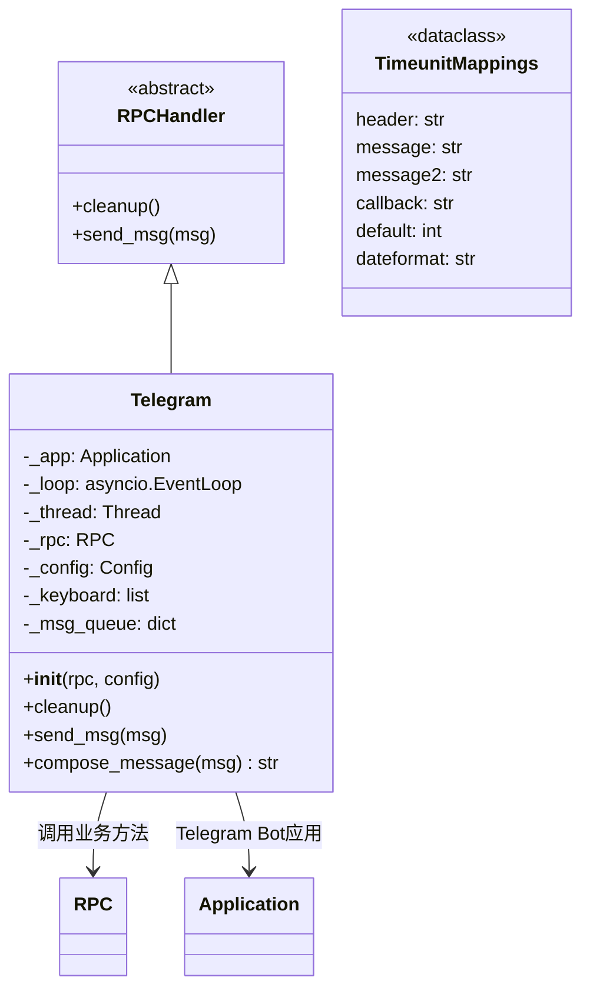
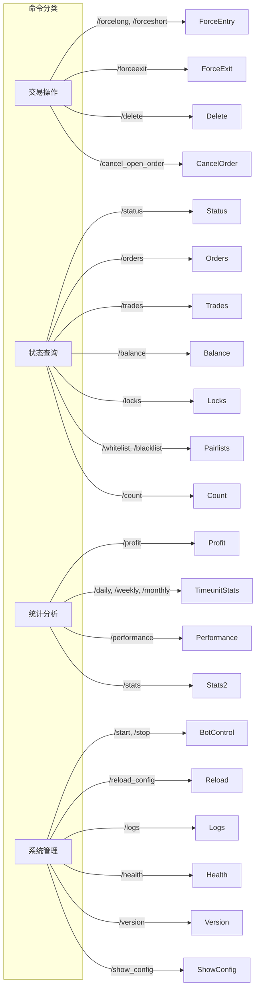

# telegram.py

## 概述

`freqtrade/rpc/telegram.py` 实现了 Freqtrade 的 Telegram Bot 通知和命令交互系统。这是 RPC 模块中最大、功能最丰富的实现，提供了超过 40 个 Telegram 命令，涵盖交易状态查询、手动交易操作、性能统计、系统管理等功能。该模块在独立线程中运行 Telegram Bot，使用 `python-telegram-bot` 库处理用户命令和消息推送。

## 架构图

## 核心类/函数

### safe_async_db(func) (装饰器)
- **职责**: 安全处理数据库 Session 的装饰器，在异步上下文切换时确保 Session 被正确清理
- **关键逻辑**: 在 `finally` 块中调用 `Trade.session.remove()`

### TimeunitMappings (dataclass)
- **字段**: `header`、`message`、`message2`、`callback`、`default`、`dateformat`
- **用途**: 为 daily/weekly/monthly 命令提供统一的配置映射

### authorized_only(command_handler) (装饰器)
- **职责**: 检查 Telegram 消息来源是否来自授权的 chat_id
- **关键逻辑**:
  - 验证 `update.effective_chat.id` 是否在允许的 `chat_id` 列表中
  - 未授权的消息会发送拒绝通知并记录日志
  - 所有命令处理器都使用此装饰器保护

### Telegram (类)

继承 `RPCHandler` 的 Telegram 通信处理器。

#### `__init__(self, rpc: RPC, config: Config)`
- **职责**:
  1. 初始化键盘布局（自定义按钮）
  2. 创建 Telegram Application（Bot）
  3. 在后台线程中启动事件循环
  4. 注册所有命令处理器
- **支持的通知配置**: `notification_settings` 允许用户配置每种消息类型的通知方式（`on`/`off`/`silent`）

#### `_init_keyboard(self) -> None`
- **职责**: 初始化 Telegram 键盘按钮
- **关键逻辑**: 支持自定义键盘（`config["telegram"]["keyboard"]`），默认提供常用命令按钮

#### `_init(self) -> None`
- **职责**: 注册所有 Telegram 命令处理器
- **已注册命令（部分列表）**:
  - `/status` -- 显示当前活跃交易
  - `/profit` -- 显示累计收益统计
  - `/balance` -- 显示账户余额
  - `/daily`, `/weekly`, `/monthly` -- 时间维度收益统计
  - `/performance` -- 交易对绩效排名
  - `/forcelong`, `/forceshort` -- 强制入场
  - `/forceexit` -- 强制出场
  - `/start`, `/stop`, `/pause` -- 控制 Bot 状态
  - `/reload_config` -- 重新加载配置
  - `/whitelist`, `/blacklist` -- 管理交易对列表
  - `/logs` -- 查看日志
  - `/health` -- 系统健康状态
  - `/help` -- 帮助信息

#### `cleanup(self) -> None`
- **职责**: 停止 Telegram Application，清理事件循环和线程

#### `compose_message(self, msg: RPCSendMsg) -> str | None`
- **职责**: 将 RPC 消息转换为 Telegram 格式的文本
- **支持的消息类型**: ENTRY, ENTRY_CANCEL, ENTRY_FILL, EXIT, EXIT_CANCEL, EXIT_FILL, PROTECTION_TRIGGER, STATUS, STARTUP, WARNING, STRATEGY_MSG, NEW_CANDLE

#### `send_msg(self, msg: RPCSendMsg) -> None`
- **职责**: 调用 `compose_message` 格式化消息，然后通过 `_send_msg` 发送
- **关键逻辑**:
  - 根据 `notification_settings` 决定消息的通知模式
  - 支持 `silent` 模式（无声推送）和 `off` 模式（不发送）
  - EXIT 消息会附加盈亏 emoji

#### 交易操作命令

- **`_force_enter`** / **`_force_exit`** -- 强制入场/出场，支持 Inline Keyboard 回调
- **`_cancel_open_order`** -- 取消指定交易的未成交订单
- **`_delete_trade`** -- 删除指定交易记录

#### 查询命令

- **`_status` / `_status_msg`** -- 显示当前交易详情（价格、盈亏、止损距离等）
- **`_status_table`** -- 表格形式显示所有活跃交易
- **`_balance`** -- 显示每个币种的余额和估值
- **`_count`** -- 显示当前交易数量和最大限制

#### 统计命令

- **`_profit_handler`** -- 核心收益统计逻辑，支持 long/short/all 方向过滤
- **`_timeunit_stats`** -- 按日/周/月维度的收益统计（由 `_daily`、`_weekly`、`_monthly` 调用）
- **`_performance`** -- 按交易对排名的绩效统计
- **`_stats`** -- 退出原因统计和平均持仓时长

#### 消息发送

- **`_send_msg(self, msg, parse_mode, ...)`** -- 底层消息发送方法
  - 支持 HTML 和 Markdown 格式
  - 自动分割超长消息（4096 字符限制）
  - 支持 `reload_able`（可更新消息）和 `callback_path`（回调按钮）
  - 处理网络错误并重试

## 依赖关系

### 内部依赖（本项目模块）
- `freqtrade.__init__` -- 导入 `__version__`
- `freqtrade.constants` -- 导入 `DUST_PER_COIN`、`Config`
- `freqtrade.enums` -- 导入 `MarketDirection`、`RPCMessageType`、`SignalDirection`、`TradingMode`
- `freqtrade.exceptions` -- 导入 `OperationalException`
- `freqtrade.misc` -- 导入 `chunks`、`plural`
- `freqtrade.persistence` -- 导入 `Trade`
- `freqtrade.rpc` -- 导入 `RPC`、`RPCException`、`RPCHandler`
- `freqtrade.rpc.rpc_types` -- 导入 `RPCEntryMsg`、`RPCExitMsg`、`RPCOrderMsg`、`RPCSendMsg`
- `freqtrade.util` -- 导入多个格式化工具函数

### 外部依赖（第三方库）
- `telegram` / `telegram.ext` -- `python-telegram-bot` 库，Telegram Bot API 封装
- `tabulate` -- 用于格式化表格输出
- `asyncio` -- 异步事件循环
- `threading.Thread` -- 后台线程
- `logging` -- 日志记录

### 被依赖（谁引用了本文件）
- `freqtrade.rpc.rpc_manager` -- 当配置中启用 Telegram 时延迟导入并实例化
