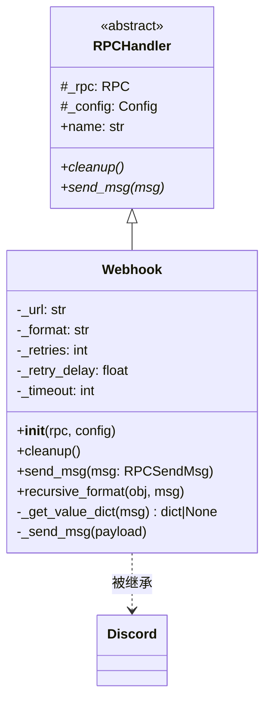

# webhook.py

## 概述

`freqtrade/rpc/webhook.py` 实现了 Webhook 通知功能，在交易事件发生时向用户配置的 URL 发送 HTTP POST 请求。支持三种数据格式（form、json、raw），具备可配置的重试机制。它同时作为 `Discord` 类的父类，提供底层 HTTP 发送能力。

## 架构图

## 核心类/函数

### Webhook

#### `__init__(self, rpc: RPC, config: Config) -> None`
- **参数**: `rpc` -- RPC 核心实例；`config` -- 项目配置
- **职责**: 从 `config["webhook"]` 中读取 URL、格式、重试次数、重试延迟、超时时间
- **默认值**: `format="form"`, `retries=0`, `retry_delay=0.1`, `timeout=10`

#### `cleanup(self) -> None`
- **职责**: 空操作。Webhook 无需清理持久资源

#### `_get_value_dict(self, msg: RPCSendMsg) -> dict[str, Any] | None`
- **参数**: `msg` -- RPC 消息字典
- **返回**: 对应消息类型的 Webhook 配置模板字典，或 `None`
- **职责**: 根据消息类型从配置中查找对应的 Webhook 模板
- **关键逻辑**:
  1. 优先使用 `msg["type"].value` 作为 key 查找（新版配置方式）
  2. 向后兼容旧版 key（如 `webhookentry`、`webhookexitcancel` 等）
  3. 对于 PROTECTION_TRIGGER、WHITELIST、ANALYZED_DF、NEW_CANDLE、STRATEGY_MSG 等类型返回 `None`（不发送）

#### `recursive_format(self, obj, msg: RPCSendMsg)`
- **参数**: `obj` -- 待格式化的对象（dict/list/str）；`msg` -- 消息数据
- **返回**: 格式化后的对象
- **职责**: 递归地对嵌套数据结构执行 `str.format(**msg)` 操作
- **关键逻辑**: 使用 Python `match/case` 语法，分别处理 dict、list、str 和其他类型

#### `send_msg(self, msg: RPCSendMsg) -> None`
- **参数**: `msg` -- RPC 消息字典
- **职责**: 获取消息模板，格式化后调用 `_send_msg` 发送
- **异常处理**: 捕获 `KeyError`（模板中引用了 msg 中不存在的字段）

#### `_send_msg(self, payload: dict) -> None`
- **参数**: `payload` -- HTTP 请求负载
- **职责**: 执行实际的 HTTP POST 请求
- **关键逻辑**:
  - 支持重试机制，最多 `_retries + 1` 次尝试
  - 每次重试之间等待 `_retry_delay` 秒
  - 根据 `_format` 选择发送方式：
    - `"form"` -- `data=payload`（form-encoded）
    - `"json"` -- `json=payload`（JSON）
    - `"raw"` -- `data=payload["data"]`，Content-Type 为 `text/plain`
  - 调用 `response.raise_for_status()` 检查 HTTP 状态码
  - 失败时记录警告日志但不抛出异常

## 依赖关系

### 内部依赖（本项目模块）
- `freqtrade.constants` -- 导入 `Config` 类型
- `freqtrade.enums` -- 导入 `RPCMessageType`
- `freqtrade.rpc` -- 导入 `RPC`、`RPCHandler`
- `freqtrade.rpc.rpc_types` -- 导入 `RPCSendMsg`

### 外部依赖（第三方库）
- `logging` -- 日志记录
- `time` -- 重试延迟的 `sleep`
- `requests` -- `post` 函数用于发送 HTTP 请求，`RequestException` 用于异常处理

### 被依赖（谁引用了本文件）
- `freqtrade.rpc.rpc_manager` -- 当配置中启用 Webhook 时延迟导入并实例化
- `freqtrade.rpc.discord` -- `Discord` 类继承 `Webhook`，复用 `_send_msg` 方法
