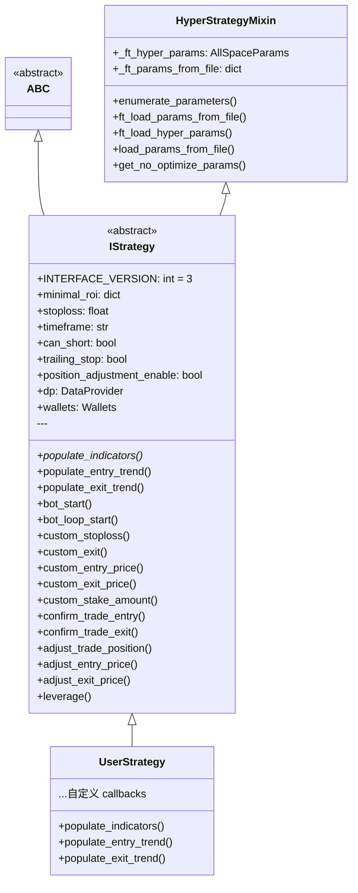
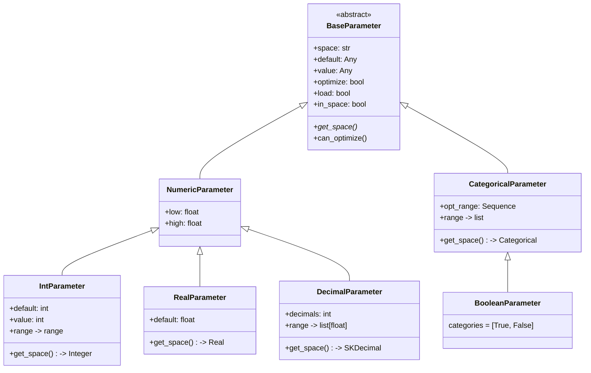
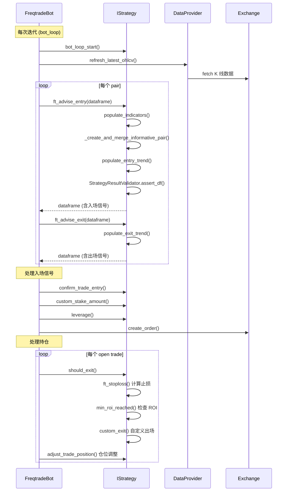
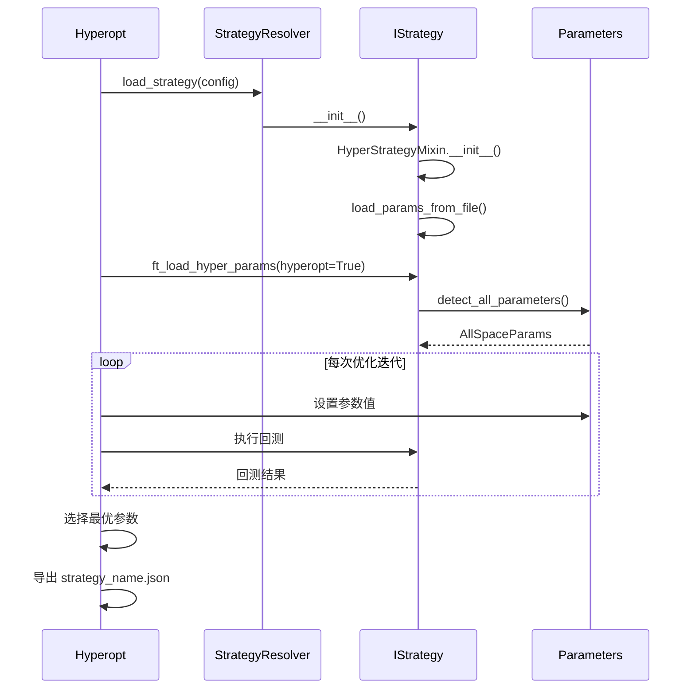
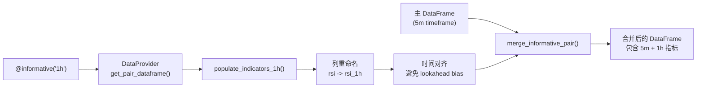

# Strategy -- 策略框架源码文档

## 1. 模块概述

`freqtrade/strategy/` 是 Freqtrade 的策略框架模块，定义了用户自定义交易策略必须遵循的接口和基础设施。该模块的核心是 `IStrategy` 抽象基类（约 80KB），它为策略开发者提供了一套完整的 callback 机制，涵盖从信号生成到订单确认的全生命周期。

### 核心设计理念

- **接口驱动**：通过 `IStrategy` 定义标准策略接口，用户只需实现 `populate_indicators()`、`populate_entry_trend()`、`populate_exit_trend()` 三个核心方法
- **Hyperopt 集成**：通过 `HyperStrategyMixin` 和参数类（`IntParameter`、`DecimalParameter` 等）支持参数自动优化
- **Informative 装饰器**：通过 `@informative` 装饰器实现多时间周期数据的声明式合并
- **安全包装**：通过 `strategy_safe_wrapper` 保护策略回调不会因用户代码错误导致系统崩溃
- **向后兼容**：通过 `StrategyUpdater` 自动将 v1/v2 策略代码迁移到 v3 接口
- **数据验证**：通过 `StrategyResultValidator` 确保策略返回的 DataFrame 未被意外修改

### 策略接口版本

| 版本 | 说明 |
|------|------|
| v1 | 初始接口，无 metadata 参数（已废弃，不再支持） |
| v2 | `populate_*` 方法包含 metadata dict |
| v3 | 当前版本，支持 short 和 leverage |

---

## 2. 目录结构

| 文件名 | 大小 | 功能说明 |
|--------|------|----------|
| `__init__.py` | ~1.5KB | 模块入口，统一导出 `IStrategy`、参数类、辅助函数等，定义 `__all__` |
| `interface.py` | ~80KB | **核心文件**。定义 `IStrategy` 抽象基类，包含所有策略回调方法（约 30+ 个 callback）、信号解析、ROI/Stoploss 计算逻辑 |
| `hyper.py` | ~6KB | Hyperopt 集成 Mixin。`HyperStrategyMixin` 类负责加载/管理可优化参数 |
| `parameters.py` | ~12KB | Hyperopt 参数类定义：`BaseParameter`、`IntParameter`、`DecimalParameter`、`RealParameter`、`CategoricalParameter`、`BooleanParameter` |
| `informative_decorator.py` | ~5KB | `@informative` 装饰器及多时间周期数据合并逻辑 |
| `strategy_helper.py` | ~5KB | 策略辅助函数：`merge_informative_pair()`、`stoploss_from_open()`、`stoploss_from_absolute()` |
| `strategy_wrapper.py` | ~2KB | `strategy_safe_wrapper` 装饰器，安全执行用户策略代码 |
| `strategy_validation.py` | ~1.5KB | `StrategyResultValidator` 类，验证策略返回的 DataFrame 完整性 |
| `strategyupdater.py` | ~8KB | `StrategyUpdater` 类，使用 AST 自动迁移旧版策略代码到 v3 接口 |

---

## 3. 架构图

```mermaid
graph TB
    subgraph "Strategy 模块整体架构"
        direction TB

        subgraph "用户策略"
            UserStrategy["MyStrategy<br/>(用户自定义)<br/>继承 IStrategy"]
        end

        subgraph "策略框架核心"
            IStrategy["IStrategy (ABC)<br/>interface.py<br/>~80KB<br/>30+ callbacks"]
            HyperMixin["HyperStrategyMixin<br/>hyper.py<br/>参数加载/管理"]
        end

        subgraph "参数系统"
            BaseParam["BaseParameter (ABC)"]
            IntParam["IntParameter"]
            DecParam["DecimalParameter"]
            RealParam["RealParameter"]
            CatParam["CategoricalParameter"]
            BoolParam["BooleanParameter"]
        end

        subgraph "辅助工具"
            Informative["@informative 装饰器<br/>informative_decorator.py"]
            Helper["strategy_helper.py<br/>merge_informative_pair<br/>stoploss_from_open"]
            Wrapper["strategy_safe_wrapper<br/>strategy_wrapper.py"]
            Validator["StrategyResultValidator<br/>strategy_validation.py"]
            Updater["StrategyUpdater<br/>strategyupdater.py<br/>AST 代码迁移"]
        end

        subgraph "外部调用方"
            FreqtradeBot["FreqtradeBot"]
            Backtesting["Backtesting"]
            Hyperopt["Hyperopt"]
            StrategyResolver["StrategyResolver"]
        end
    end

    UserStrategy -->|继承| IStrategy
    IStrategy -->|继承| HyperMixin

    HyperMixin --> BaseParam
    BaseParam <|-- IntParam
    BaseParam <|-- DecParam
    BaseParam <|-- RealParam
    BaseParam <|-- CatParam
    CatParam <|-- BoolParam

    IStrategy --> Informative
    IStrategy --> Helper
    IStrategy --> Wrapper
    IStrategy --> Validator

    FreqtradeBot --> IStrategy
    Backtesting --> IStrategy
    Hyperopt --> IStrategy
    StrategyResolver -->|加载| IStrategy
    Updater -->|迁移| UserStrategy
```

### IStrategy 类继承关系



---

## 4. 核心类/函数说明

### 4.1 `IStrategy` (`interface.py`)

#### 策略属性

| 属性 | 类型 | 说明 |
|------|------|------|
| `INTERFACE_VERSION` | `int` | 策略接口版本（当前为 3） |
| `minimal_roi` | `dict` | ROI 表，键为分钟数，值为最小收益率 |
| `stoploss` | `float` | 固定止损比例（负值，如 -0.1 表示 10%） |
| `timeframe` | `str` | 策略时间周期（如 "5m", "1h"） |
| `can_short` | `bool` | 是否支持做空 |
| `trailing_stop` | `bool` | 是否启用追踪止损 |
| `trailing_stop_positive` | `float` | 盈利后的追踪止损比例 |
| `order_types` | `dict` | 订单类型配置（entry/exit/stoploss） |
| `order_time_in_force` | `dict` | 订单有效期配置 |
| `startup_candle_count` | `int` | 策略需要的启动 K 线数量 |
| `process_only_new_candles` | `bool` | 是否只在新 K 线时运行指标计算 |
| `position_adjustment_enable` | `bool` | 是否启用仓位调整（加仓/减仓） |
| `dp` | `DataProvider` | 数据提供者，访问其他 pair/timeframe 的数据 |
| `wallets` | `Wallets` | 钱包对象，查询余额 |

#### 核心抽象方法（用户必须实现）

```python
@abstractmethod
def populate_indicators(self, dataframe: DataFrame, metadata: dict) -> DataFrame:
    """计算技术指标"""

def populate_entry_trend(self, dataframe: DataFrame, metadata: dict) -> DataFrame:
    """填充入场信号列 (enter_long, enter_short, enter_tag)"""

def populate_exit_trend(self, dataframe: DataFrame, metadata: dict) -> DataFrame:
    """填充出场信号列 (exit_long, exit_short, exit_tag)"""
```

#### 策略回调方法（可选覆盖）

**生命周期回调：**

| 方法 | 调用时机 | 返回值 |
|------|---------|--------|
| `bot_start()` | Bot 启动后仅调用一次 | None |
| `bot_loop_start()` | 每次迭代开始时调用 | None |
| `order_filled()` | 任何订单成交后调用 | None |

**入场/出场控制：**

| 方法 | 调用时机 | 返回值 |
|------|---------|--------|
| `confirm_trade_entry()` | 入场订单下单前 | `bool` 是否确认 |
| `confirm_trade_exit()` | 出场订单下单前 | `bool` 是否确认 |
| `custom_exit()` | 每次迭代检查自定义出场条件 | `str/bool/None` |
| `custom_stake_amount()` | 自定义每笔交易的 stake 数量 | `float` |

**价格/止损自定义：**

| 方法 | 调用时机 | 返回值 |
|------|---------|--------|
| `custom_stoploss()` | 每次迭代计算动态止损 | `float` 相对当前价的止损比例 |
| `custom_roi()` | 每次迭代计算动态 ROI | `float/None` ROI 阈值 |
| `custom_entry_price()` | 入场时自定义限价 | `float` |
| `custom_exit_price()` | 出场时自定义限价 | `float` |
| `adjust_entry_price()` | 未成交入场单的价格调整 | `float/None` |
| `adjust_exit_price()` | 未成交出场单的价格调整 | `float/None` |
| `adjust_order_price()` | 统一的订单价格调整接口 | `float/None` |

**仓位调整：**

| 方法 | 调用时机 | 返回值 |
|------|---------|--------|
| `adjust_trade_position()` | 每次迭代检查是否需要加仓/减仓 | `float/None` 正值加仓，负值减仓 |
| `leverage()` | 确定杠杆倍数 | `float` |

**超时处理：**

| 方法 | 调用时机 | 返回值 |
|------|---------|--------|
| `check_entry_timeout()` | 入场限价单超时检查 | `bool` 是否取消 |
| `check_exit_timeout()` | 出场限价单超时检查 | `bool` 是否取消 |

#### 信号处理内部方法

IStrategy 还包含大量内部方法用于信号处理和 ROI/Stoploss 计算：

- `ft_advise_entry()` / `ft_advise_exit()` - 包装用户的 populate_entry/exit_trend 并进行 DataFrame 验证
- `should_exit()` - 综合判断是否应该出场（ROI / Stoploss / Signal / Custom Exit）
- `ft_stoploss()` - 计算止损价格（支持固定止损、追踪止损、自定义止损）
- `min_roi_reached()` - 判断是否达到 minimal_roi 设定的收益率

### 4.2 `HyperStrategyMixin` (`hyper.py`)

Hyperopt 参数管理的 Mixin 类，为 `IStrategy` 提供参数自动发现和加载能力。

#### 参数加载优先级

```
参数文件 (strategy_name.json)
  > 策略类属性 (buy_params, sell_params)
    > 参数默认值 (default=...)
```

#### 核心方法

- `ft_load_params_from_file()` - 从 JSON 文件加载 ROI、stoploss、trailing 等全局参数
- `ft_load_hyper_params()` - 加载所有 Hyperopt 可优化参数
- `enumerate_parameters()` - 迭代所有参数（按 space 过滤）
- `detect_all_parameters()` - 扫描策略类属性，自动发现 `BaseParameter` 子类实例

#### 参数空间自动检测

参数名前缀自动映射到空间：
- `buy_*` / `enter_*` -> `buy` / `enter` space
- `sell_*` / `exit_*` -> `sell` / `exit` space
- `protection_*` -> `protection` space

### 4.3 参数类 (`parameters.py`)



**使用示例：**

```python
class MyStrategy(IStrategy):
    buy_rsi = IntParameter(10, 50, default=30, space="buy")
    sell_rsi = IntParameter(50, 90, default=70, space="sell")
    buy_adx = DecimalParameter(15.0, 50.0, default=25.0, decimals=1, space="buy")
    use_ema = BooleanParameter(default=True, space="buy")
```

### 4.4 `@informative` 装饰器 (`informative_decorator.py`)

用于声明式地定义多时间周期 informative 数据：

```python
@informative('1h')
def populate_indicators_1h(self, dataframe: DataFrame, metadata: dict) -> DataFrame:
    dataframe['rsi'] = ta.RSI(dataframe, timeperiod=14)
    return dataframe
```

**工作流程：**
1. 装饰器将 `InformativeData` 附加到方法的 `_ft_informative` 属性
2. `IStrategy.__init__()` 扫描所有带 `_ft_informative` 的方法
3. `_create_and_merge_informative_pair()` 在运行时获取 informative 数据、执行指标计算、合并到主 DataFrame
4. 合并时自动处理时间对齐，避免 lookahead bias

**列名格式化：**
- 同 pair：`{column}_{timeframe}` -> 如 `rsi_1h`
- 不同 pair：`{base}_{quote}_{column}_{timeframe}` -> 如 `btc_usdt_rsi_1h`

### 4.5 `strategy_helper.py`

**`merge_informative_pair()`**
- 安全合并不同时间周期的 DataFrame，防止 lookahead bias
- 通过将 informative candle 的日期向前偏移一个时间周期来实现
- 使用 `pd.merge_ordered` 的 ffill 方法，比单独的 ffill 快 2.5 倍

**`stoploss_from_open()`**
- 给定相对于开仓价的止损百分比和当前利润，计算相对于当前价的止损值
- 支持 long/short 和杠杆计算

**`stoploss_from_absolute()`**
- 给定绝对止损价格和当前价格，计算相对止损值

### 4.6 `strategy_safe_wrapper` (`strategy_wrapper.py`)

保护性包装器，用于安全执行用户策略代码：

- 捕获 `ValueError` 和其他 `Exception`
- 自动 deepcopy `trade` 参数，防止策略代码意外修改交易对象
- 可配置默认返回值和是否静默错误
- 格式化异常 traceback 信息用于日志记录

### 4.7 `StrategyResultValidator` (`strategy_validation.py`)

验证策略返回的 DataFrame 未被修改：
- 检查 DataFrame 长度是否一致
- 检查最后一根 K 线的 close 价格是否一致
- 检查最后一根 K 线的 date 是否一致
- 支持 `warn_only` 模式（仅警告，不抛异常）

### 4.8 `StrategyUpdater` (`strategyupdater.py`)

基于 AST (Abstract Syntax Tree) 的策略代码自动迁移工具：

**名称映射：**
- `buy` -> `enter_long`
- `sell` -> `exit_long`
- `buy_tag` -> `enter_tag`
- `ticker_interval` -> `timeframe`
- `populate_buy_trend` -> `populate_entry_trend`
- `custom_sell` -> `custom_exit`
- `np.NaN` -> `np.nan`

**工作流程：**
1. 读取源文件
2. 备份原始文件到 `strategies_orig_updater/` 目录
3. 使用 `ast_comments` 解析为 AST
4. 通过 `NameUpdater` (NodeTransformer) 遍历替换
5. 自动添加/更新 `INTERFACE_VERSION = 3`
6. 反解析回源代码并写入

---

## 5. 依赖关系

### 外部依赖

| 依赖 | 用途 |
|------|------|
| `pandas` | DataFrame 操作，核心数据结构 |
| `pydantic` | 数据验证 |
| `ast_comments` | AST 代码解析和修改（保留注释） |

### 内部依赖

| 模块 | 用途 |
|------|------|
| `freqtrade.exchange` | 时间周期转换函数 |
| `freqtrade.enums` | 信号类型、交易方向等枚举 |
| `freqtrade.persistence` | Trade, Order, PairLocks 持久化对象 |
| `freqtrade.data.dataprovider` | DataProvider 数据提供者 |
| `freqtrade.data.converter` | 数据转换工具 |
| `freqtrade.wallets` | Wallets 钱包余额查询 |
| `freqtrade.optimize.hyperopt_tools` | Hyperopt 参数文件加载 |
| `freqtrade.exceptions` | 策略相关异常类型 |

---

## 6. 数据流

### 6.1 策略执行主流程



### 6.2 Hyperopt 参数优化流程



### 6.3 Informative 数据合并流程


