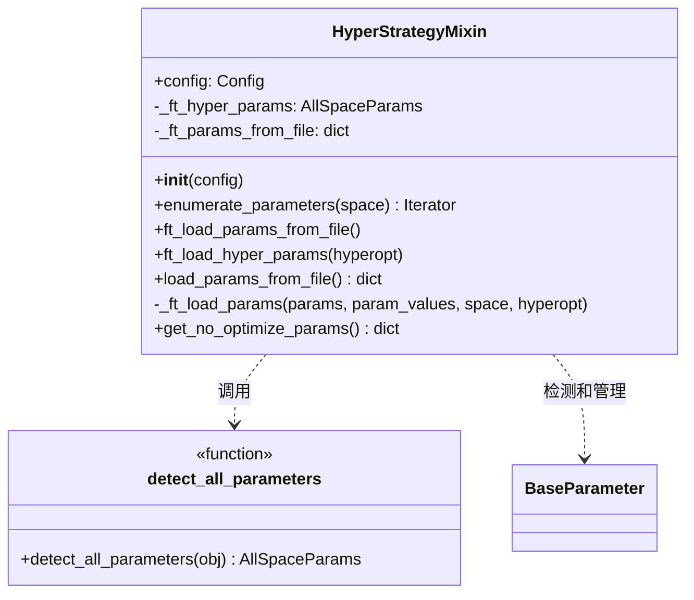

# hyper.py

## 概述

`freqtrade/strategy/hyper.py` 定义了 `HyperStrategyMixin` 混入类，为策略提供超参数优化（Hyperopt）支持。它负责：

1. 从 JSON 参数文件加载优化后的参数（ROI、stoploss、trailing stop 等）
2. 自动检测策略类中定义的所有 `BaseParameter` 子类实例
3. 按照优先级（参数文件 > 策略属性 > 默认值）设置参数值
4. 提供参数枚举和查询功能

## 架构图

## 核心类/函数

### HyperStrategyMixin

策略的超参数管理混入类，被 `IStrategy` 继承。

**`__init__(self, config: Config)`**
- 初始化配置并从 JSON 文件加载参数
- 调用 `load_params_from_file()` 获取已保存的优化结果

**`enumerate_parameters(self, space: str | None = None) -> Iterator[tuple[str, BaseParameter]]`**
- 遍历所有可优化参数
- 参数 `space`: 可选过滤器，按参数空间（如 'buy', 'sell'）过滤
- 返回 `(参数名, 参数对象)` 元组的迭代器

**`ft_load_params_from_file(self) -> None`**
- 从参数文件加载 ROI、stoploss、trailing stop 等全局设置
- 必须在 `strategy_resolver` 中加载配置值之前运行

**`ft_load_hyper_params(self, hyperopt: bool = False) -> None`**
- 加载所有可优化参数，优先级为：
  1. 参数文件中的值
  2. 策略类中定义的 `buy_params` / `sell_params` 等字典
  3. 参数默认值
- `hyperopt=True` 时将标记参数处于优化模式

**`load_params_from_file(self) -> dict`**
- 查找与策略 `.py` 文件同名的 `.json` 文件
- 验证 `strategy_name` 是否匹配
- 使用 `HyperoptTools.load_params()` 解析文件

**`_ft_load_params(self, params, param_values, space, hyperopt) -> None`**
- 逐个设置参数值
- 根据 `param.load` 标志决定是否覆盖默认值
- 设置 `param.in_space` 标志表示参数是否参与当前优化

**`get_no_optimize_params(self) -> dict[str, dict]`**
- 返回不参与当前优化的参数及其值
- 用于 Hyperopt 报告中记录固定参数

### detect_all_parameters(obj) -> AllSpaceParams

模块级函数，自动检测策略对象中所有 `BaseParameter` 子类实例。

- 遍历对象的所有属性
- 通过命名前缀（`buy_`, `sell_`, `enter_`, `exit_`, `protection_`）自动推断参数空间
- 校验空间名有效性（不允许 'all', 'default' 等保留名）
- 返回 `{space: {param_name: param_obj}}` 格式的字典

## 依赖关系

### 内部依赖（本项目模块）
- `freqtrade.constants.Config` — 配置类型
- `freqtrade.exceptions` — DependencyException, OperationalException
- `freqtrade.misc.deep_merge_dicts` — 字典深度合并
- `freqtrade.optimize.hyperopt_tools.HyperoptTools` — 加载参数文件
- `freqtrade.strategy.parameters.BaseParameter` — 参数基类

### 外部依赖（第三方库）
- `collections.defaultdict` — 默认字典
- `pathlib.Path` — 路径操作

### 被依赖（谁引用了本文件）
- `freqtrade.strategy.interface.IStrategy` — 继承 HyperStrategyMixin
- `freqtrade.commands.list_commands` — 导入 detect_all_parameters
