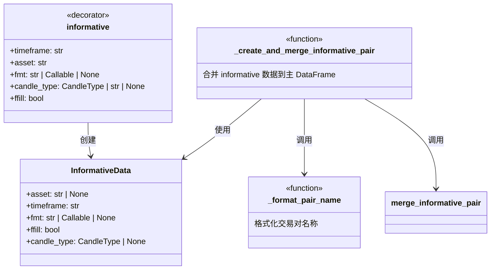

# informative_decorator.py

## 概述

`freqtrade/strategy/informative_decorator.py` 提供了 `@informative` 装饰器，允许策略开发者以声明式方式定义 informative pair（参考交易对/时间帧数据）。通过该装饰器标记的函数会自动获取指定交易对和时间帧的数据，计算指标后合并回主 DataFrame。

## 架构图

## 核心类/函数

### InformativeData (dataclass)

存储 informative pair 配置信息的数据类。

| 字段 | 类型 | 说明 |
|------|------|------|
| `asset` | `str \| None` | 交易对名称（如 'BTC/USDT'），None 表示当前交易对 |
| `timeframe` | `str` | 时间帧（如 '1h', '4h'） |
| `fmt` | `str \| Callable \| None` | 列名格式化模板或格式化函数 |
| `ffill` | `bool` | 是否前向填充合并后的缺失值 |
| `candle_type` | `CandleType \| None` | K线类型（如 mark, funding_rate） |

### informative() 装饰器

用于装饰策略中的 `populate_indicators_Nn` 方法。

**参数：**
- `timeframe: str` — 必须大于等于策略主时间帧
- `asset: str` — 交易对，支持格式变量 `{base}`, `{BASE}`, `{quote}`, `{QUOTE}`
- `fmt: str | Callable | None` — 列名格式化
  - 默认规则：如果指定了 asset 则为 `{base}_{quote}_{column}_{timeframe}`，否则为 `{column}_{timeframe}`
- `candle_type` — K线类型
- `ffill: bool` — 前向填充（默认 True）

**工作原理：**
将 `InformativeData` 对象添加到被装饰函数的 `_ft_informative` 属性列表中，供 `IStrategy.__init__()` 收集使用。

### _create_and_merge_informative_pair()

内部函数，执行实际的数据获取、指标计算和合并操作。

**流程：**
1. 解析交易对名称（支持 `{stake_currency}` 等变量替换）
2. 通过 `dp.get_pair_dataframe()` 获取 informative 数据
3. 调用用户定义的 `populate_indicators_Nn()` 计算指标
4. 根据 `fmt` 规则重命名列
5. 调用 `merge_informative_pair()` 合并到主 DataFrame

### _format_pair_name()

格式化交易对名称，支持 `{stake_currency}`, `{base}`, `{BASE}`, `{quote}`, `{QUOTE}` 变量替换。

## 依赖关系

### 内部依赖（本项目模块）
- `freqtrade.enums.CandleType` — K线类型枚举
- `freqtrade.exceptions.OperationalException` — 异常处理
- `freqtrade.strategy.strategy_helper.merge_informative_pair` — 数据合并函数

### 外部依赖（第三方库）
- `pandas.DataFrame` — 数据处理

### 被依赖（谁引用了本文件）
- `freqtrade.strategy.__init__` — 导出 informative 装饰器
- `freqtrade.strategy.interface.IStrategy` — 收集装饰器信息并调用合并函数
