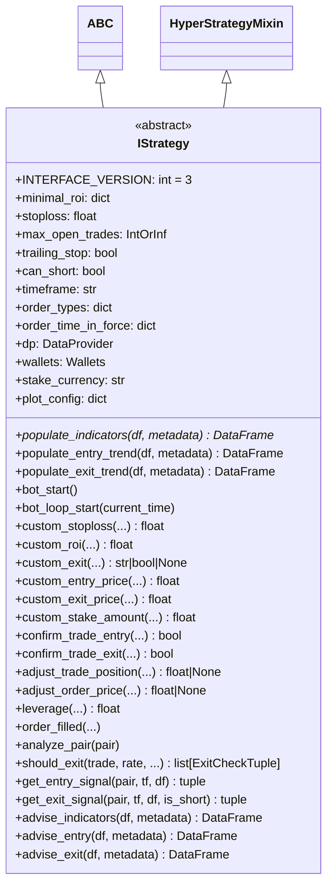

# interface.py

## 概述

`freqtrade/strategy/interface.py` 定义了 `IStrategy` — 所有自定义交易策略必须继承的核心接口类。它是 freqtrade 策略系统的核心，包含：

1. **策略配置属性**：ROI、止损、trailing stop、订单类型、时间帧等
2. **策略生命周期回调**：bot_start, bot_loop_start, order_filled 等
3. **信号生成**：populate_indicators, populate_entry_trend, populate_exit_trend
4. **交易决策回调**：custom_stoploss, custom_exit, confirm_trade_entry/exit, leverage 等
5. **价格/仓位调整**：custom_entry_price, custom_exit_price, adjust_trade_position 等
6. **内部分析管道**：analyze_pair, should_exit, ft_stoploss_reached, min_roi_reached 等
7. **FreqAI 集成**：feature_engineering_* 方法族

`IStrategy` 同时继承了 `ABC`（抽象基类）和 `HyperStrategyMixin`（超参数管理）。

## 架构图

## 核心类/函数

### IStrategy

#### 策略配置属性

| 属性 | 类型 | 默认值 | 说明 |
|------|------|--------|------|
| `INTERFACE_VERSION` | int | 3 | 策略接口版本 |
| `minimal_roi` | dict | {} | 最小收益率表（分钟: 收益率） |
| `stoploss` | float | - | 全局止损比例（负数，如 -0.1） |
| `max_open_trades` | IntOrInf | - | 最大同时持仓数 |
| `trailing_stop` | bool | False | 是否启用追踪止损 |
| `trailing_stop_positive` | float\|None | None | 正收益后的追踪止损值 |
| `trailing_stop_positive_offset` | float | 0.0 | 切换到正追踪止损的收益门槛 |
| `can_short` | bool | False | 是否支持做空 |
| `timeframe` | str | - | 策略使用的K线时间帧 |
| `process_only_new_candles` | bool | True | 仅在新K线时运行分析 |
| `startup_candle_count` | int | 0 | 策略启动所需的历史K线数 |
| `position_adjustment_enable` | bool | False | 是否启用仓位调整 |

#### 必须实现的抽象方法

**`populate_indicators(self, dataframe, metadata) -> DataFrame`**
- 计算技术指标，填充到 DataFrame
- `metadata` 包含 `{'pair': 'ETH/BTC'}` 等信息

#### 用户可重写的回调方法

**`populate_entry_trend(self, dataframe, metadata) -> DataFrame`**
- 基于指标生成入场信号，设置 `enter_long` / `enter_short` 列

**`populate_exit_trend(self, dataframe, metadata) -> DataFrame`**
- 基于指标生成退场信号，设置 `exit_long` / `exit_short` 列

**`custom_stoploss(self, pair, trade, current_time, current_rate, current_profit, after_fill) -> float | None`**
- 自定义动态止损逻辑
- 返回相对于当前价格的止损比例（如 -0.05 表示 5% 止损）
- 需设置 `use_custom_stoploss = True`

**`custom_roi(self, pair, trade, current_time, trade_duration, entry_tag, side) -> float | None`**
- 自定义 ROI 逻辑
- 需设置 `use_custom_roi = True`
- 返回 None 则回退到 `minimal_roi` 逻辑

**`custom_exit(self, pair, trade, current_time, current_rate, current_profit) -> str | bool | None`**
- 自定义退出条件
- 返回字符串作为退出原因，True 触发退出，None/False 不退出

**`leverage(self, pair, current_time, current_rate, proposed_leverage, max_leverage, entry_tag, side) -> float`**
- 自定义杠杆倍数（仅期货模式）
- 默认返回 1.0

**`confirm_trade_entry(self, ...) -> bool`** / **`confirm_trade_exit(self, ...) -> bool`**
- 入场/退场前的确认回调，返回 False 可取消操作

**`adjust_trade_position(self, ...) -> float | None | tuple`**
- 加仓/减仓逻辑，正值加仓、负值减仓
- 可返回 `(stake_amount, order_reason)` 元组

**`adjust_order_price(self, ..., is_entry) -> float | None`**
- 统一的订单价格调整逻辑（合并 adjust_entry_price 和 adjust_exit_price）

#### 内部分析管道方法

**`analyze_pair(self, pair) -> None`**
- 完整的单交易对分析流程：获取数据 -> 计算指标 -> 生成信号

**`should_exit(self, trade, rate, current_time, ...) -> list[ExitCheckTuple]`**
- 综合评估退出条件：exit signal -> stop loss -> ROI -> trailing stop
- 返回退出原因列表

**`ft_stoploss_reached(self, ...) -> ExitCheckTuple`**
- 止损到达判断，包含自定义止损、追踪止损、清算价格检测

**`min_roi_reached(self, trade, current_profit, current_time) -> bool`**
- ROI 到达判断，结合 `minimal_roi` 表和可选的 `custom_roi`

**`advise_indicators(self, dataframe, metadata) -> DataFrame`**
- 内部指标计算入口，先处理 `@informative` 装饰器，再调用 `populate_indicators`

**`gather_informative_pairs(self) -> ListPairsWithTimeframes`**
- 收集所有 informative pair 信息（手动定义 + `@informative` 装饰器 + FreqAI）

#### FreqAI 集成方法

- `feature_engineering_expand_all()` — 自动扩展的特征工程
- `feature_engineering_expand_basic()` — 基础自动扩展特征
- `feature_engineering_standard()` — 标准特征工程（不自动扩展）
- `set_freqai_targets()` — 设置预测目标

## 依赖关系

### 内部依赖（本项目模块）
- `freqtrade.configuration.TimeRange` — 时间范围
- `freqtrade.constants` — 常量定义
- `freqtrade.data.converter` — 数据转换
- `freqtrade.data.dataprovider.DataProvider` — 数据提供者
- `freqtrade.enums` — 各种枚举（CandleType, ExitType, SignalType 等）
- `freqtrade.exchange` — 时间帧工具函数
- `freqtrade.persistence` — Trade, Order, PairLocks
- `freqtrade.strategy.hyper.HyperStrategyMixin` — 超参数管理
- `freqtrade.strategy.informative_decorator` — Informative 装饰器支持
- `freqtrade.strategy.strategy_validation` — 数据验证
- `freqtrade.strategy.strategy_wrapper` — 安全调用包装器

### 外部依赖（第三方库）
- `pandas.DataFrame` — 数据处理
- `pydantic.ValidationError` — 数据验证

### 被依赖（谁引用了本文件）
- `freqtrade.strategy.__init__` — 导出 IStrategy
- `freqtrade.resolvers.strategy_resolver` — 加载和验证策略
- `freqtrade.freqtradebot` — 核心交易引擎调用策略方法
- `freqtrade.optimize.backtesting` — 回测引擎调用策略方法
- `freqtrade.freqai.freqai_interface` — FreqAI 集成
- 所有用户自定义策略 — 继承 IStrategy
