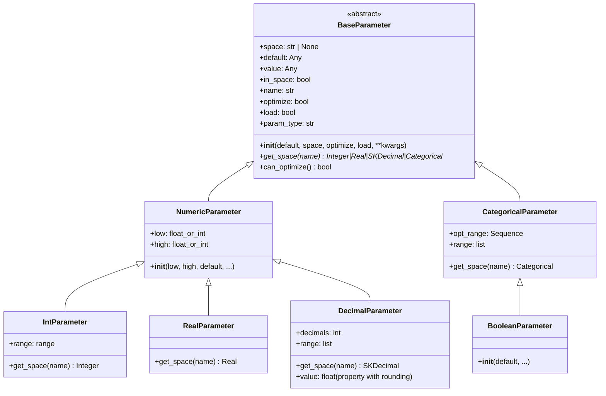

# parameters.py

## 概述

`freqtrade/strategy/parameters.py` 定义了 Hyperopt 超参数优化所使用的参数类体系。策略开发者可以在策略类中声明这些参数实例，Hyperopt 将自动搜索其最优值。该模块实现了完整的参数类型层次结构：

- `BaseParameter` — 抽象基类
- `NumericParameter` — 数值型参数基类
  - `IntParameter` — 整数参数
  - `RealParameter` — 浮点参数（无限精度）
  - `DecimalParameter` — 小数参数（指定精度）
- `CategoricalParameter` — 分类参数
  - `BooleanParameter` — 布尔参数（CategoricalParameter 的快捷方式）

## 架构图

## 核心类/函数

### BaseParameter (ABC)

所有可优化参数的抽象基类。

**关键属性：**
- `space` — 参数空间（'buy', 'sell', 'enter', 'exit', 'protection' 等），可自动推断
- `optimize` — 是否参与优化（默认 True）
- `load` — 是否从 `{space}_params` 字典加载值（默认 True）
- `in_space` — 当前是否在 Hyperopt 优化空间中
- `value` — 参数当前值

**关键方法：**
- `get_space(name)` — 抽象方法，创建 optuna 优化分布空间
- `can_optimize()` — 判断参数是否处于可优化状态（需同时满足 `in_space`, `optimize`, 非 OPTIMIZE 状态）

### IntParameter

整数类型的可优化参数。

**构造参数：**
- `low` / `high` — 优化范围（包含端点），也支持 `[low, high]` 格式
- `default` — 默认值

**`range` 属性：**
- Hyperopt 模式下返回 `range(low, high+1)`（inclusive）
- 非 Hyperopt 模式下返回仅含当前值的 range，避免计算大量指标

### RealParameter

浮点型参数，无精度限制。使用 `Real` 分布空间。

### DecimalParameter

有限精度的浮点型参数。

**额外参数：**
- `decimals: int = 3` — 小数位数

**特殊行为：**
- `value` 属性通过 property setter 自动四舍五入到指定精度
- `range` 属性返回离散化后的值列表

### CategoricalParameter

分类型参数。

**构造参数：**
- `categories: Sequence[Any]` — 候选值列表，至少需要 2 个元素
- `default` — 默认值，未指定时使用第一个候选值

### BooleanParameter

布尔型参数，是 `CategoricalParameter([True, False])` 的快捷方式。

## 依赖关系

### 内部依赖（本项目模块）
- `freqtrade.enums.HyperoptState` — Hyperopt 状态枚举
- `freqtrade.optimize.hyperopt_tools.HyperoptStateContainer` — 状态容器
- `freqtrade.optimize.space` — Integer, Real, SKDecimal, Categorical 分布类（条件导入）
- `freqtrade.exceptions.OperationalException` — 异常处理

### 外部依赖（第三方库）
- `abc.ABC` / `abstractmethod` — 抽象基类

### 被依赖（谁引用了本文件）
- `freqtrade.strategy.__init__` — 导出所有参数类
- `freqtrade.strategy.hyper` — 导入 BaseParameter 用于参数检测
- 所有用户策略 — 通过 `from freqtrade.strategy import IntParameter, ...` 使用
