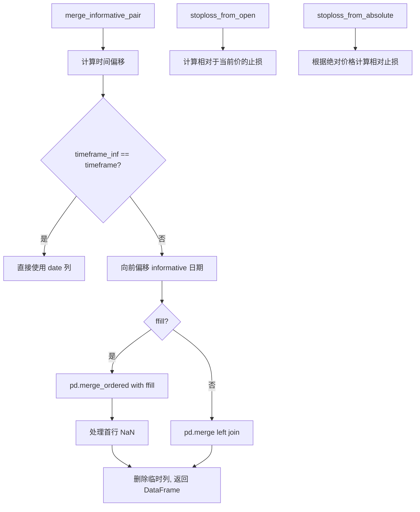

# strategy_helper.py

## 概述

`freqtrade/strategy/strategy_helper.py` 提供了策略开发中常用的辅助函数，包括：

1. `merge_informative_pair()` — 将 informative 时间帧数据合并到主 DataFrame，自动避免前瞻偏差（lookahead bias）
2. `stoploss_from_open()` — 根据相对于开仓价的期望止损计算相对于当前价的止损值
3. `stoploss_from_absolute()` — 根据绝对止损价格计算相对于当前价的止损值

## 架构图



## 核心类/函数

### merge_informative_pair()

将 informative 时间帧的数据正确合并到主 DataFrame。

**参数：**
- `dataframe` — 主 DataFrame（策略时间帧）
- `informative` — informative DataFrame（更高时间帧）
- `timeframe` — 主时间帧（如 '15m'）
- `timeframe_inf` — informative 时间帧（如 '1h'）
- `ffill: bool = True` — 是否前向填充
- `append_timeframe: bool = True` — 是否在列名后追加时间帧后缀
- `date_column: str = "date"` — 日期列名
- `suffix: str | None = None` — 自定义列名后缀（与 append_timeframe 互斥）

**核心逻辑 — 避免前瞻偏差：**
由于 K 线日期是开盘时间，直接合并会导致前瞻。例如 15:00 开始的 1h K线在 16:00 才关闭，但如果直接合并，15:00 的 15m K线就能"看到" 16:00 的收盘价。

解决方案是将 informative 日期向前偏移一个时间帧间隔：
```
date_merge = date + timedelta(inf_minutes) - timedelta(minutes)
```

这样 14:00 的 1h K线会合并到 15:00 的 15m K线上，因为 14:00 的 1h K线是在 15:00 时已经关闭的最后一根K线。

**特殊处理：**
- 如果两个时间帧相同，不做偏移
- 如果 informative 时间帧更短，抛出 ValueError
- 对于月度 K 线（'1M'），使用 `pd.offsets.MonthBegin` 处理
- 合并后处理首行 NaN：用合并日期前最近的 informative 数据填充

### stoploss_from_open()

根据期望的相对于开仓价的止损值，计算 `custom_stoploss` 需要返回的相对于当前价的止损值。

**参数：**
- `open_relative_stop: float` — 相对于开仓价的止损（正值=开仓价上方，负值=下方，已考虑杠杆）
- `current_profit: float` — 当前收益率
- `is_short: bool = False` — 是否做空
- `leverage: float = 1.0` — 杠杆倍数

**返回：**
- 相对于当前价格的止损值（始终 >= 0）
- 返回 0 表示止损价高于/低于（做多/做空）当前价

**数学公式（做多）：**
```
stoploss = 1 - (1 + open_relative_stop / leverage) / (1 + current_profit / leverage)
```

### stoploss_from_absolute()

根据绝对止损价格计算相对于当前价的止损值。

**参数：**
- `stop_rate: float` — 绝对止损价格
- `current_rate: float` — 当前价格
- `is_short: bool = False` — 是否做空
- `leverage: float = 1.0` — 杠杆倍数

**返回：**
- 正数止损值（始终 >= 0）
- 返回 0 表示止损价在当前价的"错误"侧

## 依赖关系

### 内部依赖（本项目模块）
- `freqtrade.exchange.timeframe_to_minutes` — 时间帧转换

### 外部依赖（第三方库）
- `pandas` — DataFrame 操作、merge_ordered、时间偏移

### 被依赖（谁引用了本文件）
- `freqtrade.strategy.__init__` — 导出 merge_informative_pair, stoploss_from_open, stoploss_from_absolute
- `freqtrade.strategy.informative_decorator` — 调用 merge_informative_pair
- 用户策略 — 通过 `from freqtrade.strategy import stoploss_from_open, ...` 使用
