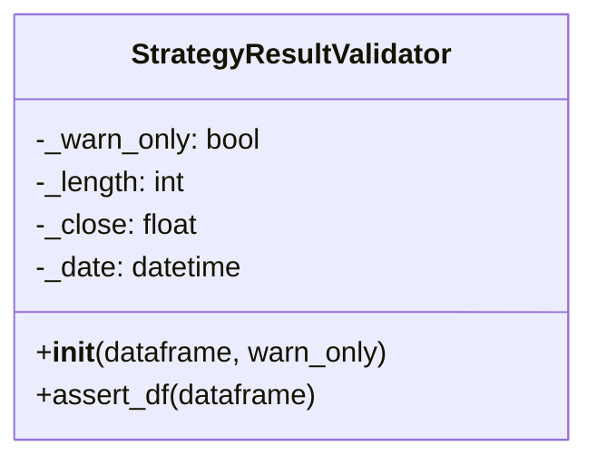

# strategy_validation.py

## 概述

`freqtrade/strategy/strategy_validation.py` 提供了 `StrategyResultValidator` 类，用于验证策略方法（如 `populate_indicators`、`populate_entry_trend` 等）返回的 DataFrame 是否符合预期。主要检测策略代码是否意外修改了 DataFrame 的长度、最后一根K线的收盘价或日期。

## 架构图



## 核心类/函数

### StrategyResultValidator

在策略方法调用前后验证 DataFrame 一致性。

**构造函数 `__init__(self, dataframe, warn_only=False)`**
- 记录 DataFrame 的初始状态快照：
  - `_length` — 行数
  - `_close` — 最后一行的收盘价
  - `_date` — 最后一行的日期
- `warn_only=False` 时抛出 StrategyError，`True` 时仅记录 warning 日志

**`assert_df(self, dataframe)`**
- 验证策略处理后的 DataFrame 是否保持一致
- 检查项目：
  1. DataFrame 是否为 None（缺少 return 语句）
  2. 行数是否变化
  3. 最后一根K线的收盘价是否被修改
  4. 最后一根K线的日期是否被修改
- 异常模式下抛出 `StrategyError`
- 警告模式下记录 `logger.warning`

**使用场景：**
```python
validator = StrategyResultValidator(dataframe, warn_only=...)
dataframe = strategy._analyze_ticker_internal(dataframe, metadata)
validator.assert_df(dataframe)  # 验证一致性
```

## 依赖关系

### 内部依赖（本项目模块）
- `freqtrade.exceptions.StrategyError` — 策略异常

### 外部依赖（第三方库）
- `pandas.DataFrame` — 数据帧操作

### 被依赖（谁引用了本文件）
- `freqtrade.strategy.interface.IStrategy` — 在 `analyze_pair()` 和 `advise_all_indicators()` 中使用
