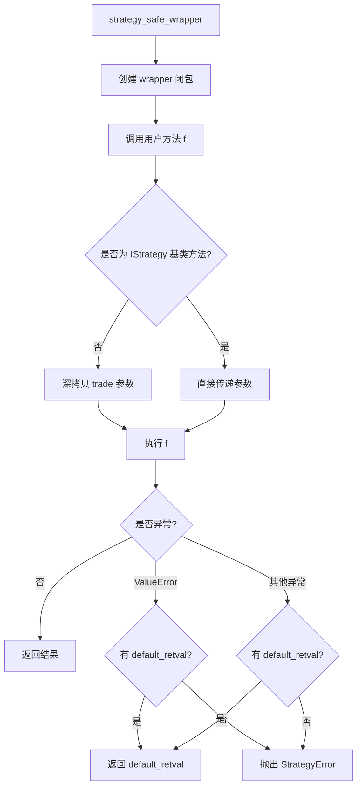

# strategy_wrapper.py

## 概述

`freqtrade/strategy/strategy_wrapper.py` 提供了 `strategy_safe_wrapper()` 函数，用于安全地调用用户策略中的方法。它：

1. 捕获所有异常，防止用户代码错误导致机器人崩溃
2. 在调用用户方法前对 `trade` 参数进行深拷贝，防止用户代码意外修改交易对象
3. 根据配置决定是返回默认值还是抛出 StrategyError

## 架构图

## 核心类/函数

### strategy_safe_wrapper(f, message="", default_retval=None, supress_error=False)

用户策略方法的安全调用包装器。

**参数：**
- `f: Callable` — 要包装的函数/方法
- `message: str` — 异常日志的前缀消息
- `default_retval` — 异常时返回的默认值；为 None 且 `supress_error=False` 时将抛出 StrategyError
- `supress_error: bool` — 为 True 时即使 `default_retval=None` 也不抛出异常

**返回：** 包装后的函数（保留原函数的签名信息，使用 `@wraps`）

**行为逻辑：**

1. **trade 参数保护：** 如果被调用的函数不是 IStrategy 基类中的方法（即用户重写的方法），并且 kwargs 中包含 'trade' 参数，则对 trade 对象进行 `deepcopy`。这防止了用户策略代码意外修改正在使用的 Trade 对象。

2. **异常处理：**
   - `ValueError` — 记录 warning 日志（包含 traceback 位置信息）
   - 其他 `Exception` — 记录 exception 日志
   - 如果 `default_retval` 不为 None，返回默认值
   - 如果 `default_retval` 为 None 且 `supress_error` 为 False，抛出 `StrategyError`

### __format_traceback(error) (私有函数)

格式化异常的 traceback 信息，跳过本文件的栈帧，返回类似 `"ClassName.method:42"` 格式的位置字符串。

## 依赖关系

### 内部依赖（本项目模块）
- `freqtrade.exceptions.StrategyError` — 策略异常类

### 外部依赖（第三方库）
- `copy.deepcopy` — 深拷贝
- `functools.wraps` — 保留被装饰函数签名

### 被依赖（谁引用了本文件）
- `freqtrade.strategy.interface.IStrategy` — 大量使用，包装 custom_stoploss, custom_exit, adjust_trade_position 等回调
- `freqtrade.plot.plotting` — 安全调用策略方法
