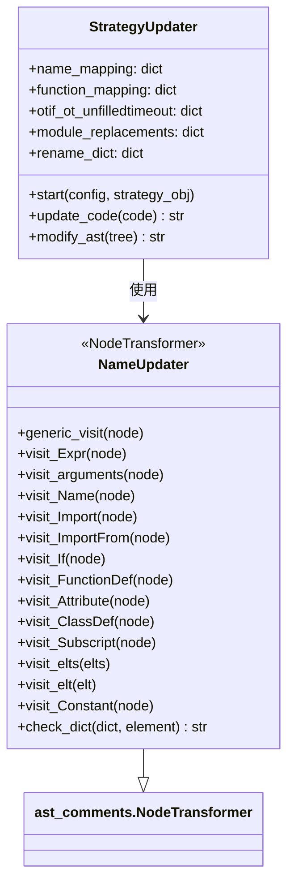

# strategyupdater.py

## 概述

`freqtrade/strategy/strategyupdater.py` 提供了策略代码自动迁移工具，将旧版（v2）策略代码自动更新为新版（v3）格式。它使用 Python AST（抽象语法树）模块解析和修改策略源代码，进行以下转换：

- 重命名旧的信号列名（`buy` -> `enter_long`, `sell` -> `exit_long` 等）
- 重命名旧的方法名（`populate_buy_trend` -> `populate_entry_trend` 等）
- 重命名旧的配置属性（`use_sell_signal` -> `use_exit_signal` 等）
- 更新过时的 NumPy 常量（`np.NaN` -> `np.nan`）
- 自动设置 `INTERFACE_VERSION = 3`

## 架构图

## 核心类/函数

### StrategyUpdater

策略迁移的主入口类。

**映射表：**

| 映射表 | 用途 | 示例 |
|--------|------|------|
| `name_mapping` | 通用名称替换 | `buy` -> `enter_long`, `sell_reason` -> `exit_reason` |
| `function_mapping` | 方法名替换 | `populate_buy_trend` -> `populate_entry_trend` |
| `otif_ot_unfilledtimeout` | order_types/time_in_force 字典键替换 | `buy` -> `entry` |
| `module_replacements` | 第三方库属性替换 | `numpy.NaN` -> `numpy.nan` |
| `rename_dict` | DataFrame 列名替换 | `buy` -> `enter_long`, `buy_tag` -> `enter_tag` |

**`start(self, config, strategy_obj)`**
1. 读取策略源文件
2. 备份原始文件到 `strategies_orig_updater/` 目录
3. 调用 `update_code()` 进行代码更新
4. 将更新后的代码写回原文件

**`update_code(self, code) -> str`**
- 使用 `ast_comments.parse()` 解析代码为 AST
- 调用 `modify_ast()` 修改 AST
- 使用 `ast_comments.unparse()` 还原为代码字符串（保留注释）

### NameUpdater (NodeTransformer)

AST 节点转换器，遍历并修改 AST 中的各种节点。

**主要 visit 方法：**

- `visit_FunctionDef` — 重命名函数定义（如 `populate_buy_trend` -> `populate_entry_trend`）
- `visit_Name` — 重命名变量引用和 numpy 常量
- `visit_ClassDef` — 检查 IStrategy 子类并添加/更新 `INTERFACE_VERSION = 3`
- `visit_Subscript` — 重命名 DataFrame 下标访问（如 `df['buy']` -> `df['enter_long']`）
- `visit_Attribute` — 重命名属性访问（如 `trade.nr_of_successful_buys` -> `trade.nr_of_successful_entries`）及 numpy 模块属性
- `visit_Constant` — 重命名字符串常量
- `visit_arguments` — 重命名函数参数
- `visit_Import` / `visit_ImportFrom` — 追踪 numpy 等模块的导入别名
- `generic_visit` — 覆盖默认遍历，跳过 `space` 关键字参数（保持 buy/sell 空间不变）

## 依赖关系

### 内部依赖（本项目模块）
- `freqtrade.constants.Config` — 配置类型

### 外部依赖（第三方库）
- `ast_comments` — 保留注释的 AST 解析/反解析库
- `shutil` — 文件备份
- `pathlib.Path` — 路径操作

### 被依赖（谁引用了本文件）
- `freqtrade.commands.strategy_utils_commands` — 策略更新命令入口
