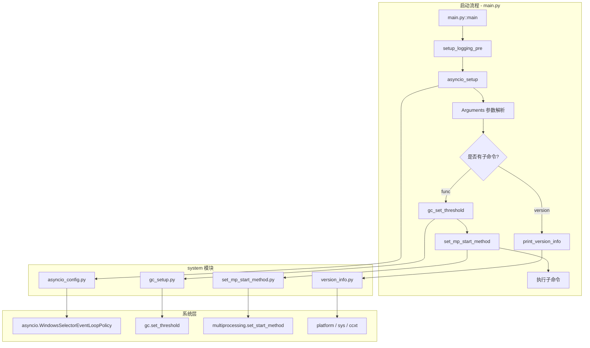
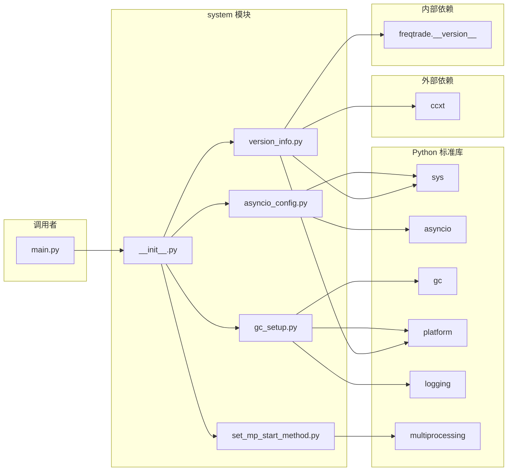
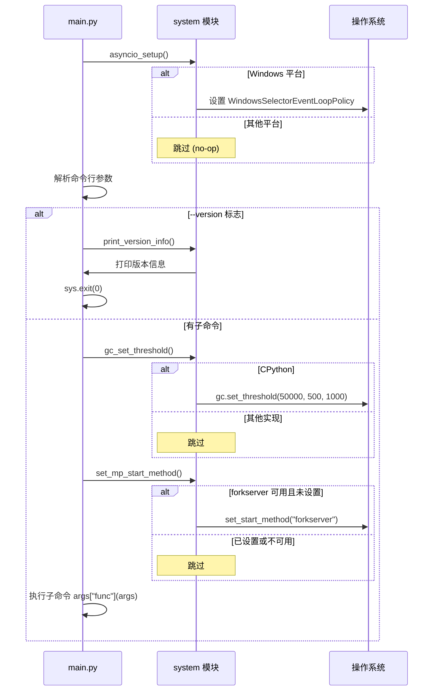

# Freqtrade 系统配置模块源码文档

## 1. 模块概述

`freqtrade/system/` 模块负责 Freqtrade 启动时的底层系统配置和性能优化。该模块在应用程序的最早阶段(在加载业务逻辑之前)执行,确保运行环境处于最佳状态。

模块的四大职责:
1. **Asyncio 事件循环配置**: 解决 Windows 平台上的 asyncio 兼容性问题
2. **垃圾回收调优**: 调整 Python GC 阈值以减少 GC 暂停,提升交易性能
3. **多进程启动方式配置**: 将 multiprocessing 的启动方式从 `fork` 迁移到 `forkserver`,适配 Python 3.14 的变更
4. **版本信息输出**: 打印操作系统、Python、CCXT 和 Freqtrade 的版本信息,辅助问题排查

这些配置都在 `main.py` 的 `main()` 函数中被调用,早于任何业务逻辑的初始化。

## 2. 目录结构

| 文件 | 功能说明 |
|------|---------|
| `__init__.py` | 模块入口,导出四个核心函数:`asyncio_setup`、`gc_set_threshold`、`print_version_info`、`set_mp_start_method` |
| `asyncio_config.py` | Asyncio 事件循环策略配置(Windows 平台适配) |
| `gc_setup.py` | Python 垃圾回收器阈值调优 |
| `set_mp_start_method.py` | Multiprocessing 启动方式设置 |
| `version_info.py` | 版本信息输出功能 |

## 3. 架构图



## 4. 核心类/函数说明

### 4.1 `asyncio_setup()` (`asyncio_config.py`)

```python
def asyncio_setup() -> None:
    if sys.platform == "win32":
        import asyncio
        asyncio.set_event_loop_policy(asyncio.WindowsSelectorEventLoopPolicy())
```

#### 功能说明

在 Windows 平台 (`win32`) 上将 asyncio 的事件循环策略设置为 `WindowsSelectorEventLoopPolicy`。

#### 技术背景

Python 3.8+ 在 Windows 上默认使用 `ProactorEventLoop`,但该循环在某些场景下(特别是与 ccxt/aiohttp 等库配合使用时)可能出现问题。`SelectorEventLoop` 虽然功能较少,但稳定性更好,适合 Freqtrade 的使用场景。

#### 调用时机

在 `main()` 函数中,早于参数解析阶段调用。仅在 Windows 平台生效,其他平台(Linux/macOS)不执行任何操作。

#### 影响范围

影响整个进程中所有使用 asyncio 的组件:
- Exchange WebSocket 连接
- API Server (FastAPI/uvicorn)
- External Message Consumer

### 4.2 `gc_set_threshold()` (`gc_setup.py`)

```python
def gc_set_threshold():
    if platform.python_implementation() == "CPython":
        gc.set_threshold(50_000, 500, 1000)
        logger.debug("Adjusting python allocations to reduce GC runs")
```

#### 功能说明

调整 CPython 的垃圾回收阈值,减少 GC 运行频率以提升性能。

#### 技术背景

CPython 的分代垃圾回收器默认阈值为 `(700, 10, 10)`:
- **Generation 0**: 每分配 700 个新对象触发一次 Gen-0 GC
- **Generation 1**: 每 10 次 Gen-0 GC 后触发一次 Gen-1 GC
- **Generation 2**: 每 10 次 Gen-1 GC 后触发一次 Gen-2 GC(Full GC)

Freqtrade 修改为 `(50_000, 500, 1000)`:
- **Generation 0**: 阈值提高到 50,000,大幅减少 Gen-0 GC 频率
- **Generation 1**: 设为 500,保持合理的中间代回收
- **Generation 2**: 设为 1000,极大减少 Full GC 的发生概率

这种优化策略参考了 Instagram 等高性能 Python 应用的实践。对于 Freqtrade 这样需要在固定时间窗口内完成策略分析和订单管理的应用,减少 GC 暂停可以降低延迟。

#### 适用条件

仅在 CPython 实现上生效(不影响 PyPy 等其他 Python 实现)。通过 `platform.python_implementation()` 检测。

#### 性能影响

- **正面**: 减少 GC 暂停次数和持续时间,降低策略分析和订单执行的延迟抖动
- **负面**: 内存使用可能略微增加(因为垃圾回收不那么频繁)
- **权衡**: 对于交易 Bot 来说,时间确定性比内存优化更重要

### 4.3 `set_mp_start_method()` (`set_mp_start_method.py`)

```python
def set_mp_start_method():
    try:
        sms = get_all_start_methods()
        if "forkserver" in sms and get_start_method(True) is None:
            set_start_method("forkserver")
    except RuntimeError:
        pass
```

#### 功能说明

将 Python multiprocessing 的启动方式从默认的 `fork` 改为 `forkserver`。

#### 技术背景

Python multiprocessing 有三种启动方式:

| 方式 | 机制 | 优点 | 缺点 |
|------|------|------|------|
| `fork` | 直接复制父进程 | 快速,共享内存 | 在多线程程序中不安全(可能导致死锁) |
| `spawn` | 启动全新 Python 解释器 | 最安全 | 最慢,不共享状态 |
| `forkserver` | 由专门的 server 进程 fork | 安全且较快 | 需要额外的 server 进程 |

Python 3.14 将把默认方式从 `fork` 改为 `forkserver`,从 Python 3.13 开始 `fork` 已被标记为 deprecated。Freqtrade 提前适配这一变更。

#### 安全机制

- 仅在当前没有显式设置启动方式时(`get_start_method(True) is None`)才设置
- 仅在 `forkserver` 可用时才设置(通过 `get_all_start_methods()` 检查)
- 捕获 `RuntimeError`(已在代码中设置过启动方式时会抛出)并静默忽略

#### 影响范围

影响 Freqtrade 中所有使用 multiprocessing 的组件:
- Hyperopt 并行优化(最主要的使用场景)
- FreqAI 模型训练
- 并行数据下载

### 4.4 `print_version_info()` (`version_info.py`)

```python
def print_version_info():
    import platform
    import sys
    import ccxt

    print(f"Operating System:\t{platform.platform()}")
    print(f"Python Version:\t\tPython {sys.version.split(' ')[0]}")
    print(f"CCXT Version:\t\t{ccxt.__version__}")
    print()
    print(f"Freqtrade Version:\tfreqtrade {__version__}")
```

#### 功能说明

打印系统环境和关键依赖的版本信息,用于问题排查和 Bug 报告。

#### 输出示例

```
Operating System:       macOS-14.0-arm64-arm-64bit
Python Version:         Python 3.12.3
CCXT Version:           4.2.10

Freqtrade Version:      freqtrade 2026.4-dev-abc1234
```

#### 调用时机

仅在用户使用 `-V/--version` 参数时调用,不在正常交易流程中执行。

#### 延迟导入

`ccxt`、`platform`、`sys` 都在函数内部导入,避免在不需要版本信息时加载这些模块(特别是 `ccxt` 的导入相对较慢)。

## 5. 依赖关系



## 6. 执行时序



## 7. 平台兼容性矩阵

| 功能 | Linux | macOS | Windows |
|------|-------|-------|---------|
| `asyncio_setup` | 不执行 | 不执行 | 设置 SelectorEventLoop |
| `gc_set_threshold` | CPython 时执行 | CPython 时执行 | CPython 时执行 |
| `set_mp_start_method` | 设置 forkserver | 设置 forkserver | 设置 forkserver(如可用) |
| `print_version_info` | 全平台 | 全平台 | 全平台 |

## 8. 设计原则

### 8.1 早期执行

所有系统配置都在业务逻辑加载之前执行,确保:
- asyncio 策略在任何异步操作之前设置
- GC 阈值在创建大量对象之前配置
- multiprocessing 启动方式在创建任何子进程之前设置

### 8.2 安全降级

每个函数都包含安全检查,在条件不满足时静默跳过:
- `asyncio_setup`: 非 Windows 不执行
- `gc_set_threshold`: 非 CPython 不执行
- `set_mp_start_method`: 已设置或 `RuntimeError` 时跳过
- `print_version_info`: 延迟导入,`ccxt` 未安装时会在导入时报错(但此时用户需要安装依赖)

### 8.3 最小侵入性

模块不修改任何全局业务状态,仅调整底层运行时参数。所有修改都是进程级别的,不影响其他程序。
