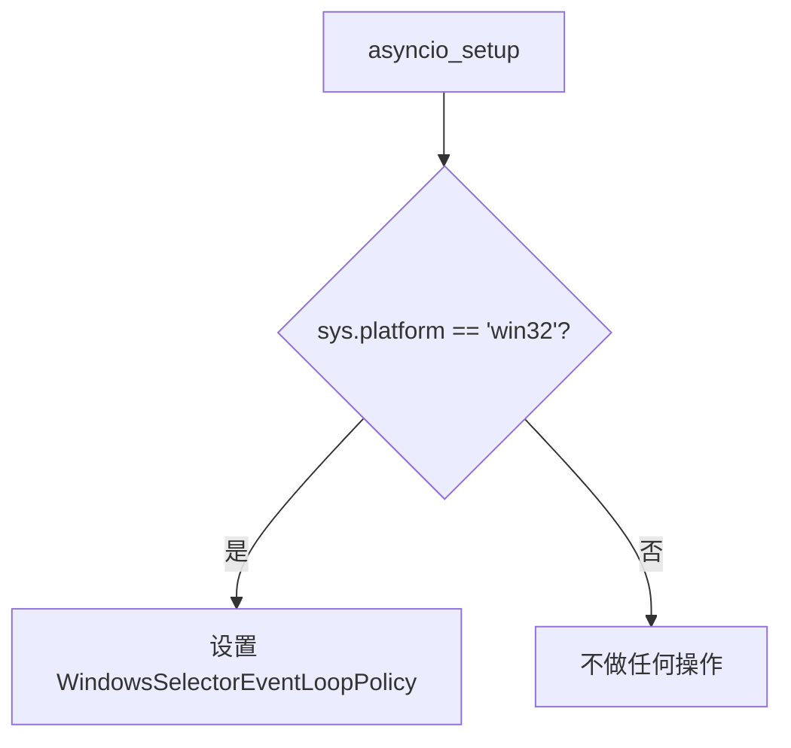

# system/asyncio_config.py

## 概述
`freqtrade/system/asyncio_config.py` 提供 asyncio 事件循环的平台适配配置。主要用于解决 Windows 平台上的 asyncio 兼容性问题，通过设置 `WindowsSelectorEventLoopPolicy` 确保在 Windows 上的正常运行。

## 架构图

## 核心函数

### `asyncio_setup() -> None`
- **参数**: 无
- **返回值**: 无
- **职责**: 在 Windows 平台上设置 asyncio 事件循环策略为 `WindowsSelectorEventLoopPolicy`
- **说明**:
  - 仅在 `sys.platform == "win32"` 时生效
  - Windows 默认的 `ProactorEventLoop` 在某些场景下可能导致兼容性问题（例如与 ccxt 的 async 功能配合）
  - `SelectorEventLoop` 更加稳定和兼容
  - 标记为 `pragma: no cover`（在非 Windows 测试环境中不计入覆盖率）

## 依赖关系

### 内部依赖（本项目模块）
- 无

### 外部依赖（第三方库）
- `sys` — 判断操作系统平台
- `asyncio` — 设置事件循环策略（仅 Windows 上导入）

### 被依赖（谁引用了本文件）
- `freqtrade.system.__init__` — 重新导出 `asyncio_setup`
- `freqtrade.main` — 在 bot 启动时调用
