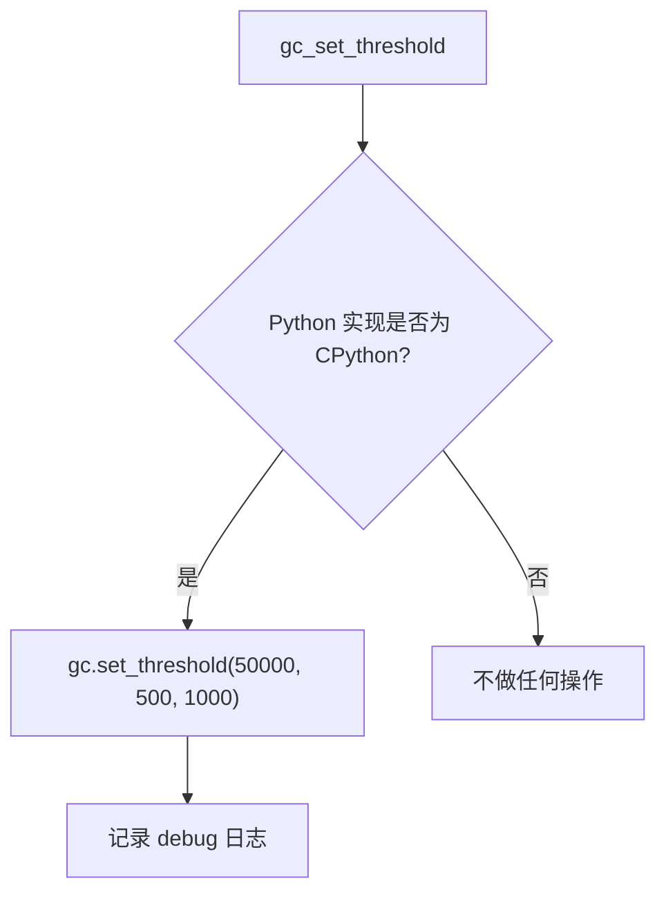

# system/gc_setup.py

## 概述
`freqtrade/system/gc_setup.py` 提供 Python 垃圾回收（GC）性能优化功能。通过调整 GC 的分代收集阈值来减少 GC 运行频率，从而提高 bot 的运行性能。

## 架构图

## 核心函数

### `gc_set_threshold() -> None`
- **参数**: 无
- **返回值**: 无
- **职责**: 调整 CPython 的垃圾回收阈值以减少 GC 触发频率
- **优化细节**:
  - 仅对 CPython 实现生效（通过 `platform.python_implementation()` 检查）
  - 将 GC 阈值设置为 `(50_000, 500, 1000)`：
    - **第 0 代阈值**: 50,000（默认 700）— 大幅提高年轻代 GC 的触发阈值
    - **第 1 代阈值**: 500（默认 10）— 第 0 代 GC 执行 500 次后触发第 1 代 GC
    - **第 2 代阈值**: 1000（默认 10）— 第 1 代 GC 执行 1000 次后触发完整 GC
  - 这种设置显著减少了 GC 运行次数，对于长时间运行的交易 bot 可以减少不必要的性能开销
  - 参考来源：Instagram 工程团队的性能优化实践（YouTube 视频）

## 依赖关系

### 内部依赖（本项目模块）
- 无

### 外部依赖（第三方库）
- `gc` — Python 垃圾回收接口
- `logging` — 日志记录
- `platform` — 检测 Python 实现（CPython vs PyPy 等）

### 被依赖（谁引用了本文件）
- `freqtrade.system.__init__` — 重新导出 `gc_set_threshold`
- `freqtrade.main` — 在子命令执行前调用
