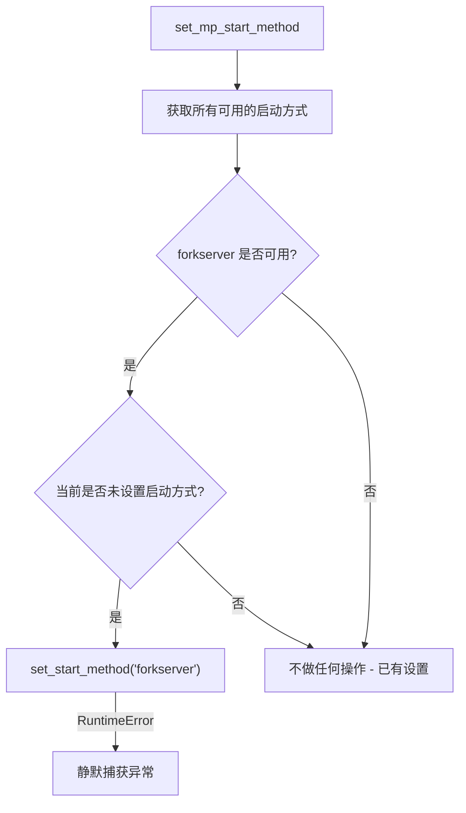

# system/set_mp_start_method.py

## 概述
`freqtrade/system/set_mp_start_method.py` 配置 Python multiprocessing 模块的进程启动方式。将默认的 `fork` 方式替换为更安全的 `forkserver`，避免在多线程环境中使用 fork 可能导致的死锁和不一致性问题。

## 架构图

## 核心函数

### `set_mp_start_method() -> None`
- **参数**: 无
- **返回值**: 无
- **职责**: 将 multiprocessing 的启动方式设置为 `forkserver`
- **逻辑**:
  1. 通过 `get_all_start_methods()` 获取当前平台支持的所有启动方式
  2. 检查 `forkserver` 是否在可用列表中
  3. 通过 `get_start_method(True)` 检查当前是否已显式设置了启动方式（`allow_none=True` 参数使得未设置时返回 `None`）
  4. 仅在 `forkserver` 可用且当前未设置时，调用 `set_start_method("forkserver")`
  5. 捕获 `RuntimeError`（可能在某些环境中启动方式已被锁定）
- **背景说明**:
  - `fork` 在多线程程序中不安全（Python 3.13 中已标记为 deprecated）
  - `forkserver` 将在 Python 3.14 中成为默认启动方式
  - `forkserver` 通过一个独立的 server 进程来创建新进程，避免了直接 fork 多线程进程的问题

## 依赖关系

### 内部依赖（本项目模块）
- 无

### 外部依赖（第三方库）
- `multiprocessing` — get_all_start_methods, get_start_method, set_start_method

### 被依赖（谁引用了本文件）
- `freqtrade.system.__init__` — 重新导出 `set_mp_start_method`
- `freqtrade.main` — 在子命令执行前调用
