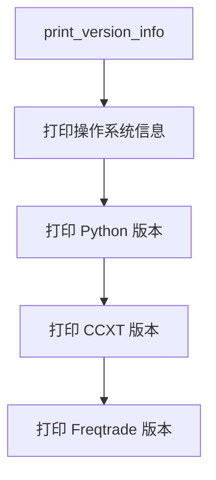

# system/version_info.py

## 概述
`freqtrade/system/version_info.py` 提供版本信息打印功能，用于在用户执行 `freqtrade --version` 命令时显示操作系统、Python 版本、CCXT 版本和 Freqtrade 版本等关键环境信息。

## 架构图


## 核心函数

### `print_version_info() -> None`
- **参数**: 无
- **返回值**: 无
- **职责**: 打印 freqtrade 运行环境的关键版本信息
- **输出格式示例**:
  ```
  Operating System:	macOS-14.0-arm64-arm-64bit
  Python Version:		Python 3.12.0
  CCXT Version:		4.2.0

  Freqtrade Version:	freqtrade 2026.4-dev-abc1234
  ```
- **说明**: 导入语句（`platform`, `sys`, `ccxt`）放在函数内部而非模块顶部，这是为了避免在不需要版本信息时加载这些模块（特别是 `ccxt` 是一个较大的库）

## 依赖关系

### 内部依赖（本项目模块）
- `freqtrade.__version__` — Freqtrade 版本号字符串

### 外部依赖（第三方库）
- `platform` — 获取操作系统信息（延迟导入）
- `sys` — 获取 Python 版本（延迟导入）
- `ccxt` — 获取 CCXT 版本号（延迟导入）

### 被依赖（谁引用了本文件）
- `freqtrade.system.__init__` — 重新导出 `print_version_info`
- `freqtrade.main` — 当用户传入 `--version` 参数时调用
