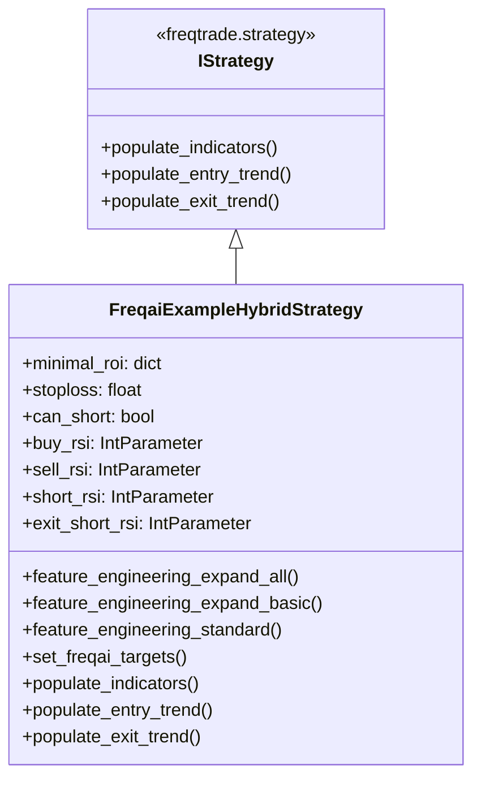

# FreqaiExampleHybridStrategy.py

## 概述
`freqtrade/templates/FreqaiExampleHybridStrategy.py` 是一个混合式 FreqAI 策略示例，展示如何将 FreqAI（Freqtrade 的机器学习框架）与传统技术分析（TA）指标相结合。策略使用 FreqAI 进行方向预测（涨/跌分类），同时结合 RSI、Bollinger Bands、TEMA 等经典技术指标进行入场/出场决策。此策略由 @smarmau 和 @johanvulgt 开发并分享。

## 架构图

## 核心类/函数

### FreqaiExampleHybridStrategy
继承自 `IStrategy`，混合 FreqAI + 传统 TA 的示例策略。

**策略参数：**
- `minimal_roi` -- 最小 ROI：0 分钟 4%，30 分钟 2%，60 分钟 1%
- `stoploss = -0.05` -- 止损 5%
- `can_short = True` -- 支持做空
- `startup_candle_count = 30` -- 启动所需历史 K 线数

**超参数（Hyperoptable）：**
- `buy_rsi` -- 做多 RSI 阈值（1-50，默认 30）
- `sell_rsi` -- 多头出场 RSI 阈值（50-100，默认 70）
- `short_rsi` -- 做空 RSI 阈值（51-100，默认 70）
- `exit_short_rsi` -- 空头出场 RSI 阈值（1-50，默认 30）

**FreqAI 特征工程方法：**

#### feature_engineering_expand_all(dataframe, period, metadata) -> DataFrame
定义会自动扩展的特征（按 `indicator_periods_candles` * `include_timeframes` * `include_shifted_candles` * `include_corr_pairs` 展开）：
- RSI, MFI, ADX, SMA, EMA
- Bollinger Bands 宽度和相对位置
- ROC（变化率）
- 相对成交量

#### feature_engineering_expand_basic(dataframe, metadata) -> DataFrame
基础扩展特征（不按 `indicator_periods_candles` 展开）：
- 价格变化百分比
- 原始成交量、原始价格

#### feature_engineering_standard(dataframe, metadata) -> DataFrame
标准特征（不自动扩展）：
- 星期几（day_of_week）
- 小时（hour_of_day）

#### set_freqai_targets(dataframe, metadata) -> DataFrame
设置 FreqAI 预测目标。使用分类模型，目标为 `&s-up_or_down`：
- 如果未来 50 根 K 线的收盘价高于当前价格 -> `"up"`
- 否则 -> `"down"`

#### populate_indicators(dataframe, metadata) -> DataFrame
计算传统技术指标：RSI、Bollinger Bands、TEMA，并调用 `self.freqai.start()` 触发 FreqAI 预测。

#### populate_entry_trend(df, metadata) -> DataFrame
入场逻辑（混合 TA + FreqAI）：
- **做多**：RSI 上穿 `buy_rsi` + TEMA 低于 BB 中轨 + TEMA 上升 + FreqAI 预测 `"up"` + `do_predict == 1`
- **做空**：RSI 上穿 `short_rsi` + TEMA 高于 BB 中轨 + TEMA 下降 + FreqAI 预测 `"down"` + `do_predict == 1`

#### populate_exit_trend(df, metadata) -> DataFrame
出场逻辑（仅基于 TA，不依赖 FreqAI）：
- **多头出场**：RSI 上穿 `sell_rsi` + TEMA 高于 BB 中轨 + TEMA 下降
- **空头出场**：RSI 上穿 `exit_short_rsi` + TEMA 低于 BB 中轨 + TEMA 上升

## 依赖关系

### 内部依赖（本项目模块）
- `freqtrade.strategy.IStrategy` -- 策略基类
- `freqtrade.strategy.IntParameter` -- 超参数定义
- `freqtrade.strategy.merge_informative_pair` -- 信息对合并工具

### 外部依赖（第三方库）
- `numpy` -- 数值计算
- `pandas` -- 数据处理
- `talib.abstract` -- 技术分析指标库（RSI, MFI, ADX, SMA, EMA, TEMA, ROC）
- `technical.qtpylib` -- 技术指标库（Bollinger Bands, crossed_above）

### 被依赖（谁引用了本文件）
本文件为模板/示例文件，不被项目其他模块直接引用。用户在创建新策略时参考使用。
