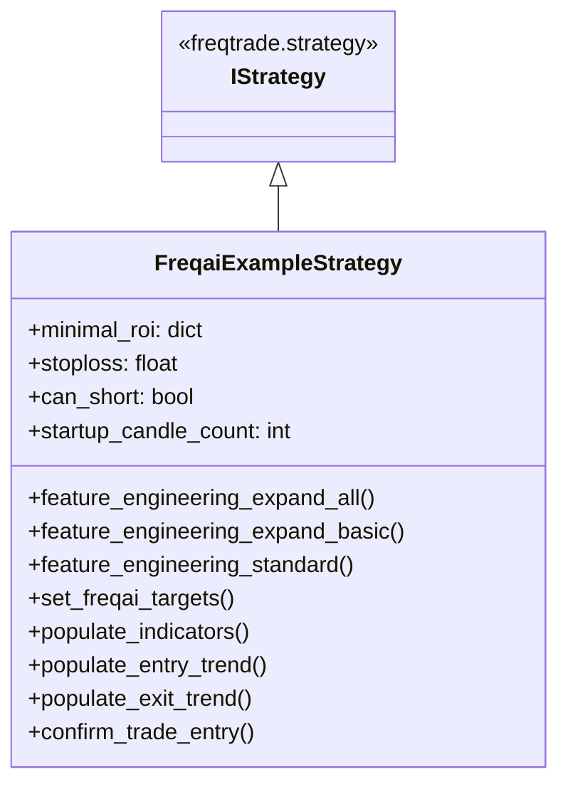

# FreqaiExampleStrategy.py

## 概述
`freqtrade/templates/FreqaiExampleStrategy.py` 是 FreqAI 的标准示例策略，展示如何将自定义的 IFreqaiModel 连接到策略中。该策略使用回归模型预测未来价格变化方向，基于预测值进行入场/出场决策。此策略用于功能展示和调试基准，**不适合用于实盘交易**。

## 架构图

## 核心类/函数

### FreqaiExampleStrategy
继承自 `IStrategy`，标准 FreqAI 回归策略示例。

**策略参数：**
- `minimal_roi = {"0": 0.1, "240": -1}` -- 0 分钟时 ROI 10%，240 分钟后允许亏损（不限）
- `stoploss = -0.05` -- 止损 5%
- `can_short = True` -- 支持做空
- `startup_candle_count = 40` -- 启动所需历史 K 线数

**FreqAI 特征工程方法：**

#### feature_engineering_expand_all(dataframe, period, metadata) -> DataFrame
定义自动扩展特征，与混合策略相同：
- RSI, MFI, ADX, SMA, EMA
- Bollinger Bands 宽度和收盘价与下轨比值
- ROC、相对成交量

#### feature_engineering_expand_basic(dataframe, metadata) -> DataFrame
基础扩展特征：价格变化百分比、原始成交量、原始价格。

#### feature_engineering_standard(dataframe, metadata) -> DataFrame
标准特征：星期几、小时。

#### set_freqai_targets(dataframe, metadata) -> DataFrame
设置回归目标 `&-s_close`：
- 计算未来 `label_period_candles` 根 K 线的滚动均价与当前价格的比值减 1
- 正值表示预测价格将上涨，负值表示将下跌

#### populate_indicators(dataframe, metadata) -> DataFrame
直接调用 `self.freqai.start()` 触发 FreqAI 预测。所有指标通过特征工程函数定义。

#### populate_entry_trend(df, metadata) -> DataFrame
入场逻辑：
- **做多**：`do_predict == 1` 且 `&-s_close > 0.01`（预测涨幅 > 1%）
- **做空**：`do_predict == 1` 且 `&-s_close < -0.01`（预测跌幅 > 1%）
- 使用 `reduce(lambda x, y: x & y, conditions)` 合并多个条件

#### populate_exit_trend(df, metadata) -> DataFrame
出场逻辑：
- **多头出场**：`do_predict == 1` 且 `&-s_close < 0`（预测将下跌）
- **空头出场**：`do_predict == 1` 且 `&-s_close > 0`（预测将上涨）

#### confirm_trade_entry(pair, order_type, amount, rate, time_in_force, current_time, entry_tag, side) -> bool
入场确认函数，防止滑点过大：
- 做多时：如果下单价格高于最新收盘价的 0.25% 以上，拒绝入场
- 做空时：如果下单价格低于最新收盘价的 0.25% 以上，拒绝入场

## 依赖关系

### 内部依赖（本项目模块）
- `freqtrade.strategy.IStrategy` -- 策略基类

### 外部依赖（第三方库）
- `functools.reduce` -- 用于条件合并
- `talib.abstract` -- 技术分析指标库
- `technical.qtpylib` -- Bollinger Bands、typical_price
- `pandas` -- 数据处理

### 被依赖（谁引用了本文件）
本文件为模板/示例文件，不被项目其他模块直接引用。用于展示 FreqAI 策略开发流程。
