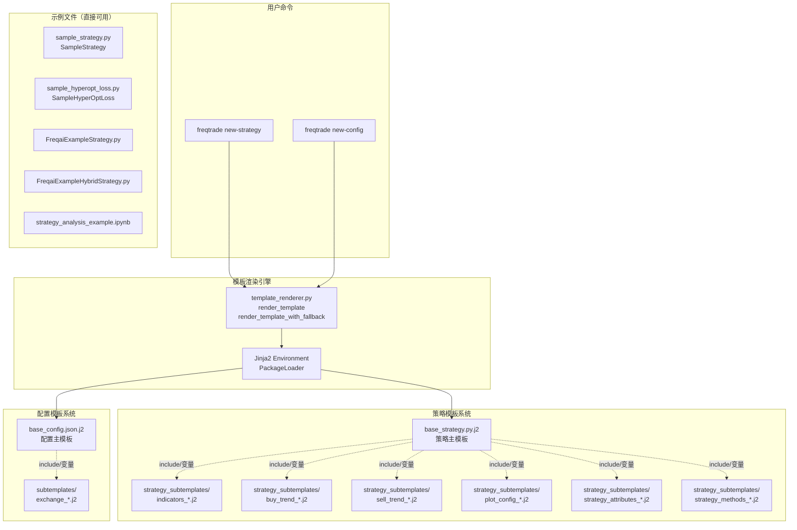
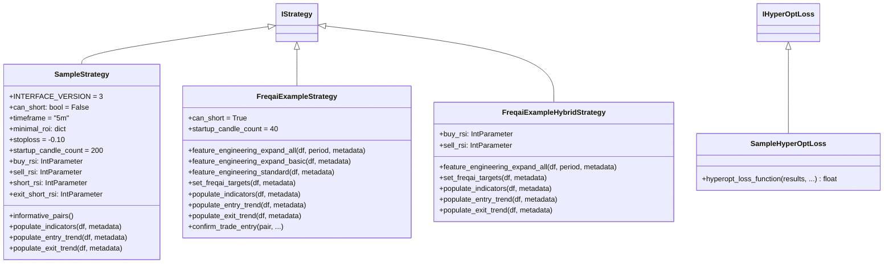
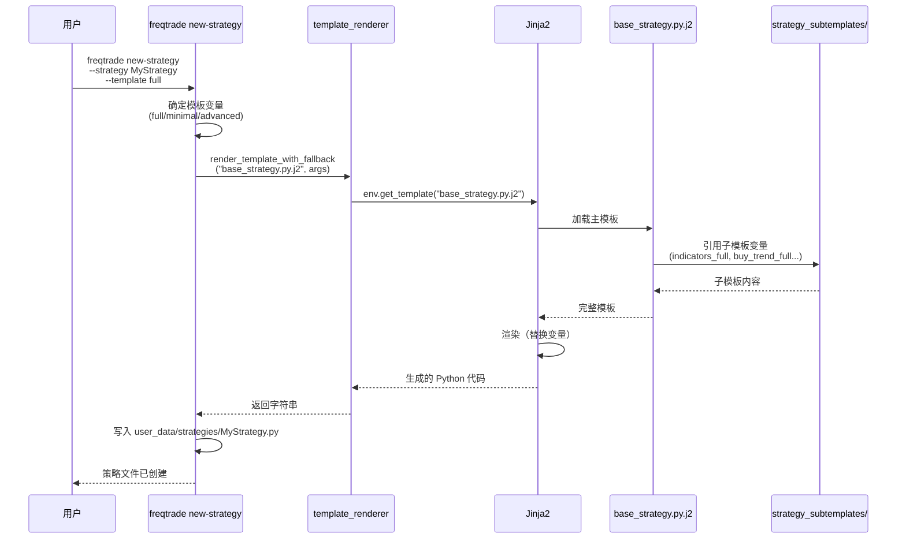
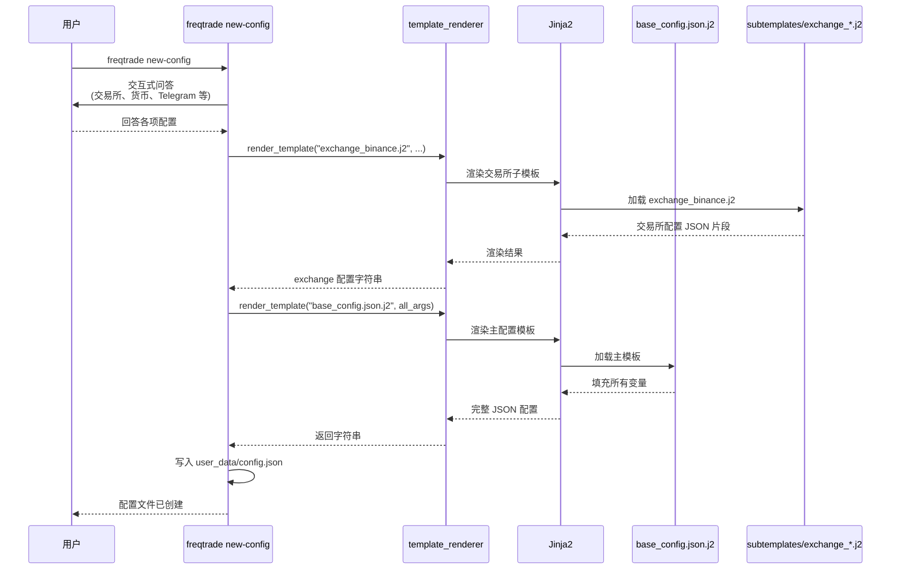
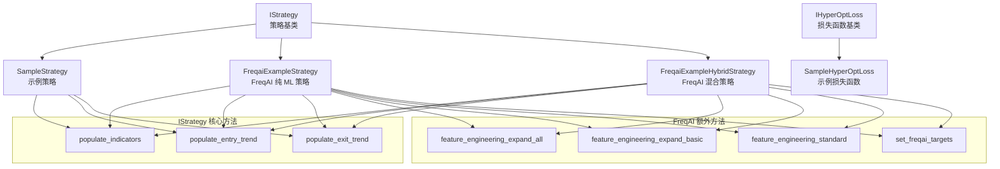

# Freqtrade Templates -- 策略模板和配置模板模块

## 1. 模块概述

`freqtrade/templates/` 模块是 Freqtrade 交易机器人的模板系统，包含了生成新策略和配置文件的 Jinja2 模板，以及一系列示例策略和 Hyperopt 损失函数。该模块服务于以下场景：

- **新策略生成**：用户运行 `freqtrade new-strategy` 命令时，使用 Jinja2 模板生成策略 Python 文件
- **新配置生成**：用户运行 `freqtrade new-config` 命令时，使用模板生成 JSON 配置文件
- **策略示例**：提供完整可运行的示例策略，帮助用户理解策略编写方式
- **FreqAI 示例**：提供 FreqAI（机器学习）集成的示例策略
- **Hyperopt 示例**：提供超参数优化的损失函数示例

模板系统使用 [Jinja2](https://jinja.palletsprojects.com/) 作为模板引擎，通过 `freqtrade.util.template_renderer` 模块进行渲染。

## 2. 目录结构

```
freqtrade/templates/
|-- __init__.py                          # 空初始化文件
|-- base_config.json.j2                  # 配置文件的 Jinja2 模板
|-- base_strategy.py.j2                  # 策略文件的 Jinja2 模板
|-- sample_strategy.py                   # 完整的示例策略（SampleStrategy）
|-- sample_hyperopt_loss.py              # 示例 Hyperopt 损失函数（SampleHyperOptLoss）
|-- FreqaiExampleStrategy.py             # FreqAI 纯机器学习示例策略
|-- FreqaiExampleHybridStrategy.py       # FreqAI 混合策略示例（ML + 传统 TA）
|-- strategy_analysis_example.ipynb      # 策略分析 Jupyter Notebook 示例
|
|-- strategy_subtemplates/               # 策略子模板（被 base_strategy.py.j2 引用）
|   |-- indicators_full.j2              # 完整指标集模板
|   |-- indicators_minimal.j2           # 最小指标集模板
|   |-- buy_trend_full.j2              # 完整买入信号模板
|   |-- buy_trend_minimal.j2           # 最小买入信号模板
|   |-- sell_trend_full.j2             # 完整卖出信号模板
|   |-- sell_trend_minimal.j2          # 最小卖出信号模板
|   |-- plot_config_full.j2            # 完整图表配置模板
|   |-- plot_config_minimal.j2         # 最小图表配置模板
|   |-- strategy_attributes_full.j2    # 完整策略属性模板
|   |-- strategy_attributes_minimal.j2 # 最小策略属性模板
|   |-- strategy_methods_advanced.j2   # 高级策略方法模板
|   |-- strategy_methods_empty.j2      # 空策略方法模板
|
|-- subtemplates/                        # 交易所配置子模板
    |-- exchange_binance.j2             # Binance 交易所配置
    |-- exchange_bittrex.j2             # Bittrex 交易所配置
    |-- exchange_gateio.j2              # Gate.io 交易所配置
    |-- exchange_generic.j2             # 通用交易所配置
    |-- exchange_huobi.j2              # Huobi 交易所配置
    |-- exchange_kraken.j2             # Kraken 交易所配置
    |-- exchange_kucoin.j2             # KuCoin 交易所配置
    |-- exchange_okex.j2               # OKX (OKEx) 交易所配置
```

## 3. 架构图





## 4. 核心类/函数说明

### 4.1 `base_strategy.py.j2` -- 策略 Jinja2 模板

策略生成的主模板文件，通过 Jinja2 变量控制生成策略的内容丰富度。

**模板变量：**

| 变量名 | 类型 | 说明 |
|--------|------|------|
| `{{ strategy }}` | str | 策略类名 |
| `{{ indicators }}` | str | `populate_indicators` 方法的指标计算代码 |
| `{{ buy_trend }}` | str | `populate_entry_trend` 方法的买入条件 |
| `{{ sell_trend }}` | str | `populate_exit_trend` 方法的卖出条件 |
| `{{ plot_config }}` | str | 图表绘制配置 |
| `{{ attributes }}` | str | 策略属性（order_types、order_time_in_force 等） |
| `{{ additional_methods }}` | str | 额外的高级方法（confirm_trade_entry 等） |

**生成的策略包含：**
- 标准导入（numpy, pandas, talib, qtpylib）
- IStrategy 继承
- INTERFACE_VERSION = 3
- timeframe、minimal_roi、stoploss 等基础配置
- Hyperopt 参数（buy_rsi、sell_rsi）
- `informative_pairs()`、`populate_indicators()`、`populate_entry_trend()`、`populate_exit_trend()` 四个核心方法

### 4.2 `base_config.json.j2` -- 配置 Jinja2 模板

生成 Freqtrade 配置文件的模板。

**模板变量：**

| 变量名 | 说明 |
|--------|------|
| `{{ max_open_trades }}` | 最大同时开仓数 |
| `{{ stake_currency }}` | 计价货币（如 USDT） |
| `{{ stake_amount }}` | 单次交易金额 |
| `{{ fiat_display_currency }}` | 法币显示货币（可选） |
| `{{ timeframe }}` | 时间周期（可选） |
| `{{ dry_run }}` | 是否为模拟模式 |
| `{{ trading_mode }}` | 交易模式（spot/futures） |
| `{{ margin_mode }}` | 保证金模式 |
| `{{ exchange }}` | 交易所配置块（来自 subtemplates/exchange_*.j2） |
| `{{ telegram }}` | 是否启用 Telegram 通知 |
| `{{ telegram_token }}` | Telegram Bot Token |
| `{{ telegram_chat_id }}` | Telegram Chat ID |
| `{{ api_server }}` | 是否启用 API Server |
| `{{ api_server_listen_addr }}` | API 监听地址 |
| `{{ api_server_jwt_key }}` | JWT 密钥 |
| `{{ api_server_ws_token }}` | WebSocket Token |
| `{{ api_server_username }}` | API 用户名 |
| `{{ api_server_password }}` | API 密码 |

**内置配置项：**
- `tradable_balance_ratio: 0.99`
- `dry_run_wallet: 1000`
- `cancel_open_orders_on_exit: false`
- `unfilledtimeout`: entry 10min, exit 10min
- `entry_pricing / exit_pricing`: 同侧价格 + order book
- `pairlists`: VolumePairList (前 20 名)
- `process_throttle_secs: 5`

### 4.3 `sample_strategy.py` -- SampleStrategy 示例策略

完整的示例策略，展示了策略编写的所有要素。这是用户学习策略开发的最佳参考。

**策略逻辑概述：**

**入场条件（Long）：**
1. RSI 向上穿越 `buy_rsi` 值（默认 30）
2. TEMA 低于 Bollinger Band 中轨
3. TEMA 在上升（当前值 > 前一根值）
4. 成交量 > 0

**出场条件（Long）：**
1. RSI 向上穿越 `sell_rsi` 值（默认 70）
2. TEMA 高于 Bollinger Band 中轨
3. TEMA 在下降
4. 成交量 > 0

**使用的技术指标：**

| 指标 | 库 | 用途 |
|------|-----|------|
| ADX | ta-lib | 趋势强度 |
| RSI | ta-lib | 相对强弱 |
| Stochastic Fast | ta-lib | 随机指标 |
| MACD | ta-lib | 移动平均线收敛/散 |
| MFI | ta-lib | 资金流向 |
| Bollinger Bands | qtpylib | 布林带 |
| Parabolic SAR | ta-lib | 抛物线转向 |
| TEMA | ta-lib | 三重指数移动平均 |
| Hilbert Transform | ta-lib | 正弦波周期指标 |

注释中还包含了大量其他可用指标的示例代码（EMA、SMA、Keltner Channel、CCI、K 线形态识别等）。

### 4.4 `FreqaiExampleStrategy.py` -- FreqAI 纯机器学习策略

展示如何将 FreqAI 机器学习框架集成到策略中。该策略完全依赖 ML 模型进行预测。

**FreqAI 特有方法：**

| 方法 | 说明 |
|------|------|
| `feature_engineering_expand_all` | 定义需要自动扩展（按 timeframe / period / corr_pair）的特征 |
| `feature_engineering_expand_basic` | 定义仅按 timeframe 扩展的基础特征 |
| `feature_engineering_standard` | 定义不自动扩展的标准特征（如星期几、小时） |
| `set_freqai_targets` | 定义模型训练的目标变量 |

**特征工程（Features）：**
- 扩展特征：RSI、MFI、ADX、SMA、EMA、Bollinger Bands 宽度、ROC、相对成交量
- 基础特征：收盘价变化百分比、原始成交量、原始价格
- 标准特征：星期几、小时

**目标变量（Target）：**
- `&-s_close`：未来 N 根 K 线收盘价的滚动平均相对于当前价格的变化比例

**交易逻辑：**
- 做多：`do_predict == 1` 且 `&-s_close > 0.01`
- 做空：`do_predict == 1` 且 `&-s_close < -0.01`
- 包含 `confirm_trade_entry` 方法，限制入场价格偏离不超过 0.25%

### 4.5 `FreqaiExampleHybridStrategy.py` -- FreqAI 混合策略

展示如何将 FreqAI 预测结果与传统技术分析（TA）指标结合使用。

**混合逻辑：**
- FreqAI 目标：预测 50 根 K 线后的价格方向（up/down 分类）
- 传统 TA 指标：RSI、Bollinger Bands、TEMA
- 入场条件：同时满足 FreqAI 方向预测 + RSI 穿越信号 + TEMA/BB 守卫条件

**与纯 FreqAI 策略的区别：**
- `populate_indicators` 中除了调用 `self.freqai.start()` 外，还额外计算传统 TA 指标
- 入场/出场条件同时包含 ML 预测和 TA 信号

### 4.6 `sample_hyperopt_loss.py` -- SampleHyperOptLoss

示例 Hyperopt 损失函数，用于超参数优化。

**损失函数公式：**

```
result = trade_loss + profit_loss + duration_loss
```

| 组件 | 公式 | 说明 |
|------|------|------|
| `trade_loss` | `1 - 0.25 * exp(-((trade_count - 600)^2) / 10^5.8)` | 交易次数偏离目标值的惩罚 |
| `profit_loss` | `max(0, 1 - total_profit / 3.0)` | 总利润不足的惩罚 |
| `duration_loss` | `0.4 * min(trade_duration / 300, 1)` | 平均持仓时间过长的惩罚 |

**常量配置：**
- `TARGET_TRADES = 600`：目标交易次数
- `EXPECTED_MAX_PROFIT = 3.0`：期望最大利润率（300%）
- `MAX_ACCEPTED_TRADE_DURATION = 300`：最大可接受平均持仓时间（分钟）

### 4.7 策略子模板（strategy_subtemplates/）

| 模板文件 | full 版本 | minimal 版本 |
|---------|-----------|-------------|
| `indicators_*.j2` | 包含完整的 TA 指标集（RSI, MACD, BB, SAR, TEMA 等） | 仅包含 RSI |
| `buy_trend_*.j2` | 多条件组合入场信号 | 简单 RSI 阈值入场 |
| `sell_trend_*.j2` | 多条件组合出场信号 | 简单 RSI 阈值出场 |
| `plot_config_*.j2` | 完整的图表配置（主图 + 子图） | 空配置 |
| `strategy_attributes_*.j2` | 包含 order_types, order_time_in_force | 空属性 |
| `strategy_methods_*.j2` | 包含 bot_start, confirm_trade_entry 等高级回调方法 | 空方法 |

### 4.8 交易所配置子模板（subtemplates/）

为每个支持的交易所提供预配置模板，包含交易所名称、交易对引号样式和 CCXT 参数。

支持的交易所：Binance、Bittrex、Gate.io、Huobi、Kraken、KuCoin、OKX，以及通用 Generic 模板。

## 5. 依赖关系

### 内部依赖

```
freqtrade/templates/
|-- freqtrade.strategy            # IStrategy 基类, IntParameter 等 Hyperopt 参数
|-- freqtrade.optimize.hyperopt   # IHyperOptLoss 基类
|-- freqtrade.constants           # Config 类型
|-- freqtrade.util.template_renderer  # 模板渲染函数（被调用方）
```

### 外部依赖

| 库 | 使用位置 | 用途 |
|----|---------|------|
| `ta-lib` (talib) | sample_strategy, FreqAI 策略 | 技术分析指标计算 |
| `technical` (qtpylib) | sample_strategy, FreqAI 策略 | Bollinger Bands, crossed_above 等 |
| `numpy` | FreqAI 策略 | 数学运算 |
| `pandas` | 所有策略 | DataFrame 操作 |
| `jinja2` | 模板渲染（间接） | 模板引擎 |

### 被依赖关系

| 调用方 | 使用方式 |
|--------|---------|
| `freqtrade.commands.deploy_commands` | `new-strategy` 和 `new-config` 命令调用模板渲染 |
| `freqtrade.util.template_renderer` | `PackageLoader("freqtrade", "templates")` 加载此目录 |
| 用户 | 直接复制和修改示例策略文件 |

## 6. 数据流

### 新策略生成流程



### 新配置生成流程



### 策略类继承关系


