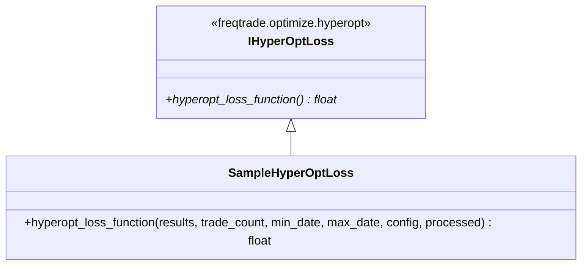

# sample_hyperopt_loss.py

## 概述
`freqtrade/templates/sample_hyperopt_loss.py` 是 Hyperopt（超参数优化）损失函数的示例实现。定义了 `SampleHyperOptLoss` 类，提供了一个综合考虑交易次数、总利润和交易时长的多目标损失函数，用于评估回测结果的质量。该函数返回的值越小，表示回测结果越好。

## 架构图


## 核心类/函数

### 常量定义
- `TARGET_TRADES = 600` -- 目标交易次数，代表理想的交易频率
- `EXPECTED_MAX_PROFIT = 3.0` -- 期望最大利润比率（3.0 表示 300%）
- `MAX_ACCEPTED_TRADE_DURATION = 300` -- 最大可接受平均交易时长（分钟）

### SampleHyperOptLoss
继承自 `IHyperOptLoss`，定义默认的超参数优化损失函数。

#### hyperopt_loss_function(results, trade_count, min_date, max_date, config, processed) -> float
静态方法，计算损失值。

**参数：**
- `results: DataFrame` -- 回测交易结果，包含 `profit_ratio` 和 `trade_duration` 列
- `trade_count: int` -- 交易总次数
- `min_date: datetime` -- 回测起始时间
- `max_date: datetime` -- 回测结束时间
- `config: Config` -- 配置对象
- `processed: dict[str, DataFrame]` -- 已处理的 K 线数据

**返回值：**
- `float` -- 损失值，越小越好

**损失计算公式（三个组成部分）：**

1. **交易次数损失 (trade_loss)**：
   ```
   trade_loss = 1 - 0.25 * exp(-((trade_count - TARGET_TRADES)^2) / 10^5.8)
   ```
   使用高斯函数，交易次数越接近 `TARGET_TRADES`（600），损失越低。最低可达 0.75。

2. **利润损失 (profit_loss)**：
   ```
   profit_loss = max(0, 1 - total_profit / EXPECTED_MAX_PROFIT)
   ```
   总利润越高，损失越低。达到 `EXPECTED_MAX_PROFIT` 时损失为 0。

3. **时长损失 (duration_loss)**：
   ```
   duration_loss = 0.4 * min(trade_duration / MAX_ACCEPTED_TRADE_DURATION, 1)
   ```
   平均交易时长越短越好。超过 `MAX_ACCEPTED_TRADE_DURATION` 时损失上限为 0.4。

**总损失 = trade_loss + profit_loss + duration_loss**

## 依赖关系

### 内部依赖（本项目模块）
- `freqtrade.constants.Config` -- 配置类型
- `freqtrade.optimize.hyperopt.IHyperOptLoss` -- 损失函数接口基类

### 外部依赖（第三方库）
- `math.exp` -- 指数函数
- `pandas.DataFrame` -- 数据结构

### 被依赖（谁引用了本文件）
本文件为模板/示例文件，不被项目直接引用。用户可以复制并修改此文件来自定义损失函数。
