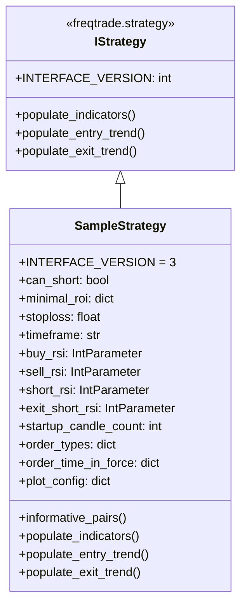

# sample_strategy.py

## 概述
`freqtrade/templates/sample_strategy.py` 是 Freqtrade 的标准示例策略模板，全面展示了策略开发的各个方面。策略基于 RSI、Bollinger Bands、TEMA 等技术指标生成交易信号，支持做多和做空。文件中大量注释掉的代码展示了各类技术指标（动量、叠加、周期、K 线形态等）的使用方法，是新用户学习策略开发的最佳起点。

## 架构图

## 核心类/函数

### SampleStrategy
继承自 `IStrategy`，全功能示例策略。

**策略配置：**
- `INTERFACE_VERSION = 3` -- 策略接口版本
- `can_short = False` -- 默认不做空（但模板中包含做空逻辑）
- `minimal_roi = {"0": 0.04, "30": 0.02, "60": 0.01}` -- 分阶段 ROI
- `stoploss = -0.10` -- 止损 10%
- `timeframe = "5m"` -- 5 分钟 K 线
- `startup_candle_count = 200` -- 需要 200 根历史 K 线

**超参数（Hyperoptable）：**
- `buy_rsi` (1-50, 默认 30) -- 做多 RSI 阈值
- `sell_rsi` (50-100, 默认 70) -- 多头出场 RSI 阈值
- `short_rsi` (51-100, 默认 70) -- 做空 RSI 阈值
- `exit_short_rsi` (1-50, 默认 30) -- 空头出场 RSI 阈值

**订单配置：**
- 入场/出场使用 limit 订单
- 止损使用 market 订单
- 订单有效期为 GTC（Good Till Cancelled）

#### informative_pairs() -> list
定义额外的信息交易对/时间周期。示例中返回空列表。

#### populate_indicators(dataframe, metadata) -> DataFrame
计算技术指标，已启用的指标包括：
- **动量指标**：ADX, RSI, Stochastic Fast (fastd/fastk), MACD, MFI
- **叠加指标**：Bollinger Bands（标准 SMA 版本）, Parabolic SAR, TEMA
- **周期指标**：Hilbert Transform (HT_SINE)

注释中展示但未启用的指标：
- 动量：Plus/Minus DI, Aroon, Awesome Oscillator, Keltner Channel, Ultimate Oscillator, CCI, Stochastic Slow/RSI, ROC
- 叠加：Weighted Bollinger Bands, EMA 系列, SMA 系列
- K 线形态：Hammer, Inverted Hammer, Dragonfly Doji, Piercing Line, Morning Star 等
- 图表类型：Heikin Ashi
- 订单簿数据获取

#### populate_entry_trend(dataframe, metadata) -> DataFrame
入场信号逻辑：
- **做多 (enter_long)**：RSI 上穿 `buy_rsi` + TEMA < BB 中轨 + TEMA 上升 + 成交量 > 0
- **做空 (enter_short)**：RSI 上穿 `short_rsi` + TEMA > BB 中轨 + TEMA 下降 + 成交量 > 0

#### populate_exit_trend(dataframe, metadata) -> DataFrame
出场信号逻辑：
- **多头出场 (exit_long)**：RSI 上穿 `sell_rsi` + TEMA > BB 中轨 + TEMA 下降 + 成交量 > 0
- **空头出场 (exit_short)**：RSI 上穿 `exit_short_rsi` + TEMA <= BB 中轨 + TEMA 上升 + 成交量 > 0

## 依赖关系

### 内部依赖（本项目模块）
- `freqtrade.strategy.IStrategy` -- 策略基类
- `freqtrade.strategy.Trade` -- 交易对象
- `freqtrade.strategy.Order` -- 订单对象
- `freqtrade.strategy.PairLocks` -- 交易对锁定
- `freqtrade.strategy.informative` -- @informative 装饰器
- `freqtrade.strategy.IntParameter` 等 -- 超参数类型
- `freqtrade.strategy` -- 各种辅助函数（timeframe_to_minutes, merge_informative_pair 等）

### 外部依赖（第三方库）
- `numpy` -- 数值计算
- `pandas` -- 数据处理
- `talib.abstract` -- TA-Lib 技术分析库
- `technical.qtpylib` -- 技术指标库（Bollinger Bands, crossed_above）

### 被依赖（谁引用了本文件）
本文件为模板/示例文件，不被项目其他模块直接引用。是 `freqtrade new-strategy` 命令生成新策略时的基础模板。
