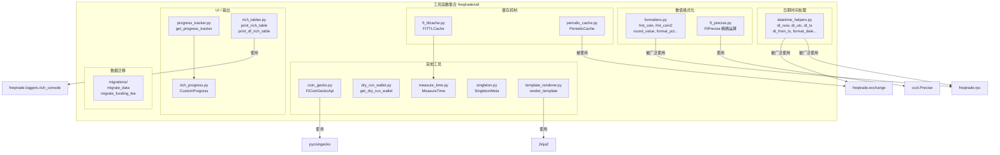
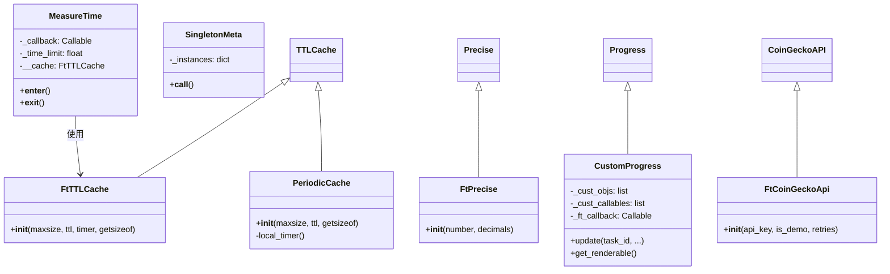
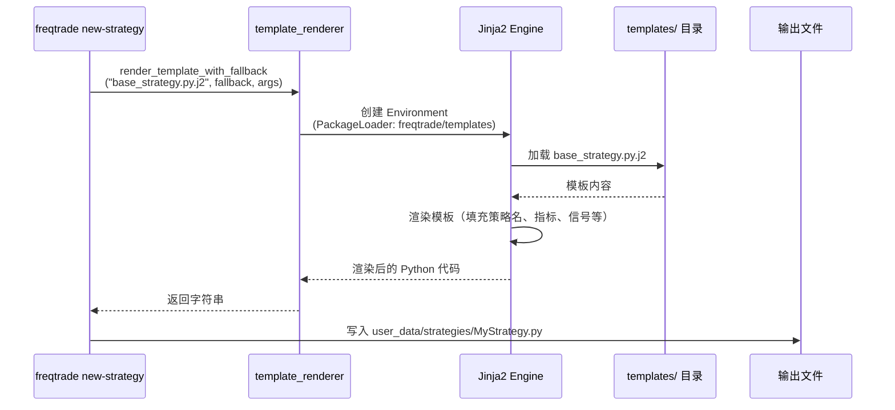
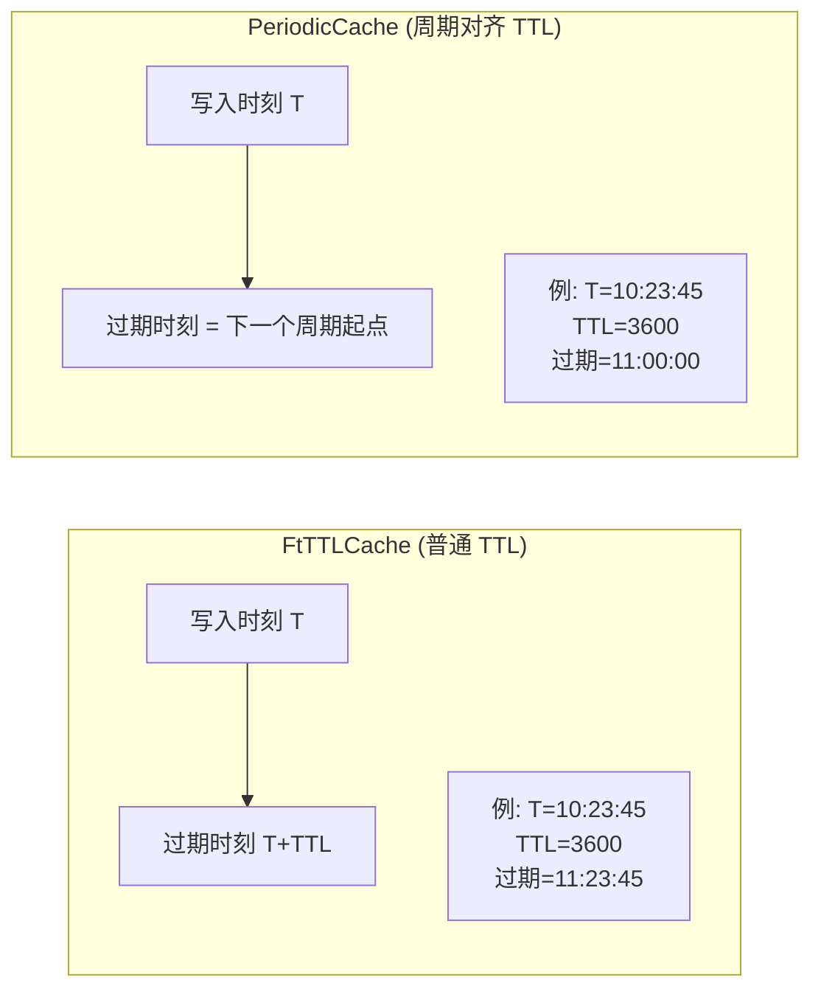
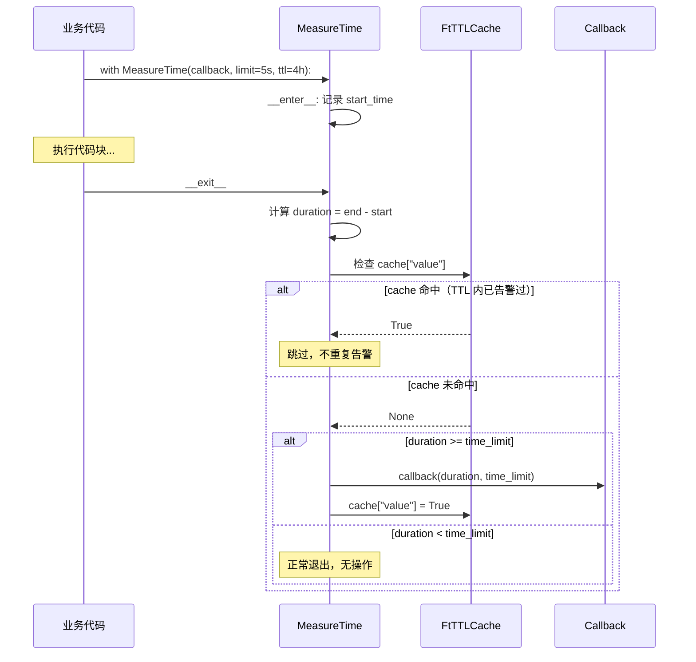

# Freqtrade Util -- 工具函数集合模块

## 1. 模块概述

`freqtrade/util/` 模块是 Freqtrade 交易机器人的通用工具函数集合，提供了日期时间处理、数值格式化、精确计算、缓存机制、进度追踪、表格渲染、模板渲染等基础能力。该模块是整个项目的底层支撑，被几乎所有其他模块所依赖。

模块的设计原则：
- **功能单一**：每个文件专注于一个功能领域
- **轻量封装**：对第三方库（ccxt Precise、cachetools TTLCache、CoinGecko API 等）进行薄封装，使其更适合 Freqtrade 的使用场景
- **统一导出**：通过 `__init__.py` 统一导出所有公共接口，使用者只需 `from freqtrade.util import xxx`
- **测试友好**：如 `FtTTLCache` 使用可替换的 timer 参数，便于单元测试中的时间模拟

## 2. 目录结构

```
freqtrade/util/
|-- __init__.py                  # 模块入口，统一导出所有公共接口
|-- coin_gecko.py                # CoinGecko API 封装，支持 Demo API Key
|-- datetime_helpers.py          # 日期时间工具函数集（UTC 处理、时间戳转换、格式化）
|-- dry_run_wallet.py            # Dry-run 模式钱包余额获取
|-- formatters.py                # 数值和货币格式化工具（小数位、百分比、持续时间）
|-- ft_precise.py                # ccxt Precise 的薄封装，支持 float 初始化的字符串精确运算
|-- ft_ttlcache.py               # cachetools TTLCache 的封装，支持自定义 timer
|-- measure_time.py              # 代码块执行时间测量工具（Context Manager 模式）
|-- migrations/                  # 数据库迁移工具子模块（详见单独文档）
|-- periodic_cache.py            # 周期性过期缓存（按整点时间过期）
|-- progress_tracker.py          # 进度条追踪器工厂函数
|-- rich_progress.py             # 自定义 Rich Progress 进度条组件
|-- rich_tables.py               # Rich 表格输出工具（支持 dict 列表和 DataFrame）
|-- singleton.py                 # Singleton 元类实现
|-- template_renderer.py         # Jinja2 模板渲染工具
```

## 3. 架构图





## 4. 核心类/函数说明

### 4.1 `datetime_helpers.py` -- 日期时间工具

该文件提供了一组围绕 UTC 时间处理的工具函数，是 Freqtrade 中使用最广泛的工具集之一。

| 函数 | 签名 | 说明 |
|------|------|------|
| `dt_now` | `() -> datetime` | 返回当前 UTC 时间 |
| `dt_utc` | `(year, month, day, ...) -> datetime` | 构造 UTC 时间对象 |
| `dt_ts` | `(dt?) -> int` | datetime 转毫秒时间戳；dt 为 None 时返回当前时间戳 |
| `dt_ts_def` | `(dt?, default=0) -> int` | datetime 转毫秒时间戳；dt 为 None 时返回默认值 |
| `dt_ts_none` | `(dt?) -> int\|None` | datetime 转毫秒时间戳；dt 为 None 时返回 None |
| `dt_floor_day` | `(dt) -> datetime` | 将时间截断到当天 00:00:00 |
| `dt_from_ts` | `(timestamp) -> datetime` | 时间戳转 datetime，自动判断秒/毫秒（阈值 1e10） |
| `shorten_date` | `(date_str) -> str` | 缩短日期字符串（seconds->sec, minutes->min, hours->h, days->d） |
| `dt_humanize_delta` | `(dt) -> str` | 使用 humanize 库将 timedelta 转为自然语言描述 |
| `format_date` | `(date?, fallback="") -> str` | 格式化日期为 `DATETIME_PRINT_FORMAT`，None 时返回 fallback |
| `format_ms_time` | `(date_ms) -> str` | 毫秒时间戳转 `%Y-%m-%dT%H:%M:%S` 格式字符串 |
| `format_ms_time_det` | `(date_ms) -> str` | 毫秒时间戳转详细格式（含毫秒）`%Y-%m-%dT%H:%M:%S.%f` |

### 4.2 `formatters.py` -- 数值格式化

提供加密货币交易场景下的数值格式化功能。

| 函数 | 说明 |
|------|------|
| `decimals_per_coin(coin)` | 获取指定币种的小数位数（如 BTC=8, USDT=3），fallback 使用 `DECIMAL_PER_COIN_FALLBACK` |
| `strip_trailing_zeros(value)` | 去除字符串末尾的零和小数点 |
| `round_value(value, decimals, keep_trailing_zeros)` | 四舍五入并格式化，None/NaN 返回 "N/A" |
| `fmt_coin(value, coin, show_coin_name, keep_trailing_zeros)` | 格式化币种金额，如 `"222.22 USDT"` |
| `fmt_coin2(value, coin, decimals, ...)` | 类似 `fmt_coin`，可自定义小数位数，适用于汇率格式化 |
| `format_duration(td)` | 将 timedelta 格式化为 `"XXd HH:MM"` 格式 |
| `format_pct(value)` | 将浮点数格式化为百分比字符串，如 `"12.34%"`，None/NaN 返回 "N/A" |

### 4.3 `ft_precise.py` -- FtPrecise 精确运算

对 ccxt 的 `Precise` 类进行薄封装。`Precise` 基于字符串实现精确的十进制运算，避免浮点数精度丢失问题。`FtPrecise` 的改进点是支持 float/int 类型的初始化参数（自动转为字符串），使调用更方便。

```python
# ccxt Precise 只接受字符串
Precise("0.1") + Precise("0.2")  # 正确

# FtPrecise 也接受数字
FtPrecise(0.1) + FtPrecise(0.2)  # 同样正确
```

### 4.4 `ft_ttlcache.py` -- FtTTLCache

对 `cachetools.TTLCache` 的封装，主要改进是使用 `time.time` 作为默认 timer（而非 cachetools 的默认 timer），这使得在测试中可以更容易地通过 mock `time.time` 来控制缓存过期行为。

### 4.5 `periodic_cache.py` -- PeriodicCache

基于 `cachetools.TTLCache` 的特殊缓存实现，其过期时间对齐到"整点"时刻。例如：
- TTL=3600 (1小时)：缓存在每个整点（:00）过期
- TTL=300 (5分钟)：缓存在每个 :00、:05、:10... 过期

实现原理：自定义 timer 函数，将当前时间戳减去对 TTL 取模的余数，使得同一个周期内的 timer 值相同。

```python
def local_timer():
    ts = datetime.now(UTC).timestamp()
    offset = ts % ttl
    return ts - offset  # 对齐到周期起始时刻
```

### 4.6 `measure_time.py` -- MeasureTime

Context Manager 模式的代码执行时间测量工具。当代码块执行时间超过设定阈值时，触发回调函数。内置 TTL 缓存机制，同一个超时告警在 TTL 时间内（默认 4 小时）只触发一次，避免告警刷屏。

```python
def warn_callback(duration, limit):
    logger.warning(f"操作耗时 {duration:.1f}s，超过限制 {limit:.1f}s")

measure = MeasureTime(callback=warn_callback, time_limit=5.0, ttl=3600*4)

with measure:
    # 被测量的代码块
    expensive_operation()
```

### 4.7 `progress_tracker.py` -- 进度追踪器

提供创建标准化进度条的工厂函数：

- **`get_progress_tracker(**kwargs)`**：创建带有标准列布局的 `CustomProgress` 实例，包含：描述文本、进度条、完成数/总数、百分比、已用时间、剩余时间
- **`retrieve_progress_tracker(pt)`**：如果传入的进度追踪器为 None，则创建新的；否则返回传入的实例

### 4.8 `rich_progress.py` -- CustomProgress

继承自 Rich 的 `Progress` 类，增加了以下功能：

- **自定义渲染对象**（`cust_objs`）：可以在进度条上方或旁边添加额外的 Rich 渲染对象
- **自定义回调**（`cust_callables`）：每次渲染时调用的回调函数，动态生成额外内容
- **Freqtrade 回调**（`ft_callback`）：每次 `update()` 时调用的回调，用于将进度信息传递给其他组件（如 WebSocket）。启用 `ft_callback` 时会自动禁用终端显示（`disable=True`）

### 4.9 `rich_tables.py` -- Rich 表格输出

提供两个表格打印函数：

| 函数 | 输入数据类型 | 说明 |
|------|-------------|------|
| `print_rich_table` | `Sequence[dict \| Sequence]` | 通用表格打印，支持 dict 列表或嵌套序列 |
| `print_df_rich_table` | `DataFrame` | Pandas DataFrame 专用表格打印，支持显示索引列 |

两个函数都使用 `get_rich_console()` 创建 Console 实例进行输出。

### 4.10 `singleton.py` -- SingletonMeta

线程安全的 Singleton 元类实现。使用方式：

```python
class MyClass(metaclass=SingletonMeta):
    pass

a = MyClass()
b = MyClass()
assert a is b  # True
```

内部维护一个类级别的 `_instances` 字典，首次创建实例后缓存，后续调用直接返回缓存实例。

### 4.11 `template_renderer.py` -- 模板渲染

基于 Jinja2 的模板渲染工具，用于生成新的策略文件和配置文件。

| 函数 | 说明 |
|------|------|
| `render_template(templatefile, arguments)` | 从 `freqtrade/templates/` 加载指定模板并渲染 |
| `render_template_with_fallback(templatefile, fallbackfile, arguments)` | 优先使用主模板，找不到时回退到备用模板 |

### 4.12 `coin_gecko.py` -- FtCoinGeckoApi

对 `pycoingecko` 库的 `CoinGeckoAPI` 的封装，增加了对 Demo API Key 的支持。

```python
# 使用 Demo API Key（免费用途）
api = FtCoinGeckoApi(api_key="your_key", is_demo=True)

# 使用正式 API Key
api = FtCoinGeckoApi(api_key="your_key", is_demo=False)
```

### 4.13 `dry_run_wallet.py` -- Dry-run 钱包

从配置中获取 Dry-run 模式的钱包余额。支持两种配置方式：
- **简单模式**：`dry_run_wallet: 1000`（直接返回数值）
- **字典模式**：`dry_run_wallet: {"USDT": 1000, "BTC": 0.1}`（根据 `stake_currency` 查找对应值）

## 5. 依赖关系

### 内部依赖

```
freqtrade/util/
|-- freqtrade.constants          # Config 类型, DECIMALS_PER_COIN, DATETIME_PRINT_FORMAT
|-- freqtrade.exceptions         # (间接)
|-- freqtrade.loggers            # error_console (progress_tracker), get_rich_console (rich_tables)
|-- freqtrade.exchange           # (migrations 子模块)
|-- freqtrade.data.history       # (migrations 子模块)
```

### 外部依赖

| 库 | 使用位置 | 用途 |
|----|---------|------|
| `humanize` | datetime_helpers | 时间差的自然语言描述 |
| `numpy` | formatters | `isnan` 检查 |
| `pandas` | rich_tables | DataFrame 支持 |
| `rich` | rich_progress, rich_tables, progress_tracker | 终端 UI 组件 |
| `cachetools` | ft_ttlcache, periodic_cache | TTL 缓存基类 |
| `ccxt` | ft_precise | Precise 精确运算基类 |
| `pycoingecko` | coin_gecko | CoinGecko API |
| `jinja2` | template_renderer | 模板渲染引擎 |

### 被依赖关系（主要使用方）

| 使用方模块 | 使用的工具 |
|-----------|-----------|
| `freqtrade.exchange` | dt_now, dt_ts, dt_from_ts, FtPrecise, PeriodicCache |
| `freqtrade.rpc` | fmt_coin, format_date, print_rich_table, CustomProgress |
| `freqtrade.optimize` | MeasureTime, get_progress_tracker |
| `freqtrade.data` | dt_ts, dt_from_ts, format_ms_time |
| `freqtrade.commands` | render_template, print_rich_table |
| `freqtrade.persistence` | dt_now, dt_ts |

## 6. 数据流

### 模板渲染数据流



### 缓存过期机制对比



### MeasureTime 执行流程


